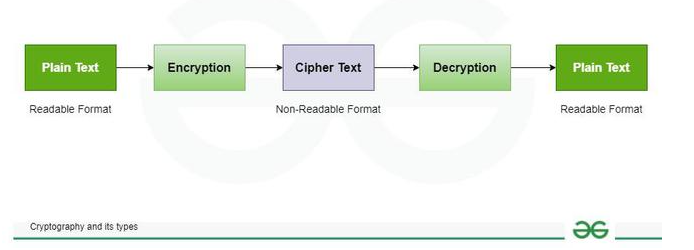

  

### [ENGLISH VERSION](#tcpip-protocols-and-networking-basics)
### [VERSÃO PORTUGUÊS-BR](#tcpip-princípios-básicos-de-protocolos-e-redes)

------------------------------------------------------------------------------------------------------------------------------------------------------------

Exam syllabus

The exam will cover the following topics

- TCP/IP (Protocols and Networking Basics)
   - OSI Layer
   - IPv4 and IPv6 addresses
   - Router, Switch and Hub
- Network Discovery Protocols
- Network Architectures, Mapping and Target Identification
- Network Scanning & Fingerprinting
- Testing Network Services
- Cryptography
- Active Directory Security Basics
- Linux and Windows Security Basics
- Common vulnerabilities affecting Windows Services
- Testing Web Servers and Frameworks
- Basic Malware Analysis
- Social Engineering attacks
- Network Security Tools and Frameworks (such as Nmap, Wireshark etc)
- Open-Source Intelligence Gathering (OSINT)
- Database Security Basics
- TLS Security Basics
- Password Storage

### [TCP/IP (Protocols and Networking Basics)](#ingles)

The TCP/IP model is a fundamental framework for computer networking. It stands for Transmission Control Protocol/Internet Protocol, which are the core protocols of the Internet. This model defines how data is transmitted over networks, ensuring reliable communication between devices. It consists of four layers: the Link Layer, the Internet Layer, the Transport Layer, and the Application Layer. Each layer has specific functions that help manage different aspects of network communication, making it essential for understanding and working with modern networks.

TCP/IP was designed and developed by the Department of Defense (DoD) in the 1960s and is based on standard protocols. The TCP/IP model is a concise version of the OSI model. It contains four layers, unlike the seven layers in the OSI model. In this article, we are going to discuss the TCP/IP model in detail.

TCP/IP model was developed alongside the creation of the ARPANET, which later became the foundation of the modern internet. It was designed with a focus on the practical aspects of networking at the time. The lower-level hardware details and physical transmission medium were largely abstracted away in favor of higher-level networking protocols.

### **What Does TCP/IP Do?**

The main work of TCP/IP is to transfer the data of a computer from one device to another. The main condition of this process is to make data reliable and accurate so that the receiver will receive the same information which is sent by the sender. To ensure that, each message reaches its final destination accurately, the TCP/IP model divides its data into packets and combines them at the other end, which helps in maintaining the accuracy of the data while transferring from one end to another end. The TCP/IP model is used in the context of the real-world internet, where a wide range of physical media and network technologies are in use. Rather than specifying a particular Physical Layer, the TCP/IP model allows for flexibility in adapting to different physical implementations.

### **Difference Between TCP and IP**

| Feature | TCP (Transmission Control Protocol) | IP (Internet Protocol) |
| :---: | ----- | ----- |
| **Purpose** | Ensures reliable, ordered, and error-checked delivery of data between applications. | Provides addressing and routing of packets across networks. |
| **Type** | Connection-oriented | Connectionless |
| **Function** | Manages data transmission between devices, ensuring data integrity and order. | Routes packets of data from the source to the destination based on IP addresses. |
| **Error Handling** | Yes, includes error checking and recovery mechanisms. | No, IP itself does not handle errors; relies on upper-layer protocols like TCP. |
| **Flow Control** | Yes, includes flow control mechanisms. | No |
| **Congestion Control** | Yes, manages network congestion. | No |
| **Data Segmentation** | Breaks data into smaller packets and reassembles them at the destination. | Breaks data into packets but does not handle reassembly. |
| **Header Size** | Larger, 20-60 bytes | Smaller, typically 20 bytes |
| **Reliability** | Provides reliable data transfer | Does not guarantee delivery, reliability, or order. |
| **Transmission Acknowledgment** | Yes, acknowledges receipt of data packets. | No |

### 

### **How Does the TCP/IP Model Work?**

Whenever we want to send something over the internet using the TCP/IP Model, the TCP/IP Model divides the data into packets at the sender’s end and the same packets have to be recombined at the receiver’s end to form the same data, and this thing happens to maintain the accuracy of the data. TCP/IP model divides the data into a 4-layer procedure, where the data first go into this layer in one order and again in reverse order to get organized in the same way at the receiver’s end.

The diagrammatic comparison of the TCP/IP and OSI model is as follows:

 
*TCP/IP and OSI*

#### **1\. Network Access Layer**

It is a group of applications requiring network communications. This layer is responsible for generating the data and requesting connections. It acts on behalf of the sender and the Network Access layer on the behalf of the receiver. During this article, we will be talking on the behalf of the receiver.

The packet’s network protocol type, in this case, TCP/IP, is identified by network access layer. Error prevention and “framing” are also provided by this layer. [Point-to-Point Protocol (PPP)](https://www.geeksforgeeks.org/point-to-point-protocol-ppp-frame-format) framing and Ethernet IEEE 802.2 framing are two examples of data-link layer protocols.

#### **2\. Internet or Network Layer**

This layer parallels the functions of OSI’s Network layer. It defines the protocols which are responsible for the logical transmission of data over the entire network. The main protocols residing at this layer are as follows:

* IP:[IP](https://www.geeksforgeeks.org/what-is-an-ip-address) stands for Internet Protocol and it is responsible for delivering packets from the source host to the destination host by looking at the IP addresses in the packet headers. IP has 2 versions: IPv4 and IPv6. IPv4 is the one that most websites are using currently. But IPv6 is growing as the number of IPv4 addresses is limited in number when compared to the number of users.  
* ICMP:[ICMP](https://www.geeksforgeeks.org/difference-between-icmp-and-igmp) stands for Internet Control Message Protocol. It is encapsulated within IP datagrams and is responsible for providing hosts with information about network problems.  
* ARP:[ARP](https://www.geeksforgeeks.org/how-address-resolution-protocol-arp-works) stands for Address Resolution Protocol. Its job is to find the hardware address of a host from a known IP address. ARP has several types: Reverse ARP, Proxy ARP, Gratuitous ARP, and Inverse ARP.

The Internet Layer is a layer in the Internet Protocol (IP) suite, which is the set of protocols that define the Internet. The Internet Layer is responsible for routing packets of data from one device to another across a network. It does this by assigning each device a unique IP address, which is used to identify the device and determine the route that packets should take to reach it.

**Example:** Imagine that you are using a computer to send an email to a friend. When you click “send,” the email is broken down into smaller packets of data, which are then sent to the Internet Layer for routing. The Internet Layer assigns an IP address to each packet and uses routing tables to determine the best route for the packet to take to reach its destination. The packet is then forwarded to the next hop on its route until it reaches its destination. When all of the packets have been delivered, your friend’s computer can reassemble them into the original email message.

In this example, the Internet Layer plays a crucial role in delivering the email from your computer to your friend’s computer. It uses IP addresses and routing tables to determine the best route for the packets to take, and it ensures that the packets are delivered to the correct destination. Without the Internet Layer, it would not be possible to send data across the Internet.

#### **3\. Transport Layer**

The TCP/IP transport layer protocols exchange data receipt acknowledgments and retransmit missing packets to ensure that packets arrive in order and without error. End-to-end communication is referred to as such. Transmission Control Protocol (TCP) and User Datagram Protocol are transport layer protocols at this level (UDP).

* TCP: Applications can interact with one another using [TCP](https://www.geeksforgeeks.org/what-is-transmission-control-protocol-tcp) as though they were physically connected by a circuit. TCP transmits data in a way that resembles character-by-character transmission rather than separate packets. A starting point that establishes the connection, the whole transmission in byte order, and an ending point that closes the connection make up this transmission.  
* UDP: The datagram delivery service is provided by [UDP](https://www.geeksforgeeks.org/user-datagram-protocol-udp) , the other transport layer protocol. Connections between receiving and sending hosts are not verified by UDP. Applications that transport little amounts of data use UDP rather than TCP because it eliminates the processes of establishing and validating connections.

#### **4\. Application Layer**

This layer is analogous to the transport layer of the OSI model. It is responsible for end-to-end communication and error-free delivery of data. It shields the upper-layer applications from the complexities of data. The three main protocols present in this layer are:

* HTTP and HTTPS:[HTTP](https://www.geeksforgeeks.org/difference-between-http-and-https-2) stands for Hypertext transfer protocol. It is used by the World Wide Web to manage communications between web browsers and servers. HTTPS stands for HTTP-Secure. It is a combination of HTTP with SSL(Secure Socket Layer). It is efficient in cases where the browser needs to fill out forms, sign in, authenticate, and carry out bank transactions.  
* SSH:[SSH](https://www.geeksforgeeks.org/introduction-to-sshsecure-shell-keys) stands for Secure Shell. It is a terminal emulations software similar to Telnet. The reason SSH is preferred is because of its ability to maintain the encrypted connection. It sets up a secure session over a TCP/IP connection.  
* NTP:[NTP](https://www.geeksforgeeks.org/network-time-protocol-ntp) stands for Network Time Protocol. It is used to synchronize the clocks on our computer to one standard time source. It is very useful in situations like bank transactions. Assume the following situation without the presence of NTP. Suppose you carry out a transaction, where your computer reads the time at 2:30 PM while the server records it at 2:28 PM. The server can crash very badly if it’s out of sync.

The host-to-host layer is a layer in the OSI (Open Systems Interconnection) model that is responsible for providing communication between hosts (computers or other devices) on a network. It is also known as the transport layer.

Some common use cases for the host-to-host layer include:

* Reliable Data Transfer: The host-to-host layer ensures that data is transferred reliably between hosts by using techniques like error correction and flow control. For example, if a packet of data is lost during transmission, the host-to-host layer can request that the packet be retransmitted to ensure that all data is received correctly.  
* Segmentation and Reassembly: The host-to-host layer is responsible for breaking up large blocks of data into smaller segments that can be transmitted over the network, and then reassembling the data at the destination. This allows data to be transmitted more efficiently and helps to avoid overloading the network.  
* Multiplexing and Demultiplexing: The host-to-host layer is responsible for multiplexing data from multiple sources onto a single network connection, and then demultiplexing the data at the destination. This allows multiple devices to share the same network connection and helps to improve the utilization of the network.  
* End-to-End Communication: The host-to-host layer provides a connection-oriented service that allows hosts to communicate with each other end-to-end, without the need for intermediate devices to be involved in the communication.

**Example:** Consider a network with two hosts, A and B. Host A wants to send a file to host B. The host-to-host layer in host A will break the file into smaller segments, add error correction and flow control information, and then transmit the segments over the network to host B. The host-to-host layer in host B will receive the segments, check for errors, and reassemble the file. Once the file has been transferred successfully, the host-to-host layer in host B will acknowledge receipt of the file to host A.

In this example, the host-to-host layer is responsible for providing a reliable connection between host A and host B, breaking the file into smaller segments, and reassembling the segments at the destination. It is also responsible for multiplexing and demultiplexing the data and providing end-to-end communication between the two hosts.

#### **Why TCP/IP Model Does Not Have Physical Layer**

The physical layer is not covered by the TCP/IP model because the data link layer is considered the point at which the interface occurs between the TCP/IP stock and the underlying network hardware. Also, it is designed to be independent of the underlying physical media. This allows TCP/IP to be flexible and adaptable to different types of physical connections, such as Ethernet, Wi-Fi, fiber optics, or even older technologies like dial-up modems. The physical layer is typically handled by hardware components and standards specific to the physical medium being used, like Ethernet cables or radio waves for Wi-Fi.

#### **Other Common Internet Protocols**

TCP/IP Model covers many Internet Protocols. The main rule of these Internet Protocols is how the data is validated and sent over the Internet. Some Common Internet Protocols include:

* HTTP (Hypertext Transfer Protocol):[HTTP](https://www.geeksforgeeks.org/http-full-form) takes care of Web Browsers and Websites.  
* FTP (File Transfer Protocol):[FTP](https://www.geeksforgeeks.org/file-transfer-protocol-ftp-in-application-layer) takes care of how the file is to be sent over the Internet.  
* SMTP (Simple Mail Transfer Protocol):[SMTP](https://www.geeksforgeeks.org/simple-mail-transfer-protocol-smtp) is used to send and receive data.

#### 

#### **Difference between TCP/IP and OSI Model**

| TCP/IP | OSI |
| ----- | ----- |
| TCP refers to Transmission Control Protocol. | OSI refers to Open Systems Interconnection. |
| TCP/IP uses both the session and presentation layer in the application layer itself. | OSI uses different session and presentation layers. |
| TCP/IP follows connectionless a horizontal approach. | OSI follows a vertical approach. |
| The Transport layer in TCP/IP does not provide assurance delivery of packets. | In the OSI model, the transport layer provides assurance delivery of packets. |
| Protocols cannot be replaced easily in TCP/IP model. | While in the OSI model, Protocols are better covered and are easy to replace with the technology change. |
| TCP/IP model network layer only provides connectionless (IP) services. The transport layer (TCP) provides connections. | Connectionless and connection-oriented services are provided by the network layer in the OSI model. |

#### 

#### **Advantages of TCP/IP Model**

* Interoperability : The TCP/IP model allows different types of computers and networks to communicate with each other, promoting compatibility and cooperation among diverse systems.  
* Scalability : TCP/IP is highly scalable, making it suitable for both small and large networks, from local area networks (LANs) to wide area networks (WANs) like the internet.  
* Standardization : It is based on open standards and protocols, ensuring that different devices and software can work together without compatibility issues.  
* Flexibility : The model supports various routing protocols, data types, and communication methods, making it adaptable to different networking needs.  
* Reliability : TCP/IP includes error-checking and retransmission features that ensure reliable data transfer, even over long distances and through various network conditions.

#### **Disadvantages of TCP/IP Model**

* Complex Configuration : Setting up and managing a TCP/IP network can be complex, especially for large networks with many devices. This complexity can lead to configuration errors.  
* Security Concerns : TCP/IP was not originally designed with security in mind. While there are now many security protocols available (such as SSL/TLS), they have been added on top of the basic TCP/IP model, which can lead to vulnerabilities.  
* Inefficiency for Small Networks : For very small networks, the overhead and complexity of the TCP/IP model may be unnecessary and inefficient compared to simpler networking protocols.  
* Limited by Address Space : Although IPv6 addresses this issue, the older IPv4 system has a limited address space, which can lead to issues with address exhaustion in larger networks.  
* Data Overhead : TCP, the transport protocol, includes a significant amount of overhead to ensure reliable transmission. This can reduce efficiency, especially for small data packets or in networks where speed is crucial.

## OSI (Open Systems Interconnection) Model

The OSI (Open Systems Interconnection) Model is a set of rules that explains how different computer systems communicate over a network. OSI Model was developed by the International Organization for Standardization (ISO). The OSI Model consists of 7 layers and each layer has specific functions and responsibilities. This layered approach makes it easier for different devices and technologies to work together. OSI Model provides a clear structure for data transmission and managing network issues. The OSI Model is widely used as a reference to understand how network systems function.**![OSI-Model][image2]**

OSI Model

### Layers of the OSI Model

There are 7 layers in the OSI Model and each layer has its specific role in handling data. All the layers are mentioned below:

* [Physical Layer](https://www.geeksforgeeks.org/physical-layer-in-osi-model)  
* [Data Link Layer](https://www.geeksforgeeks.org/data-link-layer)  
* [Network Layer](https://www.geeksforgeeks.org/network-layer-in-osi-model/)  
* [Transport Layer](https://www.geeksforgeeks.org/transport-layer-in-osi-model/)  
* [Session Layer](https://www.geeksforgeeks.org/session-layer-in-osi-model)  
* [Presentation Layer](https://www.geeksforgeeks.org/presentation-layer-in-osi-model)  
* [Application Layer](https://www.geeksforgeeks.org/application-layer-in-osi-model)

#### Layer 1 – Physical Layer

The lowest layer of the OSI reference model is the Physical Layer. It is responsible for the actual physical connection between the devices. The physical layer contains information in the form of bits. Physical Layer is responsible for transmitting individual bits from one node to the next. When receiving data, this layer will get the signal received and convert it into 0s and 1s and send them to the Data Link layer, which will put the frame back together. Common physical layer devices are [Hub](https://www.geeksforgeeks.org/what-is-network-hub-and-how-it-works/), [Repeater](https://www.geeksforgeeks.org/repeaters-in-computer-network/), [Modem](https://www.geeksforgeeks.org/difference-between-modem-and-router/), and [Cables](https://www.geeksforgeeks.org/types-of-ethernet-cable/).

Functions of the Physical Layer

* Bit Synchronization: The physical layer provides the synchronization of the bits by providing a clock. This clock controls both sender and receiver thus providing synchronization at the bit level.  
* Bit Rate Control: The Physical layer also defines the transmission rate i.e. the number of bits sent per second.  
* Physical Topologies: Physical layer specifies how the different, devices/nodes are arranged in a network i.e. [bus topology](https://www.geeksforgeeks.org/advantages-and-disadvantages-of-bus-topology/) , [star topology](https://www.geeksforgeeks.org/advantages-and-disadvantages-of-star-topology/) , or [mesh topology](https://www.geeksforgeeks.org/advantage-and-disadvantage-of-mesh-topology/) .  
* Transmission Mode: Physical layer also defines how the data flows between the two connected devices. The various transmission modes possible are [Simplex, half-duplex and full-duplex](https://www.geeksforgeeks.org/difference-between-simplex-half-duplex-and-full-duplex-transmission-modes/) .

#### Layer 2 – Data Link Layer (DLL)

The data link layer is responsible for the node-to-node delivery of the message. The main function of this layer is to make sure data transfer is error-free from one node to another, over the physical layer. When a packet arrives in a network, it is the responsibility of the DLL to transmit it to the Host using its [MAC address](https://www.geeksforgeeks.org/mac-address-in-computer-network). Packet in the Data Link layer is referred to as Frame. [Switches and Bridges](https://www.geeksforgeeks.org/difference-between-switch-and-bridge/) are common Data Link Layer devices.

The Data Link Layer is divided into two sublayers:

* Logical Link Control (LLC)  
* Media Access Control (MAC)

The packet received from the Network layer is further divided into frames depending on the frame size of the [NIC(Network Interface Card)](https://www.geeksforgeeks.org/nic-full-form/). DLL also encapsulates Sender and Receiver’s MAC address in the header.

The Receiver’s MAC address is obtained by placing an [ARP(Address Resolution Protocol)](https://www.geeksforgeeks.org/how-address-resolution-protocol-arp-works) request onto the wire asking “Who has that IP address?” and the destination host will reply with its MAC address.

Functions of the Data Link Layer

* Framing: Framing is a function of the data link layer. It provides a way for a sender to transmit a set of bits that are meaningful to the receiver. This can be accomplished by attaching special bit patterns to the beginning and end of the frame.  
* Physical Addressing: After creating frames, the Data link layer adds physical addresses ( MAC addresses ) of the sender and/or receiver in the header of each frame.  
* Error Control: The data link layer provides the mechanism of error control in which it detects and retransmits damaged or lost frames.  
* Flow Control: The data rate must be constant on both sides else the data may get corrupted thus, flow control coordinates the amount of data that can be sent before receiving an acknowledgment.  
* Access Control: When a single communication channel is shared by multiple devices, the MAC sub-layer of the data link layer helps to determine which device has control over the channel at a given time.

#### Layer 3 – Network Layer

The network layer works for the transmission of data from one host to the other located in different networks. It also takes care of packet routing i.e. selection of the shortest path to transmit the packet, from the number of routes available. The sender and receiver’s [IP address](https://www.geeksforgeeks.org/what-is-an-ip-address) are placed in the header by the network layer. Segment in the Network layer is referred to as Packet. Network layer is implemented by networking devices such as [routers and switches](https://www.geeksforgeeks.org/difference-between-router-and-switch/).

Functions of the Network Layer

* Routing: The network layer protocols determine which route is suitable from source to destination. This function of the network layer is known as routing.  
* Logical Addressing: To identify each device inter-network uniquely, the network layer defines an addressing scheme. The sender and receiver’s IP addresses are placed in the header by the network layer. Such an address distinguishes each device uniquely and universally.

#### Layer 4 – Transport Layer

The transport layer provides services to the application layer and takes services from the network layer. The data in the transport layer is referred to as Segments. It is responsible for the end-to-end delivery of the complete message. The transport layer also provides the acknowledgment of the successful data transmission and re-transmits the data if an error is found. Protocols used in Transport Layer are [TCP](https://www.geeksforgeeks.org/what-is-transmission-control-protocol-tcp/), [UDP](https://www.geeksforgeeks.org/user-datagram-protocol-udp/)  [NetBIOS](https://www.geeksforgeeks.org/what-is-netbios-enumeration/), [PPTP](https://www.geeksforgeeks.org/pptp-full-form/).

At the sender’s side, the transport layer receives the formatted data from the upper layers, performs Segmentation, and also implements Flow and error control to ensure proper data transmission. It also adds Source and Destination [port number](https://www.geeksforgeeks.org/what-is-ports-in-networking) in its header and forwards the segmented data to the Network Layer.

* Generally, this destination port number is configured, either by default or manually. For example, when a web application requests a web server, it typically uses port number 80, because this is the default port assigned to web applications. Many applications have default ports assigned.

At the Receiver’s side, Transport Layer reads the port number from its header and forwards the Data which it has received to the respective application. It also performs sequencing and reassembling of the segmented data.

Functions of the Transport Layer

* Segmentation and Reassembly: This layer accepts the message from the (session) layer, and breaks the message into smaller units. Each of the segments produced has a header associated with it. The transport layer at the destination station reassembles the message.  
* Service Point Addressing: To deliver the message to the correct process, the transport layer header includes a type of address called service point address or port address. Thus by specifying this address, the transport layer makes sure that the message is delivered to the correct process.

Services Provided by Transport Layer

* [Connection-Oriented Service](https://www.geeksforgeeks.org/connection-oriented-service)  
* [Connectionless Service](https://www.geeksforgeeks.org/connection-less-service)

#### Layer 5 – Session Layer

Session Layer in the OSI Model is responsible for the establishment of connections, management of connections, terminations of sessions between two devices. It also provides authentication and security. Protocols used in the Session Layer are NetBIOS, PPTP.

Functions of the Session Layer

* Session Establishment, Maintenance, and Termination: The layer allows the two processes to establish, use, and terminate a connection.  
* Synchronization: This layer allows a process to add checkpoints that are considered synchronization points in the data. These synchronization points help to identify the error so that the data is re-synchronized properly, and ends of the messages are not cut prematurely and data loss is avoided.  
* Dialog Controller: The session layer allows two systems to start communication with each other in half-duplex or full-duplex.

Example

Let us consider a scenario where a user wants to send a message through some Messenger application running in their browser. The “Messenger” here acts as the application layer which provides the user with an interface to create the data. This message or so-called Data is compressed, optionally encrypted (if the data is sensitive), and converted into bits (0’s and 1’s) so that it can be transmitted.

#### Layer 6 – Presentation Layer

The presentation layer is also called the Translation layer. The data from the application layer is extracted here and manipulated as per the required format to transmit over the network. Protocols used in the Presentation Layer are [JPEG](https://www.geeksforgeeks.org/difference-between-jpeg-and-png/), [MPEG](https://www.geeksforgeeks.org/mpeg-full-form/), [GIF](https://www.geeksforgeeks.org/what-is-a-gif-file/), [TLS/SSL](https://www.geeksforgeeks.org/difference-between-secure-socket-layer-ssl-and-transport-layer-security-tls/), etc.

Functions of the Presentation Layer

* Translation: For example, [ASCII to EBCDIC](https://www.geeksforgeeks.org/difference-between-ascii-and-ebcdic) .  
* Encryption/ Decryption: Data encryption translates the data into another form or code. The encrypted data is known as the ciphertext and the decrypted data is known as plain text. A key value is used for encrypting as well as decrypting data.  
* Compression: Reduces the number of bits that need to be transmitted on the network.

#### Layer 7 – Application Layer

At the very top of the OSI Reference Model stack of layers, we find the Application layer which is implemented by the network applications. These applications produce the data to be transferred over the network. This layer also serves as a window for the application services to access the network and for displaying the received information to the user. Protocols used in the Application layer are [SMTP](https://www.geeksforgeeks.org/simple-mail-transfer-protocol-smtp/), [FTP](https://www.geeksforgeeks.org/file-transfer-protocol-ftp-in-application-layer/), [DNS](https://www.geeksforgeeks.org/domain-name-system-dns-in-application-layer/), etc.

Functions of the Application Layer

The main functions of the application layer are given below.

* Network Virtual Terminal(NVT): It allows a user to log on to a remote host.  
* File Transfer Access and Management(FTAM): This application allows a user to access files in a remote host, retrieve files in a remote host, and manage or control files from a remote computer.  
* Mail Services: Provide email service.  
* Directory Services: This application provides distributed database sources and access for global information about various objects and services.

### How Data Flows in the OSI Model?

When we transfer information from one device to another, it travels through 7 layers of OSI model. First data travels down through 7 layers from the sender’s end and then climbs back 7 layers on the receiver’s end.

Data flows through the OSI model in a step-by-step process:

* Application Layer: Applications create the data.  
* Presentation Layer: Data is formatted and encrypted.  
* Session Layer: Connections are established and managed.  
* Transport Layer: Data is broken into segments for reliable delivery.  
* Network Layer : Segments are packaged into packets and routed.  
* Data Link Layer: Packets are framed and sent to the next device.  
* Physical Layer: Frames are converted into bits and transmitted physically.

Each layer adds specific information to ensure the data reaches its destination correctly, and these steps are reversed upon arrival.

We can understand how data flows through OSI Model with the help of an example mentioned below.

Let us suppose, Person A sends an e-mail to his friend Person B.

Step 1: Person A interacts with e-mail application like Gmail, outlook, etc. Writes his email to send. (This happens at Application Layer).

Step 2: At Presentation Layer, Mail application prepares for data transmission like encrypting data and formatting it for transmission.

Step 3: At Session Layer, There is a connection established between the sender and receiver on the internet.

Step 4: At Transport Layer, Email data is broken into smaller segments. It adds sequence number and error-checking information to maintain the reliability of the information.

Step 5: At Network Layer, Addressing of packets is done in order to find the best route for transfer.

Step 6: At Data Link Layer, data packets are encapsulated into frames, then MAC address is added for local devices and then it checks for error using error detection.

Step 7: At Physical Layer, Frames are transmitted in the form of electrical/ optical signals over a physical network medium like ethernet cable or WiFi.

After the email reaches the receiver i.e. Person B, the process will reverse and decrypt the e-mail content. At last, the email will be shown on Person B email client.

### Protocols Used in the OSI Layers

| Layer | Working | Protocol Data Unit | Protocols |
| :---- | :---- | :---- | :---- |
| 1 – Physical Layer | Establishing Physical Connections between Devices. | Bits | [USB](https://www.geeksforgeeks.org/universal-serial-bus-usb/), [SONET/SDH](https://www.geeksforgeeks.org/difference-between-sonet-and-sdh/), etc. |
| 2 – Data Link Layer | Node to Node Delivery of Message. | Frames | [Ethernet](https://www.geeksforgeeks.org/what-is-ethernet/), PPP, etc. |
| 3 – Network Layer | Transmission of data from one host to another, located in different networks. | Packets | IP, [ICMP](https://www.geeksforgeeks.org/internet-control-message-protocol-icmp/), [IGMP](https://www.geeksforgeeks.org/what-is-igmpinternet-group-management-protocol/), [OSPF](https://www.geeksforgeeks.org/open-shortest-path-first-ospf-protocol-states/), etc. |
| 4 – Transport Layer | Take Service from Network Layer and provide it to the Application Layer. | Segments (for TCP) or Datagrams (for UDP) | [TCP](https://www.geeksforgeeks.org/what-is-transmission-control-protocol-tcp/), [UDP](https://www.geeksforgeeks.org/user-datagram-protocol-udp/), [SCTP,](https://www.geeksforgeeks.org/stream-control-transmission-protocol/) etc. |
| 5 – Session Layer | Establishes Connection, Maintenance, Ensures Authentication and Ensures security. | Data | [NetBIOS](https://www.geeksforgeeks.org/what-is-netbios-enumeration/), [RPC](https://www.geeksforgeeks.org/remote-procedure-call-rpc-in-operating-system/), [PPTP](https://www.geeksforgeeks.org/pptp-full-form/), etc. |
| 6 – Presentation Layer | Data from the application layer is extracted and manipulated in the required format for transmission. | Data | [TLS/SSL](https://www.geeksforgeeks.org/what-is-ssl-tls-handshake/), [MIME](https://www.geeksforgeeks.org/multipurpose-internet-mail-extension-mime-protocol/), JPEG, PNG, ASCII, etc. |
| 7 – Application Layer | Helps in identifying the client and synchronizing communication. | Data | [FTP](https://www.geeksforgeeks.org/file-transfer-protocol-ftp-in-application-layer/), [SMTP](https://www.geeksforgeeks.org/simple-mail-transfer-protocol-smtp/), [DNS](https://www.geeksforgeeks.org/domain-name-system-dns-in-application-layer/), [DHCP](https://www.geeksforgeeks.org/dynamic-host-configuration-protocol-dhcp/), etc. |

### 

### Why Does The OSI Model Matter?

The OSI Model matters because it provides the user a clear structure of “how the data moves in the network?”. As the OSI Model consists of 7 layers, each layer has its specific role, and due to which it helps in understanding, identifying and solving the complex network problems easily by focusing on one of the layers not the entire network.

As the modern Internet does not prefer the OSI Model, but still, the OSI Model is still very helpful for solving network problems. It helps people understanding network concepts very easily.

### Difference Between OSI and TCP/IP Model

| OSI Model | TCP/IP Model |
| :---- | :---- |
| OSI stands for Open Systems Interconnection. | TCP/IP stands for Transmission Control Protocol/Internet Protocol. |
| OSI model has 7 layers. | TCP/IP model consists of 4 layers. |
| Package delivery is guaranteed in OSI Model. | Package delivery is not guaranteed in the TCP/IP Model. |
| In the OSI model, Only layers 1,2 and 3 are necessary for data transmission. | All layers of the TCP/IP model are needed for data transmission. |
| Protocols at each layer is independent of the other layer. | Layers are integrated, some layers are required by other layers of TCP/IP model. |
| OSI Model is a conceptual framework, less used in practical applications. | Widely used in actual networks like Internet and Communication Systems. |

###

### Advantages of OSI Model

The OSI Model defines the communication of a computing system into 7 different layers. Its advantages include:

* It divides network communication into 7 layers which makes it easier to understand and troubleshoot.  
* It standardizes network communications, as each layer has fixed functions and protocols.  
* Diagnosing network problems is easier with the OSI model.  
* It is easier to improve with advancements as each layer can get updates separately.

### Disadvantages of OSI Model

* The OSI Model has seven layers, which can be complicated and hard to understand for beginners.  
* In real-life networking, most systems use a simpler model called the Internet protocol suite (TCP/IP), so the OSI Model is not always directly applicable.  
* Each layer in the OSI Model adds its own set of rules and operations, which can make the process more time-consuming and less efficient.  
* The OSI Model is more of a theoretical framework, meaning it’s great for understanding concepts but not always practical for implementation.

###### 

## Network Discovery Protocols

### What is IPv4?

IPv4, or Internet Protocol version 4, is the original addressing system of the Internet, introduced in 1983\. It uses a 32-bit address scheme, which theoretically allows for over 4 billion unique addresses (2^32). IPv4 addresses are typically displayed in decimal format, divided into four octets separated by dots. For example, 192.168.1.1 is a common IPv4 address you might find in a home network.

#### IPv4 Address Format

IPv4 Address Format is a 32-bit Address that comprises binary digits separated by a dot (.).

### **Characteristics of IPv4**

* 32-bit address length: Allows for approximately 4.3 billion unique addresses.  
* Dot-decimal notation: IP addresses are written in a format of four decimal numbers separated by dots, such as 192.168.1.1.  
* Packet structure: Includes a header and payload; the header contains information essential for routing and delivery.  
* Checksum fields: Uses checksums in the header for error-checking the header integrity.  
* Fragmentation: Allows packets to be fragmented at routers along the route if the packet size exceeds the maximum transmission unit (MTU).  
* Address Resolution Protocol (ARP): Used for mapping IP network addresses to the hardware addresses used by a data link protocol.  
* Manual and DHCP configuration: Supports both manual configuration of IP addresses and dynamic configuration through DHCP (Dynamic Host Configuration Protocol).  
* Limited address space: The main limitation which has led to the development of IPv6 to cater to more devices.  
* Network Address Translation (NAT): Used to allow multiple devices on a private network to share a single public IP address.  
* Security: Lacks inherent security features, requiring additional protocols such as IPSec for secure communications.

### Drawbacks of IPv4

* Limited Address Space : IPv4 has a limited number of addresses, which is not enough for the growing number of devices connecting to the internet.  
* Complex Configuration : IPv4 often requires manual configuration or DHCP to assign addresses, which can be time-consuming and prone to errors.  
* Less Efficient Routing : The IPv4 header is more complex, which can slow down data processing and routing.  
* Security Issues : IPv4 does not have built-in security features, making it more vulnerable to attacks unless extra security measures are added.  
* Limited Support for Quality of Service (QoS) : IPv4 has limited capabilities for prioritizing certain types of data, which can affect the performance of real-time applications like video streaming and VoIP.  
* Fragmentation : IPv4 allows routers to fragment packets, which can lead to inefficiencies and increased chances of data being lost or corrupted.  
* Broadcasting Overhead : IPv4 uses broadcasting to communicate with multiple devices on a network, which can create unnecessary network traffic and reduce performance.

### What is IPv6?

Another most common version of the Internet Protocol currently is IPv6. The well-known IPv6 protocol is being used and deployed more often, especially in mobile phone markets. IPv6 was designed by the Internet Engineering Task Force (IETF) in December 1998 with the purpose of superseding IPv4 due to the global exponentially growing internet of users.

IPv6 stands for Internet Protocol version 6\. IPv6 is the new version of Internet Protocol, which is way better than IPv4 in terms of complexity and efficiency. IPv6 is written as a group of 8 hexadecimal numbers separated by colon (:). It can be written as 128 bits of 0s and 1s.

### IPv6 Address Format

IPv6 Address Format is a 128-bit IP Address, which is written in a group of 8 hexadecimal numbers separated by colon (:).

To switch from IPv4 to IPv6, there are several strategies:

* Dual Stacking : Devices can use both IPv4 and IPv6 at the same time. This way, they can talk to networks and devices using either version.  
* Tunneling : This method allows IPv6 users to send data through an IPv4 network to reach other IPv6 users. Think of it as creating a “tunnel” for IPv6 traffic through the older IPv4 system.  
* Network Address Translation (NAT) : NAT helps devices using different versions of IP addresses (IPv4 and IPv6) to communicate with each other by translating the addresses so they understand each other.

Characteristics of IPv6

IPv6 uses 128-bit addresses, offering a much larger address space than IPv4’s 32-bit system.

IPv6 addresses use a combination of numbers and letters separated by colons, allowing for more unique addresses.

The IPv6 header has fewer fields, making it more efficient for routers to process.

IPv6 supports Unicast, Multicast, and Anycast, but no Broadcast, reducing network traffic.

IPv6 allows flexible subnetting (VLSM) to divide networks based on specific needs.

IPv6 uses Neighbor Discovery for MAC address resolution instead of ARP.

IPv6 uses advanced routing protocols like OSPFv3 and RIPng for better address handling.

IPv6 devices can self-assign IP addresses using SLAAC, or use DHCPv6 for more control.

IPv6 handles fragmentation at the sender side, not by routers, improving speed.

Difference Between IPv4 and IPv6

| IPv4 | IPv6 |
| ----- | ----- |
| IPv4 has a 32-bit address length | IPv6 has a 128-bit address length |
| It Supports Manual and [DHCP](https://www.geeksforgeeks.org/dynamic-host-configuration-protocol-dhcp/) address configuration | It supports Auto and renumbering address configuration |
| In IPv4 end to end, connection integrity is Unachievable | In IPv6 end-to-end, connection integrity is Achievable |
| It can generate 4.29×10 9 address space | The address space of IPv6 is quite large it can produce 3.4×10 38 address space |
| The Security feature is dependent on the application | IPSEC is an inbuilt security feature in the IPv6 protocol |
| Address representation of IPv4 is in decimal | Address representation of IPv6 is in hexadecimal |
| [Fragmentation](https://www.geeksforgeeks.org/what-is-fragmentation-in-operating-system/) performed by Sender and forwarding routers | In IPv6 fragmentation is performed only by the sender |
| In IPv4 Packet flow identification is not available | In IPv6 packet flow identification are Available and uses the flow label field in the header |
| In IPv4 checksum field is available | In IPv6 [checksum](https://www.geeksforgeeks.org/difference-between-checksum-and-crc/) field is not available |
| It has a broadcast Message Transmission Scheme | In IPv6 multicast and anycast message transmission scheme is available |
| In IPv4 Encryption and Authentication facility not provided | In IPv6 [Encryption](https://www.geeksforgeeks.org/what-is-data-encryption/) and Authentication are provided |
| IPv4 has a header of 20-60 bytes. | IPv6 has a header of 40 bytes fixed |
| IPv4 can be converted to IPv6 | Not all IPv6 can be converted to IPv4 |
| IPv4 consists of 4 fields which are separated by addresses dot (.) | IPv6 consists of 8 fields, which are separated by a colon (:) |
| IPv4’s  IP addresses are divided into five different classes. Class A , Class B, Class C, Class D , Class E. | IPv6 does not have any classes of the IP address. |
| IPv4 supports VLSM( [Variable Length subnet mask](https://www.geeksforgeeks.org/introduction-of-variable-length-subnet-mask-vlsm/) ). | IPv6 does not support VLSM. |
| Example of IPv4:  66.94.29.13 | Example of IPv6: 2001:0000:3238:DFE1:0063:0000:0000:FEFB |

### Benefits of IPv6 over IPv4

The recent Version of IP IPv6 has a greater advantage over IPv4. Here are some of the mentioned benefits:

* Larger Address Space: IPv6 has a greater address space than IPv4, which is required for expanding the IP Connected Devices. IPv6 has 128 bit IP Address rather and IPv4 has a 32-bit Address.  
* Improved Security: IPv6 has some improved security which is built in with it. IPv6 offers security like Data Authentication, Data Encryption, etc. Here, an Internet Connection is more Secure.  
* Simplified Header Format: As compared to IPv4, IPv6 has a simpler and more effective header Structure, which is more cost-effective and also increases the speed of Internet Connection.  
* Prioritize: IPv6 contains stronger and more reliable support for QoS features, which helps in increasing traffic over websites and increases audio and video quality on pages.  
* Improved Support for Mobile Devices: IPv6 has increased and better support for Mobile Devices. It helps in making quick connections over other Mobile Devices and in a safer way than IPv4.

### 

### Why IPv4 is Still in Use?

* Infrastructure Compatibility Many systems and devices are built for IPv4 and require significant updates to support IPv6, including routers, switches, and computers.  
* Cost of Transition – Switching to IPv6 can be expensive and complex, involving hardware updates, software upgrades, and training for personnel.  
* Lack of Immediate Need – Techniques like NAT (Network Address Translation) help extend the life of IPv4 by allowing multiple devices to share a single public IP address, reducing the urgency to switch to IPv6.  
* Coexistence Strategies – Technologies that allow IPv4 and IPv6 to run simultaneously make it easier for organizations to adopt IPv6 gradually while maintaining their existing IPv4 systems.  
* Slow Global Adoption – The adoption of IPv6 varies significantly around the world, which necessitates the continued support of IPv4 for global connectivity.  
* Lack of Visible Benefits – Many users and organizations don’t see immediate improvements with IPv6 if they don’t face an IP address shortage, reducing the incentive to upgrade.

## 

## Router, Switch and Hub

In computer network it is very important to understand the difference between devices like hubs, switches, and routers. These devices play an important role in how data is transferred across networks, affecting everything from speed and efficiency to security. In this article we will see basic differences between these devices, how they work within the OSI model, and where their use cases are applicable.

## **What is Hub?**

A [Hub](https://www.geeksforgeeks.org/advantages-and-disadvantages-of-hub/) is just a connector that connects the wires coming from different sides. There is no signal processing or regeneration. It is an electronic device that operates only on physical layers of the [OSI model](https://www.geeksforgeeks.org/open-systems-interconnection-model-osi/).

It is also known as a repeater as it transmits signal to every port except the port from where signal is received. Also, hubs are not that intelligent in communication and processing information for 2nd and 3rd layer.

## 

## **What is Switch?**

Switch is a point to point communication device. It operates at the [data link layer](https://www.geeksforgeeks.org/data-link-layer/) of OSI model. It uses switching table to find out the correct destination.

Basically, it is a kind of [bridge](https://www.geeksforgeeks.org/what-is-bridge-in-computer-network-types-uses-functions-differences/) that provides better connections. It is a kind of device that set up and stop the connections according to the requirements  needed at that time. It comes up with many features such as flooding, filtering and frame transmission.

## **What is Router?**

Routers are the multiport devices and more sophisticated as compared to repeaters and bridges. It contains a routing table that enables it to make decision about the route i.e. to determine which of several possible paths between the source and destination is the best for a particular transmission.

It works on the network layer 3 and used in LANs, MANs and WANs. It stores [IP address](https://www.geeksforgeeks.org/what-is-an-ip-address/) and maintains address on its own.

## **Difference between Hub, Switch and Router**

| Hub | Switch | Router |
| ----- | ----- | ----- |
| Hub is a physical layer device i.e. layer 1\.  | Switch is a data link layer device i.e. layer 2\.  | Router is a network layer device i.e. layer 3\.   |
| A Hub works on the basis of broadcasting. | Switch works on the basis of MAC address. | A router works on the basis of IP address. |
| A Hub is a multiport repeater in which a signal introduced at the input of any port appears at the output of the all available ports. | A Switch is  a tele-communication  device which receives a message from any device connected to it and then transmits the message only to the device for which the message is intended. | A router reads the header of incoming packet and forward it to the port for which it is intended there by determines the route. It can also perform filtering and encapsulation. |
| Hub is not an intelligent device that may include amplifier on repeater. | A Switch is an intelligent device as it passes on the message to the selective device by inspecting the address. | A route is more sophisticated and intelligent device as it can read IP address and direct the packets to another network with specified IP address. Moreover routers can built address tables that helps in routing decisions. |
| At least single network is required to connect. | At least single network is required to connect. | Router needs at least two networks to connect.  |
| Hub is cheaper as compared to switch and router.  | Switch is an expensive device than hub. | Router is a relatively much more expensive device than hub and switch. |
| Speed of original hub 10Mbps and modern internet hub is 100Mbps. | maximum speed is 10Mbps to 100Mbps. | maximum speed for wireless is 1-10 Mbps and maximum speed for wired connections is 100 Mbps. |
| Hubs are used in LANs. | Switch is used in LANs. | Routers are used in LANs, MANs and WANs. |

## 

## Network Architectures, Mapping and Target Identification

### Network Architectures

Common Architectures:

* Hub-and-Spoke: A central hub (often a router) connects to multiple spoke devices (clients or other smaller networks). Simple but can become a single point of failure.  
* Mesh: Every device is connected to every other device. Highly redundant but complex to manage.  
* Star: Similar to Hub-and-Spoke, but with a more centralized control device.  
* Bus: All devices are connected to a single shared communication line.  
* Ring: Devices are connected in a closed loop.  
* Cloud Architectures: Understand cloud models (IaaS, PaaS, SaaS) and their security implications.  
* Virtualization: How virtualization technologies (e.g., VMware, VirtualBox) impact network architecture and security.

### Network Mapping and Discovery

Network Mapping is the process of identifying and documenting all devices and their connections within a network. This includes:

* Discovering devices: Identifying all active devices on the network, such as computers, servers, printers, and network devices (routers, switches).  
* Mapping connections: Determining how these devices are interconnected, including physical and logical connections.  
* Identifying services: Determining the services running on each device (e.g., web servers, databases, email servers).  
* Gathering information: Collecting information about the operating systems, software versions, and security configurations of each device.

Network Discovery Techniques:

* Passive:  
  * Monitoring network traffic: Analyzing network traffic to identify devices and their communication patterns. Tools like Wireshark can be used for this.  
  * Analyzing log files: Examining system and network logs for information about devices on the network.  
* Active:  
  * Ping sweeps: Sending ICMP echo requests (ping) to a range of IP addresses to determine which hosts are reachable.  
  * Port scanning: Scanning ports on target devices to identify open services. Nmap is a powerful tool for this.  
  * Service fingerprinting: Identifying the version and type of service running on a specific port.

Tools for Network Mapping and Discovery

* Nmap (Network Mapper): A versatile open-source tool for network discovery, port scanning, and service version detection.  
* Wireshark: A powerful network protocol analyzer for capturing and analyzing network traffic.  
* Zenmap: The graphical user interface for Nmap, providing a more user-friendly interface.  
* Nessus: A commercial vulnerability scanner that also includes network discovery capabilities.  
* OpenVAS: An open-source vulnerability assessment scanner with network discovery features.

Importance of Network Mapping and Discovery

* Security assessments: Identifying vulnerabilities and potential attack vectors.  
* Network planning and design: Understanding the current network topology to make informed decisions about network upgrades and expansions.  
* Troubleshooting network problems: Isolating and diagnosing network issues.  
* Compliance: Meeting regulatory and compliance requirements that require network inventories.

Ethical Considerations:

* Obtain proper authorization: Always obtain proper authorization before conducting network scans on any network that you do not own or have explicit permission to scan.  
* Minimize disruption: Avoid excessive scanning that could impact network performance.  
* Respect privacy: Be mindful of privacy concerns and avoid scanning devices that you are not authorized to scan.

By understanding network mapping and discovery techniques and utilizing the appropriate tools, you can gain valuable insights into your network environment, identify potential vulnerabilities, and improve the overall security posture of your organization.

### Target Identification

* Prioritization: Identifying critical assets (e.g., servers, databases, network devices) and prioritizing them for security measures.  
* Vulnerability Assessment: Identifying and assessing vulnerabilities in systems and applications on the network.  
* Threat Modeling: Identifying potential threats and their impact on the organization.  
* Intelligence Gathering: Collecting information about potential threats and adversaries.

Target Identification in cybersecurity is the crucial initial step in understanding and mitigating potential threats. It involves identifying the specific systems, applications, and data within an organization that are most valuable to attackers and therefore require the strongest security measures.

#### Key Aspects of Target Identification:

Asset Inventory:

* Identify all critical assets: This includes servers, workstations, databases, network devices, applications, data stores, and any other valuable resource.  
* Categorize assets: Classify assets based on their criticality (e.g., high, medium, low) and sensitivity (e.g., confidential, sensitive, public).  
* Document asset information: Gather detailed information about each asset, such as its location, owner, purpose, and associated vulnerabilities.

Threat Modeling:

* Identify potential threats: Analyze the organization's environment and identify potential threats, such as malware attacks, phishing scams, data breaches, and denial-of-service attacks.  
* Assess vulnerabilities: Evaluate the potential impact of these threats on critical assets.  
* Determine attack vectors: Identify the possible entry points for attackers, such as internet-facing systems, employee devices, and third-party vendors.

Prioritization:

* Focus on high-value targets: Prioritize the protection of assets that are most critical to the organization's operations and that contain the most sensitive data.  
* Allocate resources effectively: Focus security resources on the most critical assets to maximize the return on investment.

Continuous Monitoring:

* Regularly review and update asset inventories: As the organization evolves, new assets are added and existing assets may change.  
* Monitor for new threats: Stay informed about the latest threats and vulnerabilities to adjust security measures accordingly.

Tools and Techniques

* Vulnerability scanning tools: Tools like Nmap, Nessus, and OpenVAS can be used to identify vulnerabilities in systems and applications.  
* Threat intelligence feeds: Subscribe to threat intelligence feeds from reputable sources to stay informed about the latest threats and vulnerabilities.  
* Risk assessments: Conduct regular risk assessments to identify and prioritize potential threats and vulnerabilities.  
* Security information and event management (SIEM) systems: Collect and analyze security logs to identify suspicious activity.

#### Importance of Target Identification:

* Improved security posture: By focusing on the most critical assets, organizations can allocate their security resources more effectively.  
* Reduced risk of breaches: Proactive identification and mitigation of vulnerabilities can significantly reduce the risk of successful cyberattacks.  
* Compliance with regulations: Many regulations (e.g., GDPR, HIPAA) require organizations to identify and protect sensitive data.  
* Enhanced decision-making: Informed decisions about security investments can be made based on a clear understanding of the organization's most critical assets.

By effectively identifying and prioritizing targets, organizations can significantly improve their overall security posture and better protect themselves against cyber threats.

## 

## 

## Network Scanning & Fingerprinting

### **Network Scanning** 

Técnica fundamental em segurança da informação que envolve a varredura de uma rede para identificar dispositivos, serviços e vulnerabilidades. É como fazer um censo da sua rede para entender o que está conectado e como está configurado.  
Por que realizar network scanning?

* Inventário de ativos: Identificar todos os dispositivos conectados à rede, incluindo servidores, workstations, dispositivos IoT, etc.  
* Descoberta de serviços: Identificar os serviços em execução em cada dispositivo (HTTP, SSH, FTP, etc.).  
* Identificação de vulnerabilidades: Encontrar vulnerabilidades conhecidas nos sistemas e serviços.  
* Mapeamento da topologia da rede: Visualizar a estrutura da rede e as conexões entre os dispositivos.

Ferramentas Comuns para Network Scanning:

* Nmap: Uma das ferramentas mais populares e versáteis para varredura de redes. Permite realizar diversas tarefas, como varredura de portas, detecção de sistemas operacionais e identificação de serviços.  
* Nessus: Uma ferramenta comercial focada em vulnerabilidades, mas que também possui recursos de descoberta de redes.  
* OpenVAS: Uma alternativa open-source ao Nessus, oferecendo funcionalidades similares.  
* Wireshark: Embora seja um analisador de pacotes, o Wireshark pode ser usado para descobrir dispositivos na rede capturando o tráfego.

Tipos de Varredura:

* Varredura de hosts: Identifica dispositivos ativos na rede.  
* Varredura de portas: Identifica as portas abertas em cada dispositivo, indicando os serviços em execução.  
* Varredura de vulnerabilidades: Identifica vulnerabilidades conhecidas nos sistemas e serviços.  
* Varredura de serviços: Identifica o tipo de serviço em execução em cada porta aberta.

Considerações Importantes:

* Permissões: Certifique-se de ter as permissões necessárias para realizar varreduras em uma rede.  
* Alcance: Defina o escopo da varredura para evitar impactar negativamente a rede.  
* Velocidade: Varreduras completas podem levar tempo, especialmente em redes grandes.  
* Legalidade: Verifique as leis e regulamentos locais antes de realizar varreduras em redes que não sejam suas.

Exemplo de comando Nmap:

Bash  
nmap \-sS \-sV 192.168.1.0/24

* \-sS: Realiza uma varredura TCP SYN (half-open) para identificar hosts ativos e portas abertas.  
* \-sV: Tenta identificar a versão dos serviços em execução nas portas abertas.  
* 192.168.1.0/24: Especifica a faixa de IP a ser varrida.

Por que a Network Scanning é importante para a segurança?

* Identificação de vulnerabilidades: Permite identificar sistemas vulneráveis antes que sejam explorados por atacantes.  
* Mapeamento da infraestrutura: Auxilia na criação de inventários de ativos e na visualização da topologia da rede.  
* Detecção de dispositivos não autorizados: Permite identificar dispositivos não autorizados conectados à rede.  
* Monitoramento contínuo: A realização de varreduras regulares pode ajudar a detectar mudanças não autorizadas na rede.

Em resumo, a network scanning é uma ferramenta essencial para qualquer profissional de segurança da informação. Ao entender os princípios e as ferramentas de network scanning, você estará melhor preparado para proteger sua organização contra ameaças cibernéticas.

### Fingerprinting

What exactly is cybersecurity fingerprinting? It’s a cutting-edge technique that detects cyber threats by analyzing the unique digital ‘fingerprints’ of systems and network traffic. Without the fluff, this article will guide you through the core of cybersecurity fingerprinting and its significance in the modern cybersecurity landscape.

Key Takeaways

* Cybersecurity fingerprinting, a key step in cybersecurity [information gathering](https://www.recordedfuture.com/threat-intelligence-101/intelligence-sources-collection/information-gathering), is a critical process for gathering detailed profiles of systems to identify potential threats, weaknesses, and the presence of malicious activities by analyzing network traffic, and probing targeted systems.  
* Different fingerprinting techniques, including active, passive, and hybrid, are utilized for identifying systems, software, and vulnerabilities, with each having unique approaches such as traffic analysis, system probing, and encrypted protocol handling to [enhance threat detection](https://www.recordedfuture.com/products/threat-intelligence) and network security.  
* The effectiveness of cybersecurity fingerprinting is amplified by a variety of tools and methods, including Nmap, p0f, and XProbe2, while it must be used under strict legal and ethical guidelines to prevent unauthorized fingerprinting and protect user privacy.

Demystifying Cybersecurity Fingerprinting

Cybersecurity fingerprinting can be compared to a digital Sherlock Holmes, as it meticulously collects clues to build a comprehensive profile of a system. The process involves scanning network traffic, launching specifically crafted packets, or analyzing outgoing packets from a target system.

However, it's worth noting that the network layer of the Open Systems Interconnection (OSI) model, as [highlighted](https://louis.uah.edu/cgi/viewcontent.cgi?article=1011&context=cyber-summit) by Adrian Ordorica and Dale R. Thompson from the Science and Computer Engineering Department at the University of Arkansas, does not inherently provide explicit information about the operating system of the network device generating traffic. Despite this limitation, cybersecurity professionals leverage fingerprinting techniques to gather crucial details, including operating system, protocols, and other system attributes. These insights are invaluable for accurately identifying and mitigating potential threats.

The key objective of cybersecurity fingerprinting mirrors that of a seasoned detective \- exposing potential weaknesses and countering advanced cyber threats. Just as a detective constructs a profile of a potential suspect, cybersecurity fingerprinting creates server profiles capable of recognizing distinct identifiers and characteristics of potential cyber threats, making it an essential tool for network security experts.

## 

## Testing Network Services

Many businesses will test their network to make sure it’s functioning properly and providing the right level of service for users. It therefore serves to guarantee working efficiency for internal processes and, where products and services are sold online, ensure a smooth customer experience. However, network testing is also important for business cyber security.  

In this blog, we’ll be delving into network security testing – what it means, why it matters, and the types of tests available today. 

###  **Why test a network?**

A network can pose a significant security risk to businesses due to the amount of software and devices it interacts with. Vulnerabilities arise when a network has weaknesses that can be exploited by cyber attackers. These weak points can be found in a variety of places, such as servers, firewalls, routers, modems, physical connection ports, operating systems, and software updates. Any one of these could serve as a way for criminals to gain access to the network and cause damage to the business’s systems. 

Networks can face a range of threats. As such, it’s not possible to recognise a network cyber attack by only monitoring a certain piece of the infrastructure or a particular type of data. On top of this, networks often face multiple attacks employing different techniques at the same time. Potential network security threats include: 

* Malware   
* Viruses   
* Botnets   
* Keyloggers   
* Ransomware   
* SQL injection attacks   
* Man-in-the-middle attacks   
* Phishing attacks and social engineering   
* Physical surveillance and sabotage 

Network security is important as it protects personal data of employees and customers, as well as other information that can used to damage the business. Securing this data is vital, as it is often essential to everyday operations. In addition, if user data becomes compromised it can damage the integrity of the organisation, possibly leading to customers going to other providers. 

###  **The process of a network test** 

The purpose of the test is to simulate how an attacker would go about gaining access to the network. In this, it aims to reveal any potential weaknesses that could be used as entry points. The information provided by the network test can then be used to devise targeted reinforcement plans. This will strengthen security in specific areas and implement targeted measures. 

When you run a test on your network with the help cyber security professionals, it will typically follow these steps: 

     1\. Planning  

We’ll first discuss with you what methods will be used in the test and how the results will be measured. Both these aspects will vary depending on the scope and goals of the test. At this stage, an ethical hacker will also identify the critical areas of your network that could contain vulnerabilities.  

      2\. Probing 

The ethical hacker then starts using testing solutions to examine how the network responds to cyber attacks. For example, if there is an endpoint threat detection system the tester will become aware of it. This allows them to gain an understanding of how various parts of the network communicate, along with the nature of the response. The result is the ethical hacker now knows to operate in the way that’s most likely to bypass any automated defences. 

      3\. Mock attacks 

Following the appropriate network research, an ethical hacker will simulate a range of attacks. This can include any of the types of network threats already discussed. If a network vulnerability is found, they will then take actions to exploit the weakness such as attempting to disrupt traffic, increase privileges, and stealing data.  

The tester can then measure the vulnerability by how much theoretical damage they would be able to inflict. Time can be a factor here too. After gaining access, testers can try and make changes that lock internal administrators out of the network.  

      4\. Analysing the results  

The test concludes once the tester is confident there isn’t any more information that can be gleaned about the network’s security. Following this, a report will be created to show their findings to the business owner. Testing reports contain insights into the vulnerabilities found, details of recommended remedial action, and the likely timeframe for solving any network problems.

###  **Different types of network testing** 

All network tests will follow the general structure outlined above. However, there are variations based on the approach of the tester and the aspects focused on. These are: 

* White box testing – testers have an intimate knowledge of the network and how its infrastructure has been constructed. They’re therefore primarily concerned with examining code implementation, control flow, data flow, error handling, and other technical features.   
* Black box testing – the tester lacks any prior knowledge of the organisation’s network or systems. As such, this method is the most effective at simulating the effects of an actual cyber attack.    
* Grey box testing – unsurprisingly, this combines elements of both white and black box testing. The ethical hacker is given a select amount of information about the network. Grey box tests are ideal for assessing the risk privileged users pose to the business.

### **Best network security practices** 

Oftentimes, a network test report will recommend the following practices to ensure you security is kept up to standard. The first is to keep your software and operating systems up-to-date. Many network vulnerabilities are solved through system updates. Therefore, it’s possible that old versions of pieces of software will still contain weaknesses. For the same reason, care should be taken to ensure old disused devices are not still connected to your network. 

Next, keep a record of the business’s most valuable assets and how they can be accessed. This should be an indicator of where your security should be targeted, as a breach in these areas brings a more significant risk. These records should then be used to create a response plan in the event that your network is breached. 

Finally, your cyber security policies and procedures should be reviewed regularly. The threat landscape is constantly shifting, so it’s important your resources are being allocated efficiently.

## Cryptography

Cryptography is a technique of securing communication by converting plain text into ciphertext. It involves various algorithms and protocols to ensure data confidentiality, integrity, authentication, and non-repudiation. In this article, we will discuss cryptography and its types.

### What is Cryptography?

Cryptography is a technique of securing information and communications through the use of codes so that only those persons for whom the information is intended can understand and process it. Thus preventing unauthorized access to information. The prefix “crypt” means “hidden” and the suffix “graphy” means “writing”. In Cryptography, the techniques that are used to protect information are obtained from mathematical concepts and a set of rule-based calculations known as algorithms to convert messages in ways that make it hard to decode them. These algorithms are used for cryptographic key generation, digital signing, and verification to protect data privacy, web browsing on the internet and to protect confidential transactions such as credit card and debit card transactions.

### Features Of Cryptography

* Confidentiality: Information can only be accessed by the person for whom it is intended and no other person except him can access it.  
* Integrity: Information cannot be modified in storage or transition between sender and intended receiver without any addition to information being detected.  
* Non-repudiation: The creator/sender of information cannot deny his intention to send information at a later stage.  
* Authentication: The identities of the sender and receiver are confirmed. As well destination/origin of the information is confirmed.  
* Interoperability: Cryptography allows for secure communication between different systems and platforms.  
* Adaptability: Cryptography continuously evolves to stay ahead of security threats and technological advancements.

### Types Of Cryptography

#### 1\. Symmetric Key Cryptography

It is an encryption system where the sender and receiver of a message use a single common key to encrypt and decrypt messages. [Symmetric Key cryptography](https://www.geeksforgeeks.org/what-is-a-symmetric-encryption/) is faster and simpler but the problem is that the sender and receiver have to somehow exchange keys securely. The most popular symmetric key cryptography systems are [Data Encryption Systems (DES)](https://www.geeksforgeeks.org/data-encryption-standard-des-set-1/) and [Advanced Encryption Systems (AES)](https://www.geeksforgeeks.org/advanced-encryption-standard-aes/) .

  
Symmetric Key Cryptography

#### 2\. Hash Functions

There is no usage of any key in this algorithm. A hash value with a fixed length is calculated as per the plain text which makes it impossible for the contents of plain text to be recovered. Many operating systems use hash functions to encrypt passwords.

#### 3\. Asymmetric Key Cryptography

In [Asymmetric Key Cryptography,](https://www.geeksforgeeks.org/asymmetric-key-cryptography/) a pair of keys is used to encrypt and decrypt information. A sender’s public key is used for encryption and a receiver’s private key is used for decryption. Public keys and Private keys are different. Even if the public key is known by everyone the intended receiver can only decode it because he alone knows his private key. The most popular asymmetric key cryptography algorithm is the RSA algorithm.

## 

Asymmetric Key Cryptography

#### Applications of Cryptography

* Computer passwords: Cryptography is widely utilized in computer security, particularly when creating and maintaining passwords. When a user logs in, their password is hashed and compared to the hash that was previously stored. Passwords are hashed and encrypted before being stored. In this technique, the passwords are encrypted so that even if a hacker gains access to the password database, they cannot read the passwords.  
* Digital Currencies: To protect transactions and prevent fraud, digital currencies like Bitcoin also use cryptography. Complex algorithms and cryptographic keys are used to safeguard transactions, making it nearly hard to tamper with or forge the transactions.  
* Secure web browsing: Online browsing security is provided by the use of cryptography, which shields users from eavesdropping and man-in-the-middle assaults. Public key cryptography is used by the [Secure Sockets Layer (SSL)](https://www.geeksforgeeks.org/secure-socket-layer-ssl/) and [Transport Layer Security (TLS)](https://www.geeksforgeeks.org/transport-layer-security-tls/) protocols to encrypt data sent between the web server and the client, establishing a secure channel for communication.  
* Electronic Signatures: Electronic signatures serve as the digital equivalent of a handwritten signature and are used to sign documents. Digital signatures are created using cryptography and can be validated using public key cryptography. In many nations, electronic signatures are enforceable by law, and their use is expanding quickly.  
* Authentication: Cryptography is used for authentication in many different situations, such as when accessing a bank account, logging into a computer, or using a secure network. Cryptographic methods are employed by authentication protocols to confirm the user’s identity and confirm that they have the required access rights to the resource.  
* Cryptocurrencies: Cryptography is heavily used by cryptocurrencies like Bitcoin and Ethereum to protect transactions, thwart fraud, and maintain the network’s integrity. Complex algorithms and cryptographic keys are used to safeguard transactions, making it nearly hard to tamper with or forge the transactions.  
* End-to-end Internet Encryption: End-to-end encryption is used to protect two-way communications like video conversations, instant messages, and email. Even if the message is encrypted, it assures that only the intended receivers can read the message.  End-to-end encryption is widely used in communication apps like WhatsApp and Signal, and it provides a high level of security and privacy for users.

## Types of Cryptography Algorithm

* Advanced Encryption Standard (AES): [AES (Advanced Encryption Standard)](https://www.geeksforgeeks.org/advanced-encryption-standard-aes/) is a popular encryption algorithm which uses the same key for encryption and decryption It is a symmetric block cipher algorithm with block size of 128 bits, 192 bits or 256 bits. AES algorithm is widely regarded as the replacement of DES (Data encryption standard) algorithm.  
* Data Encryption Standard (DES): [DES (Data encryption standard)](https://www.geeksforgeeks.org/data-encryption-standard-des-set-1/) is an older encryption algorithm that is used to convert 64-bit plaintext data into 48-bit encrypted ciphertext. It uses symmetric keys (which means same key for encryption and decryption). It is kind of old by today’s standard but can be used as a basic building block for learning newer encryption algorithms.  
* RSA: [RSA](https://www.geeksforgeeks.org/rsa-algorithm-cryptography/) is an basic asymmetric cryptographic algorithm which uses two different keys for encryption. The RSA algorithm works on a block cipher concept that converts plain text into cipher text and vice versa.  
* Secure Hash Algorithm (SHA): [SHA](https://www.geeksforgeeks.org/sha-1-hash-in-java/) is used to generate unique fixed-length digital fingerprints of input data known as hashes. SHA variations such as SHA-2 and SHA-3 are commonly used to ensure data integrity and authenticity. The tiniest change in input data drastically modifies the hash output, indicating a loss of integrity. Hashing is the process of storing key value pairs with the help of a hash function into a hash table.

## Advantages of Cryptography

* Access Control: Cryptography can be used for access control to ensure that only parties with the proper permissions have access to a resource. Only those with the correct decryption key can access the resource thanks to encryption.  
* Secure Communication: For secure online communication, cryptography is crucial. It offers secure mechanisms for transmitting private information like passwords, bank account numbers, and other sensitive data over the Internet.  
* Protection against attacks: Cryptography aids in the defense against various types of assaults, including replay and [man-in-the-middle attacks](https://www.geeksforgeeks.org/how-to-prevent-man-in-the-middle-attack/) . It offers strategies for spotting and stopping these assaults.  
* Compliance with legal requirements: Cryptography can assist firms in meeting a variety of legal requirements, including data protection and privacy legislation.

### Active Directory Security Basics

Active Directory (AD) is a critical component of many Windows-based organizations, providing centralized management of users, computers, and other network resources. Securing AD is paramount to protect your entire network. Here's a breakdown of key security concepts:

#### 1\. Account Security

* Strong Passwords:  
  * Complexity: Enforce strong password policies (length, character types, complexity).  
  * History: Prevent the reuse of old passwords.  
  * Account Lockout: Lock accounts after multiple failed login attempts to prevent brute-force attacks.  
* Privileged Accounts:  
  * Least Privilege: Grant only the necessary permissions to each user account.  
  * Service Accounts: Use dedicated service accounts for applications and services instead of domain user accounts.  
  * Multi-Factor Authentication (MFA): Implement MFA for all privileged accounts (e.g., domain administrators).  
* Account Disablement: Promptly disable inactive or compromised accounts.

#### 2\. Group Policy

* Centralized Control: Utilize Group Policy to enforce security settings across the domain, such as password policies, software restrictions, and security configurations.  
* Security Templates: Leverage pre-built security templates for common configurations and compliance requirements.  
* Regular Auditing: Regularly review and audit Group Policy settings to ensure they are effective and up-to-date.

#### 3\. Domain Controller Security

* Physical Security: Ensure physical security of domain controllers by placing them in secure locations, using physical locks, and implementing proper environmental controls.  
* Virtualization: Consider virtualizing domain controllers for enhanced security and disaster recovery.  
* Regular Patching and Updates: Keep domain controllers up-to-date with the latest security patches and updates from Microsoft.

#### 4\. Active Directory Auditing

* Event Logs: Regularly review security event logs for suspicious activity, such as failed login attempts, account modifications, and security policy violations.  
* Security Information and Event Management (SIEM) systems: Utilize SIEM tools to collect, analyze, and correlate security events from various sources, including Active Directory.

#### 5\. Other Security Measures

* Regular backups: Perform regular backups of the Active Directory database to ensure data recovery in case of a disaster.  
* Security audits: Conduct regular security audits to identify and address potential vulnerabilities.  
* Implement security best practices: Follow best practices for network security, such as using firewalls, intrusion detection systems (IDS), and antivirus software.

### Key Security Principles:

* Principle of Least Privilege: Grant users only the minimum necessary privileges to perform their job duties.  
* Defense in Depth: Implement multiple layers of security controls to provide a robust defense.  
* Regular Monitoring and Auditing: Continuously monitor and audit your Active Directory environment for suspicious activity.  
* Stay Informed: Keep up-to-date with the latest threats and vulnerabilities related to Active Directory.

By implementing these security measures, you can significantly enhance the security of your Active Directory environment and protect your organization's valuable data and systems.

## Linux and Windows Security Basics

Compared to other [operating systems](https://phoenixnap.com/glossary/operating-system) like Windows and macOS, Linux has fewer vulnerabilities. However, Linux is not immune to all [types of cyberattacks](https://phoenixnap.com/blog/types-of-cyber-attacks). The most common vulnerabilities in Linux systems are privilege escalation, memory corruption, and information disclosure. Cyber attackers use these vulnerabilities to gain unauthorized access to a Linux system and steal data.

Reports from sources such as [The National Vulnerability Database (NVD)](https://nvd.nist.gov/) and [Crowdstrike](https://www.crowdstrike.com/) show an increase in Linux vulnerabilities each year. For example, there were 1,958 Linux vulnerabilities reported in 2020\. In 2021, there was a 35% rise in malware targeting Linux systems compared to 2020\. And in 2022, the number of new Linux malwares reached nearly 1.7 million, a 650% increase from the previous year.

Significant [Linux ransomwares](https://phoenixnap.com/blog/linux-ransomware) and vulnerabilities over the years are:

1. Shellshock (2014 \- active). A vulnerability in the [Bash shell](https://phoenixnap.com/kb/linux-shells) that lets attackers run random code by running a specially prepared environment variable.  
2. Ghost (2015 \- resolved). A vulnerability in the [GNU](https://phoenixnap.com/glossary/what-is-gnu) C Library (glibc) that allowed attackers to run arbitrary code by sending a specific [DNS response](https://phoenixnap.com/kb/what-is-domain-name-system-works).  
3. Dirty COW (2016 \- resolved). This vulnerability affected the [Linux kernel](https://phoenixnap.com/glossary/what-is-a-kernel) and gave attackers [root access](https://phoenixnap.com/glossary/what-is-root-access) by exploiting a race condition in the [memory management](https://phoenixnap.com/kb/memory-management) system.  
4. BlueBorne (2017 \- resolved). This vulnerability affected Bluetooth implementations on Windows, Linux, and Android. BlueBorne would run the code remotely, allowing the attackers to steal sensitive information.  
5. SACK Panic (2019 \- resolved). A vulnerability in the [TCP](https://phoenixnap.com/glossary/transmission-control-protocol-tcp) stack of the Linux kernel caused a denial of service by sending TCP Selective Acknowledgment (SACK) packets.  
6. Ghostcat (2020 \- active). This vulnerability affects the [Apache Tomcat](https://phoenixnap.com/kb/install-tomcat-ubuntu) web server and allows attackers to gain unauthorized access to sensitive information.  
7. SUDO (2021 \- active). This vulnerability affected the [sudo](https://phoenixnap.com/kb/linux-sudo-command) command-line utility and allowed attackers to execute commands as root without a password.  
8. Text4Shell or ACT4Shell (2022 \- active). A critical [remote code execution (RCE)](https://phoenixnap.com/glossary/remote-code-execution-rce) vulnerability that abuses the Apache Commons Text interpolation functionality in [string substitution](https://phoenixnap.com/kb/sed-replace).  
9. Linux Kernel Vulnerability (2023 \- active). A security issue was found in the Linux kernel's NVMe functionality, specifically in the nvmet\_setup\_auth() function, which can result in a pre-auth [denial of service (DoS) attack](https://phoenixnap.com/blog/prevent-ddos-attacks) on a remote machine.  
10. Signal Desktop Vulnerability (2023 \- active). A vulnerability in the Signal Desktop software allows attackers access to sensitive message attachments.

### Linux Security Tips and Best Practices

As the use of Linux systems continues to grow, it's crucial to implement adequate security measures to protect a system from potential threats. The sections below offer a range of practical tips and best practices for enhancing the security of a Linux system.

#### 1\. Use Strong Passwords

**(Basic security mechanism)**

Use [strong passwords](https://phoenixnap.com/blog/strong-great-password-ideas) and change them regularly as a basic step to securing your Linux system. Strong passwords prevent unauthorized access to the system and reduce the risk of identity theft, [data loss](https://phoenixnap.com/blog/data-loss-prevention-best-practices), and other security incidents.

A strong password is at least 12 characters long and includes a mixture of upper and lowercase letters, numbers, and special characters. That makes [brute-force attacks](https://phoenixnap.com/blog/brute-force-attack) extremely more difficult.

Regularly changing passwords also improves security. The process reduces the risk of password reuse and exposure, giving a potential attacker a limited time frame to exploit the password if it becomes compromised.

#### 2\. Verify All Accounts Have Passwords

(Basic security mechanism)

Accounts with no passwords allow anyone to log into the system without any authentication, compromising the system's data security and confidentiality. Therefore, make sure to verify that no accounts have empty passwords.

Run the [awk command](https://phoenixnap.com/kb/awk-command-in-linux) with the following options:

sudo awk \-F: '($2 \== "") {print $1}' /etc/shadow

![sudo awk -f terminal output][image15]

This command searches the /etc/shadow file, which contains information about user account passwords, and prints the names of any accounts with an empty password field.

Since accounts with empty passwords are a serious security risk, consider the following actions:

* Set a password. For instance, assign a new password to a user with the [passwd command](https://phoenixnap.com/kb/passwd-command-in-linux):  
  * sudo passwd \[username\]  
* Disable the account. Prevent users from logging into the account by disabling it entirely. To lock a Linux user account, run the [usermod command](https://phoenixnap.com/kb/usermod-linux) with the \-L option (which prints no output):  
  * sudo usermod \-L \[username\]

Alternatively, use the passwd command with the \-l option:

sudo passwd \-l \[username\]

![passwd -l to lock a user.][image16]

The user is now unable to log in using their password.

Delete the account. Remove unnecessary accounts with:

sudo userdel \[username\]

The command shows no output if executed correctly.

#### 3\. Set Up Password Aging

(Basic security mechanism)

Password aging is the practice of requiring users to change passwords regularly. Regular password changes reduce the chance of users reusing previous passwords. The practice also prevents password cracking attacks, which often succeed because of weak passwords that are not changed frequently.

There are several ways to set up password aging for a Linux user:

* Use the chage command. For instance, enable a password aging process that ensures the password expires in 60 days, the system warns the user 10 days before the expiration date, and the user has to change the password within 14 days. To do so, run:

sudo change \-M 60 \-m 10 \-W 14 \[username\]

* Alternatively, use the passwd command:

sudo passwd \-x 60 \[username\]  
![sudo passwd -x 60 NewUser terminal output][image17]

The command sets the password expiration date for NewUser at 60 days.

#### 

#### 4\. Restrict the Use of Previous Passwords on Linux

(Basic security mechanism)

Prevent all users from reusing old passwords. Old passwords might have been compromised and attackers might be actively trying to take advantage of that to hack into the system.

To prevent password reuse attacks:

1. Enforce password history with PAM, a unique Linux library with the pam\_unix module feature. This feature keeps track of users' passwords and disallows the reuse of any previously used ones.   
2. Enforce rules for password complexity, including minimum length and a mix of characters, with pam\_cracklib. Requiring users to create complex passwords makes it more difficult for attackers to guess or crack passwords.  
3. Regularly check system logs for any suspicious activity, such as repeated failed login attempts, to detect potential password-related security threats.  
4. Store hashed passwords using a strong cryptographic hash function such as Message-Digest Algorithm (MDA), Secure Hash Algorithm (SHA), or [NTLM](https://phoenixnap.com/glossary/ntlm).  
5. Use an [enterprise password manager](https://phoenixnap.com/blog/enterprise-password-management-solutions) to generate and store unique, secure passwords for each account.

#### 

#### 5\. Ensure OpenSSH Server Security

(Intermediate security mechanism)

OpenSSH is a widely used and secure implementation of [SSH](https://phoenixnap.com/kb/what-is-ssh) for Linux systems. It provides [encryption for data in transit](https://phoenixnap.com/blog/data-in-transit-encryption), robust [authentication](https://phoenixnap.com/glossary/what-is-authentication) methods, and a secure way to administer systems and transfer files remotely. To ensure the security of OpenSSH, minimize the tool's vulnerabilities.

Secure the OpenSSH server by following these tips:

* Use [non-standard SSH ports](https://phoenixnap.com/kb/change-ssh-port).  
* Limit user access and disable root login.  
* Use [SSH key](https://phoenixnap.com/kb/generate-setup-ssh-key-ubuntu) pairs for authentication.  
* Disable root login and password-based logins on the server.  
* Keep OpenSSH updated regularly.  
* Use strong authentication methods.  
* Limit the number of authentication attempts.  
* Disable unused protocols and features.  
* Implement a firewall.  
* Monitor logs regularly.

#### 6\. Disable Root Login via SSH

(Intermediate security mechanism)

Linux machines have external root access enabled by default. That leaves an open [SSH security](https://phoenixnap.com/kb/linux-ssh-security) vulnerability which hackers can exploit with brute-force attacks. Disabling server SSH root login prevents unauthorized individuals from gaining control over the system. An active root account allows attackers to obtain or guess the root password with full administrative privileges.

To disable root login in Linux, change the SSH configuration file:

1\. Open the file in a [text editor of your choice](https://phoenixnap.com/kb/best-linux-text-editors-for-coding). To access the config file in Vim, run:

sudo vim /etc/ssh/sshd\_config

2\. Find the PermitRootLogin line.

![locate the PermitRootLogin line i Vim][image18]

3\. Change the value from yes to no.

![Change PermitRootLogin to no][image19]

4\. [Save the changes and exit the file](https://phoenixnap.com/kb/how-to-vim-save-quit-exit).

5\. Restart the SSH service to apply the changes.

Note: Disabling root login can prevent legitimate users from performing administrative tasks on the system. Ensure that authorized users have the necessary permissions by creating a regular user account with administrative privileges and [add the user to the sudo group](https://phoenixnap.com/kb/how-to-create-sudo-user-on-ubuntu).

#### 7\. Limit the Use of sudo

(Intermediate security mechanism)

Unrestricted use of sudo leads to privilege escalation and allows attackers to gain control of the system. Limiting sudo permissions reduces the number of potential [attack vectors](https://phoenixnap.com/blog/attack-vector-vs-attack-surface). If an attacker gains access to a user account, they will only be able to run a limited set of [Linux commands](https://phoenixnap.com/kb/linux-commands), making it harder to cause damage.

However, limiting the use of sudo requires [modifying the sudoers file](https://phoenixnap.com/kb/how-to-create-sudo-user-on-ubuntu). While it's possible to do it correctly, making mistakes could result in security vulnerabilities.

#### 8\. Ensure Only Root Has User ID Set to 0

(Basic security mechanism)

The root account controls the system, including installing and removing software, modifying system configuration files, and accessing all user data. Root is also the only account with a User ID (UID) set to 0\.

A non-root account with a UID of 0 is effectively equivalent to the root account, creating a significant security risk.

To ensure that no non-root accounts have a UID of 0, run:

sudo awk \-F: '($3 \== "0") {print}

![sudo awk -F terminal output][image20]

The command prints root as the only user with a UID of 0\. If the output shows any non-root accounts with a UID of 0, delete them or change the UID to a non-zero value with usermod. 

#### 9\. Lock User Accounts After Login Failures

(Intermediate security mechanism)

Locking user accounts after several login failures makes it harder for an attacker to guess or brute-force a password.

The system works by setting the maximum number of login attempts per user. Once that number is reached, the account locks for a specified period. Another option is to install a system for unlocking the account, either automatically after a set time has elapsed or manually by an administrator.

To achieve this, use different [Identity Access Management (IAM) systems](https://phoenixnap.com/glossary/identity-and-access-management). These tools block incoming traffic from IP addresses with failed login attempts, helping mitigate brute-force attacks or monitor log files and ban IP addresses with repeated failed login attempts.

Writing custom scripts to parse log files, keep track of failed login attempts, and lock user accounts is also an option.

#### 10\. Enable Two-Factor Authentication

(Intermediate security mechanism)

Two-factor authentication (2FA) is a security measure that adds an extra layer of protection. By requiring a secondary verification method, such as a one-time code sent to the user's mobile device, 2FA makes it much more difficult for unauthorized users to access sensitive information or systems.

There are various ways to enable 2FA on Linux systems. Common methods include using [TOTP (Time-based One-Time Password)](https://phoenixnap.com/glossary/totp-time-based-one-time-password) apps like Google Authenticator or a hardware token like a Yubikey. Certain Linux systems have built-in 2FA capabilities, such as PAM (Pluggable Authentication Modules), that work with various authentication methods.

#### 11\. Keep Linux Up to Date

(Basic security mechanism)

Hackers exploit outdated software. To maintain Linux server security, keep the Linux kernel and software up to date. Different [Linux distributions](https://phoenixnap.com/glossary/what-is-a-linux-distribution) offer various package managers to update packages manually, with [yum and apt](https://phoenixnap.com/kb/yum-vs-apt) being the most popular.

Another method includes automatic updates. Automatic updates are installed in the background without requiring any action from the user, making updating software easier and more convenient. However, these types of updates are also risky.

Important: Automatic updates cause compatibility issues with other packages or result in unexpected changes to the system. In general, it is not recommended to run automatic updates on production servers.

#### 12\. Use Linux Security Extensions

(Intermediate security mechanism)

Linux security extensions are tools and features that provide additional security measures to a Linux operating system. These extensions help protect against misconfigured or compromised programs, defend against potential attacks, and enforce limitations on networks and programs.

Popular Linux security extensions are:

* [SELinux (Security-Enhanced Linux)](https://phoenixnap.com/kb/selinux) is a security feature integrated into the Linux kernel that uses [Mandatory Access Control](https://phoenixnap.com/glossary/mandatory-access-control-mac) (MAC) system. It allows administrators to control access to system resources by only allowing authorized users and processes. This ensures that only trusted parties access and modify important system information. SELinux is more common in RHEL and CentOS systems.  
* [AppArmor](https://phoenixnap.com/kb/apparmor-vs-selinux) is a mandatory access control system that allows administrators to specify the permissions required by applications to access system resources. It's been a default feature of Ubuntu since version 7.10.   
* TCP Wrappers are a security tool that provides basic access control for network services by checking the client's IP address against a list of allowed or denied addresses. The request is granted if the client's IP address is found in the allow list, and if it is found in the deny list, the request is rejected.  
* PAM (Pluggable Authentication Modules) provides a flexible and centralized system for managing authentication on a Linux system. PAM allows administrators to configure the authentication system and choose the best methods for their security needs. Moreover, PAM makes it easier to enforce strong authentication policies and ensures that all applications and services use the same authentication system.

#### 13\. Configure Linux Firewall 

(Basic security mechanism)

A [firewall](https://phoenixnap.com/glossary/what-is-a-firewall) on a Linux system acts as the first line of defense against malicious network traffic. The firewall defines rules that govern what traffic is allowed and what is blocked. Sysadmins apply those rules to control incoming and outgoing network traffic, blocking unauthorized access and only allowing necessary services.

The default Linux firewall is [iptables](https://phoenixnap.com/kb/iptables-tutorial-linux-firewall), a popular tool that provides packet filtering and manipulation capabilities for IPv4 and IPv6 network traffic. It filters network traffic, [forwards traffic](https://phoenixnap.com/kb/iptables-port-forwarding) between network interfaces, and implements [network address translation (NAT)](https://phoenixnap.com/glossary/nat-network-address-translation).

#### 14\. Reduce Network Service Vulnerabilities by Isolation

(Intermediate security mechanism)

To enhance the security of network services, run each service on a separate server or virtual instance. The process limits the number of vulnerable services, making managing [security patches](https://phoenixnap.com/glossary/what-is-security-patch), updates, and configurations easier.

There are several ways to implement this method:

* Use virtualization tools like [VirtualBox](https://phoenixnap.com/kb/install-virtualbox-on-ubuntu) to create individual [virtual machines (VMs)](https://phoenixnap.com/glossary/what-is-a-virtual-machine) for each network service. Or, create isolated containers with [Docker](https://phoenixnap.com/kb/what-is-docker) or [Kubernetes](https://phoenixnap.com/kb/what-is-kubernetes) for each network service.  
* Use firewall rules to control incoming and outgoing network traffic, only allowing the necessary services.  
* [Segment the network](https://phoenixnap.com/blog/network-segmentation-security) into separate subnets to isolate different services and minimize the risk of attacks.  
* Regularly [monitor network traffic](https://phoenixnap.com/glossary/what-is-network-monitoring) and logs for suspicious activity and take appropriate action.

#### 15\. Secure Web Servers

(Intermediate security mechanism)

Web servers like [Apache](https://phoenixnap.com/glossary/what-is-apache) and [Nginx](https://phoenixnap.com/kb/how-to-install-nginx-on-ubuntu-20-04) are prime cyberattack targets as they often deal with sensitive data. Securing these servers is critical to prevent unauthorized access and [data breaches](https://phoenixnap.com/blog/what-is-a-data-breach).

Top tips for securing Apache and Nginx web servers are:

* Regularly update the software to apply the latest security patches and fixes.  
* Configure access control to limit access to sensitive information and prevent unauthorized access.  
* Disable unneeded modules and features to reduce the attack surface and minimize security vulnerabilities.  
* Use strong passwords to secure the administration interface and prevent unauthorized access.  
* Use SSL certificates to encrypt data transmitted over the network and secure sensitive information such as passwords and financial data.  
* Regularly monitor logs for suspicious activity or unauthorized access attempts.  
* Run web servers as a non-root user with limited privileges to prevent unauthorized access and data breaches.

#### 16\. Detect Listening Network Ports

(Intermediate security mechanism)

In a Linux system, [ports](https://phoenixnap.com/glossary/what-is-a-port) are used when a program, such as a server or a network service, opens a [network socket](https://phoenixnap.com/glossary/what-is-a-socket) to receive incoming client connections. Open ports listen for those incoming connections.

However, listening ports are a weakness attackers exploit. A vulnerable listening port provides access to the system or sensitive information.

By detecting all listening ports, sysadmins identify and secure them by applying updates, limiting access, or disabling unnecessary ones. Furthermore, identifying listening ports helps detect rogue or unauthorized applications that pose a security risk.

Identify listening ports in a Linux system with [netstat](https://phoenixnap.com/kb/netstat-command), [ss](https://phoenixnap.com/kb/ss-command), or [lsof](https://phoenixnap.com/kb/lsof-command).

#### 17\. Disable Unwanted Linux Services

(Basic security mechanism)

Unneeded services in Linux are a security vulnerability and consume resources like memory and [CPU](https://phoenixnap.com/glossary/cpu-definition). To improve security and performance on a Linux operating system server, keep a minimal installation with only the necessary packages.

To manage system services, Linux uses [systemd](https://phoenixnap.com/kb/journalctl-systemd-logs) with the systemctl command.

1\. To check if a service is active, run:

sudo systemctl status \[service\_name\]

For instance, check the status for [snap](https://phoenixnap.com/kb/snap-packages) with:

sudo systemctl status snapd

![sudo systemctl status snapd terminal output][image21]

2\. To stop an active service, run:

sudo systemctl stop \[service\_name\]

To stop snap, execute:

sudo systemctl stop snapd

![sudo systemctl stop snapd terminal output][image22]

3\. To prevent the service from starting at boot, use:

sudo systemctl disable \[service\_name\]

For instance, apply this command on snap:

sudo systemctl disable snapd

![sudo systemctl disable snapd terminal output][image23]

When working with older systems that use System V or Upstart, run the [chkconfig](https://phoenixnap.com/kb/chkconfig) command to manage services.

It is also important to check dependencies before installing software and inspect auto-started dependencies to ensure they are needed.

#### 18\. Use Centralized Authentication Service

(Intermediate security mechanism)

A Centralized Authentication Service (CAS) is a [single sign-on](https://phoenixnap.com/glossary/single-sign-on-sso) protocol that allows web applications that may not be trusted to authenticate users through a centralized, trusted server. The CAS server handles all authentication, so the user's credentials are not revealed to the applications.

A centralized authentication service is crucial for Linux security as it allows sysadmins to enforce password policies and manage user accounts in a secure and scalable way. It makes monitoring and auditing authentication easier, reduces the risk of lost login credentials, and ensures consistent user data.

Common Linux Central Authentication Services are [Kerberos](https://phoenixnap.com/blog/kerberos-authentication), [Samba](https://phoenixnap.com/kb/ubuntu-samba), and Winbind.

#### 19\. Set Up an Intrusion Detection System

(Advanced security mechanism)

An [intrusion detection system](https://phoenixnap.com/blog/intrusion-detection-system) (IDS) monitors processes running on the server. It detects potential threats such as denial-of service attacks, port scans, or attempts to crack into computers by monitoring network traffic.

Popular IDS options include:

* Sophos. A cloud-based management platform that integrates multiple security products and uses machine learning to trigger automatic threat responses. It also uses advanced techniques like sandboxing and SSL inspection to identify and isolate compromised systems.  
* SolarWinds \- NetFlow Traffic Analyzer. [A network monitoring utility](https://phoenixnap.com/kb/linux-network-bandwidth-monitor-traffic) that inspects network traffic using intrusion detection. It is configured with over 700 event correlation rules, allowing it to automatically detect suspicious activities and implement remediation actions.  
* [Fail2Ban](https://phoenixnap.com/kb/fail2ban). A lightweight host-based intrusion detection software system designed to protect against brute force attacks. It monitors server logs and detects any suspicious activity, providing an extra layer of security for the server.

#### 20\. Manage Linux File Permissions

(Basic security mechanism)

Managing [file permissions in Linux](https://phoenixnap.com/kb/linux-file-permissions) protects sensitive files and directories from unauthorized access. Limiting access to files and directories reduces the risk of data breaches, theft of sensitive information, and unauthorized modifications to the system.

Several tools manage file permissions in Linux, including the chmod command, which allows sysadmins to change [file permission recursively](https://phoenixnap.com/kb/chmod-recursive) and configure multiple files and subdirectories using a single command.

The [ls command](https://phoenixnap.com/kb/linux-ls-commands) lists file permissions, and the [chown command](https://phoenixnap.com/kb/linux-chown-command-with-examples) changes file ownership.

#### 21\. Use Access Control Lists (ACLs)

(Intermediate security mechanism)

Compared to traditional file permissions systems, [ACLs](https://phoenixnap.com/kb/acl-network) are a more advanced way of controlling access to files and directories in Linux systems. The traditional system only allows three basic permissions (read, write, and execute) to be assigned to three permission classes (file owner, group owner, and others). However, ACLs allow for more fine-grained control.

Sysadmins use ACLs to define different permissions for specific users and groups on a per-file or per-directory basis. This allows for implementing more complex access control policies, like granting certain users read-only access to sensitive files or allowing certain groups write access to specific [directories](https://phoenixnap.com/glossary/what-is-a-directory).

#### 22\. Monitor Suspicious Server Logs 

(Intermediate security mechanism)

To improve Linux system security and [prevent brute force attacks](https://phoenixnap.com/kb/prevent-brute-force-attacks), analyze server logs with [log management](https://phoenixnap.com/glossary/log-management) applications such as Logwatch or logcheck. 

Both tools allow sysadmins to regularly monitor the logs for unusual activity and provide a summarized report.

Logwatch parses log files from services and applications running on the system and generates a daily report of error messages, security alerts, and system warnings. The command has numerous options and settings. For instance, to see a detailed report in the terminal, run:

sudo logwatch \--detail high

![sudo logwatch --detail high terminal output][image24]

Logcheck focuses on log files related to system security, such as authentication logs and firewall logs. Logcheck summarizes the events in these logs and sends a daily report via email to the sysadmin.

The logcheck command also has a lot of options. To output everything, run:

sudo \-u logcheck logcheck \-o \-t

![sudo -u logcheck logcheck -o -t terminal output][image25]

Note: Neither Logwatch nor logcheck come preinstalled in Linux. Use the apt command to install them.

#### 23\. Restrict World-Writable Files

(Intermediate security mechanism)

World-writable files, directories, and devices on a Linux server pose a significant security risk. Any user is able to modify these files, potentially leading to unauthorized changes, data tampering, or malicious actions.

Locate and remove these files following these steps:

1\. Identify world-writable files or directories with the [find command](https://phoenixnap.com/kb/guide-linux-find-command):

sudo find /. \-xdev \-type d \\( \-perm \-0002 \-a \! \-perm \-1000 \\) \-print

![Identify world-writable files or directories with the find command][image26]

2\. In this case, the output prints one directory. If there are more, Investigate each one.

3\. Use chmod to update the permissions or remove unnecessary files or directories. For instance, set file permissions to 600 to ensure the owner has full read and write access to the directory, while no other user has access.

sudo chmod 600 \[directory\]

The command has no output.

#### 24\. Configure Logging and Auditing Processes

(Intermediate security mechanism)

Logging and auditing provide valuable information about the system and network events, aiding administrators in detecting and addressing malicious threats. To increase security:

1. Centralize log data from different sources to a single [repository](https://phoenixnap.com/glossary/what-is-a-repository) making it easier to search, analyze, and store logs.  
2. Rotate logs regularly to keep only a limited number of logs and reduce the storage space.  
3. Enforce a retention policy to save space and prevent log data from becoming too large to handle.  
4. Use SELinux or another auditing framework to track and record specific events, such as access to sensitive files, user logins, and system changes.  
5. Implement real-time [syslog server](https://phoenixnap.com/kb/syslog-server) monitoring tools, such as log analyzers or security information and [event management (SIEM) systems](https://phoenixnap.com/blog/siem-security-information-event-management-tools), to get alerts for potential security incidents.  
6. Restrict privileges to log files, allowing access to only necessary users to prevent unauthorized modification or tampering of log data.  
7. Encrypt log data before any network transmission s to maintain data confidentiality. 

#### 25\. Disable Unwanted SUID and SGID Binaries

(Intermediate security mechanism)

SUID and SGID are file permissions allowing a file to be executed with owner or group privileges. Still, they pose security risks if not adequately secured. The main risk is a privilege escalation attack. Privilege escalation attacks occur when an attacker gains access to a system with limited privileges and then uses a vulnerability to elevate their privileges to the binary owner or group level.

To disable these files:

1\. Identify SUID and SGID files with the find command.

sudo find / \-perm \+u+s \-type f

![sudo find / -perm +u+s -type f terminal output][image27]

2\. To locate all SGID files, execute:

sudo find / \-perm \+g+s \-type f

![sudo find / -perm +g+s -type f terminal output][image28]

Note: An alternative way to locate all SUID and SGID files is the find / \-perm \+6000 \-type f command. However, the command prints an error on some systems that do not support the \+6000 option, in which case the command returns an error message.

3\. Evaluate the output and decide what to keep or discard.

4\. Use the chmod command to change the permissions or remove unnecessary files.

5\. Regularly monitor the SUID and SGID files to ensure the permissions have not changed.

#### 26\. Encrypt Data Communication

(Intermediate security mechanism)

Linux provides various methods for encrypting data communication:

1. [Secure File Transfer Protocol (SFTP)](https://phoenixnap.com/kb/what-is-sftp) transfers files between systems securely. With SFTP, users choose the level of authentication for transferring files. To use SFTP, users must install an SFTP server on one system and an SFTP client on the other. However, SFTP only protects files during transfer, and the data is no longer encrypted after reaching the server.  
2. [Secure Socket Layer (SSL)](https://phoenixnap.com/kb/tls-vs-ssl) guards information passed between two systems via the internet and is used in server-client and server-server communication. SSL encrypts the transmitted data, making it difficult for an attacker to intercept or alter the information. To use SSL, users must obtain an SSL certificate and install it on both the client and the server systems.  
3. Apache SSL (Secure Server Layer) is a component for Apache web server that provides secure communication between a client and a server. It implements the SSL (Secure Socket Layer) or TLS (Transport Layer Security) protocols, which provide encryption and authentication for secure communication.  
4. [SSL/TLS:](https://phoenixnap.com/kb/tls-vs-ssl) SSL (Secure Sockets Layer) and its successor, TLS (Transport Layer Security), are widely used protocols for encrypting data communication over the internet. TLS (Transport Layer Security) is more secure and provides better encryption. 

#### 27\. Use Encryption Tools to Protect Sensitive Data

(Intermediate security mechanism)

Encryption allows users to protect confidential information from unauthorized access, even during a data breach. Encrypting files before transmitting them with SFTP, for instance, ensures additional protection. The following tools allow users to encrypt files before transmitting:

* LUKS (Linux Unified Key Setup). The most widely used method for encrypting partitions on Linux systems. LUKS allows users to encrypt the entire partition file system, protecting all the data.  
* Node.js. An open-source [JavaScript (JS)](https://phoenixnap.com/glossary/what-is-javascript) runtime environment that works as an encryption tool. Node.js has an extensive cryptography library, such as crypto, node-forge, or sodium-native, which provide functions for encrypting and decrypting data, generating encryption keys, and managing cryptographic operations.  
* CryFS. A cryptographic file system that encrypts users' files and stores the encrypted data on cloud storage services like Dropbox or Google Drive. CryFS works by transparently encrypting a user's files before they are uploaded to the cloud and then decrypting them when accessed. The files remain encrypted and protected from unauthorized access, even when stored in the cloud.  
* SecureDoc for Linux. A security solution for Linux endpoints, providing enterprise-class full disk encryption. It separates encryption into two components, encryption, and [key management](https://phoenixnap.com/blog/encryption-key-management-best-practices). SecureDoc for Linux adopts a [Zero Trust](https://phoenixnap.com/blog/zero-trust-security) approach to security but allows live disk conversion during encryption.

#### 28\. Use a VPN

(Basic security mechanism)

[Virtual Private Networks](https://phoenixnap.com/glossary/vpn-definition) (VPNs) are crucial in ensuring communication security over public networks on Linux systems. A VPN uses encryption and authentication to protect sensitive information from interception or tampering during transmission.

Unlike open networks, private and virtual private networks limit access to only authorized users. Private networks use a unique [IP address](https://phoenixnap.com/glossary/what-is-an-ip-address) to set up isolated communication channels between servers within the same IP range, allowing data exchange without exposure to a public space.

With a VPN, data is encrypted at the source, transmitted over a public network, and decrypted at the destination. This helps to secure communication between the two points, even over an insecure network. VPNs are useful when connecting to a remote server as if directly connected to a private network.

In Linux, a popular VPN is OpenVPN. This open-source VPN solution provides robust security and high performance. It supports various encryption protocols, including SSL/TLS and PPTP. OpenVPN is known for its ease of use, flexible configuration options, and compatibility with most Linux distributions.

#### 29\. Harden the Linux Kernel

(Intermediate security mechanism)

The Linux kernel plays a crucial role in the overall security of a system. The /etc/sysctl.conf file [configures kernel parameters](https://www.cyberciti.biz/faq/linux-kernel-etcsysctl-conf-security-hardening/) at runtime and hardens the Linux kernel. Hardening the Linux kernel prevents attacks and limits the damage from potential attacks.

To harden the Linux kernel, configure settings in the /etc/sysctl.conf file:

* Disable IP forwarding to reduce the risk of the system being used as a pivot point in an attack.  
* Enable source address verification to prevent IP spoofing attacks by verifying that incoming packets have a valid source IP address.  
* Disable ICMP redirect acceptance to stop attackers from altering the system's routing tables through ICMP redirect messages.  
* Disable IP source routing to prevent IP packet routing manipulation.  
* Increase the connection tracking table size to limit the memory used by the connection tracking system, reducing the risk of a denial-of-service attack.

#### 30\. Separate Disk Partitions for Improved Linux Security

(Intermediate security mechanism)

Separating disk partitions in a Linux system improves its security by isolating sensitive data and system files from each other. This allows for implementing different security measures for each partition, making it more difficult for an attacker to compromise the entire system.

Critical filesystems to be mounted on separate partitions include: 

* /usr  
* /home  
* /tmp   
* /var  
* /var/tmp

[Creating separate partitions](https://phoenixnap.com/kb/linux-create-partition) for Apache and FTP server roots is also recommended. Mounting the partitions with different file permissions and mount options, such as the noexec option, prevents the execution of programs in a partition. This helps prevent attackers from exploiting vulnerabilities in the software installed on the system and limits the potential damage.

Having separate partitions also makes it easier to back up, restore, upgrade, or replace individual parts without affecting the rest of the system. In the event of a security breach, this allows for restoring the compromised partition without affecting the entire system.

#### 31\. Enable Disk Quotas

(Basic security mechanism)

Enabling disk quotas in Linux prevents the system from running out of disk space. Limited disk space makes it easier for attackers to exploit vulnerabilities or cause a denial-of-service (DoS) attack by filling up the disk. Setting disk quotas limits the disk space that each user or group takes, preventing attackers from using up all available disk space.

#### 32\. Manage "Noowner" Files

(Basic security mechanism)

Managing "noowner" files is essential for Linux security because files not owned by a valid user or group are easily manipulated by an attacker and used to hide malicious files or activities.

To manage "noowner" files:

1. Use the find command to locate files that do not belong to a valid user or group.  
2. Investigate each reported file to determine its purpose and usage.  
3. Assign the file to an appropriate user and group, or remove it if unnecessary.

#### 33\. Backup Linux System

(Intermediate security mechanism)

Backing up a Linux system is crucial for security, allowing users to recover from a system compromise or data loss. A data backup copy helps restore the system to a secure state in case of a security breach, hardware failure, or another disaster.

To back up a Linux system, use traditional UNIX backup programs such as dump and restore or a cloud-based service such as AWS. Ensure the backups' security by encrypting and storing them in a secure location, such as an external storage device or a [NAS server](https://phoenixnap.com/glossary/nas-network-attached-storage).

Most Linux distributions have built-in backup tools. To start with backup on Linux, search for backup tools in the system menu.

#### 34\. Install an Antivirus Program

(Basic security mechanism)

An antivirus program protects the system from viruses, trojans, and spyware. Antivirus scans the system, detects potential threats, and prevents damage.

Several antivirus options are available for Linux systems, including free and paid options. Popular free antivirus programs are ClamAV and AVG, and paid options include McAfee and Symantec. Also, regularly update and run the antivirus program to ensure that it provides the most up-to-date protection.

#### 35\. Prevent Ransomware Attacks

(Advanced security mechanism)

[Ransomware](https://phoenixnap.com/blog/what-is-ransomware) is malware that encrypts user files and demands payment for the decryption key. If a Linux system is infected with ransomware, the loss of important data, files, and sensitive information is possible.

[Preventing ransomware](https://phoenixnap.com/blog/how-to-prevent-ransomware) attacks requires a combination of security measures, such as:

* Setting up a firewall.  
* Setting up ad blockers.  
* Implementing strong passwords.  
* Keeping software up-to-date.  
* Using reliable antivirus software.  
* Running regular security tests.  
* Whitelisting applications.  
* Setting up a [sandbox](https://phoenixnap.com/glossary/what-is-sandbox).  
* Improving [email security.](https://phoenixnap.com/blog/email-security-best-practices)  
* Employing the zero-thrust policy.

#### 36\. Regularly Perform Vulnerability Assessments

(Advanced security mechanism)

Performing regular [vulnerability assessments](https://phoenixnap.com/blog/vulnerability-assessment) in Linux helps identify any potential security risks and weaknesses in the system.

The process enables sysadmins to proactively mitigate the risks and improve the system's overall security.

Several tools and techniques perform vulnerability assessments in Linux, including:

* Network scanning tools scan the network for open ports and services and identify potential vulnerabilities in the system.  
* [Penetration testing](https://phoenixnap.com/blog/penetration-testing) tools simulate an attack on the system to identify weaknesses an attacker could exploit.  
* Code review tools analyze the source code of applications and system components, looking for potential security vulnerabilities.  
* Vulnerability databases provide information about known vulnerabilities in specific software and operating systems, including patches and workarounds.

#### 37\. Invest in Disaster Recovery

(Advanced security mechanism)

A disaster recovery plan outlines the steps to be taken in case of a system failure, data loss, or security breach. A well-designed disaster recovery minimizes a disaster's impact, reduces downtime, and increases the Linux system's security.

To create a [disaster recovery plan](https://phoenixnap.com/blog/disaster-recovery-plan-checklist), follow this checklist:

* Identify critical systems and data that must be recovered in a disaster.  
* Choose a backup and recovery solution that meets your needs and budget.  
* Test the backup and recovery plan regularly to ensure it works as expected.  
* Train all personnel on the disaster recovery plan and procedures.  
* Document the plan and keep it up-to-date.

#### 38\. Upgrade Security Incident Response Plan (CSIRP)

(Advanced security mechanism)

An effective [security incident response plan (CSIRP)](https://phoenixnap.com/phoenixnap.com/blog/cyber-security-incident-response-plan) is critical to a robust security program. It provides a clear and organized plan for responding to various security incidents, such as data breaches, cyber-attacks, and other security-related events. It is essential to periodically update the CSIRP to keep up with new security threats and be able to detect and respond to security incidents to minimize damage and data loss.

When upgrading the CRISP, make sure to:

* Review the current plan and identify areas for improvement.  
* Evaluate contemporary security threats and assess the impact.  
* Revise incident response procedures to align with current security best practices.  
* Update incident categorization and prioritization criteria.  
* Review and update communication plans for internal and external stakeholders.  
* Test and refine the updated CSIRP through simulations and tabletop exercises.

#### 39\. Use a Security-Focused Web Browser

(Basic security mechanism)

Using a security-focused web browser and configuring it to block malicious sites on Linux protects against malware attacks by blocking access to known malicious websites and warning users about potentially dangerous sites.

Certain security-focused web browsers like Tor encrypt internet connections to protect against eavesdropping and tampering. The process creates a secure internet connection and reduces the risk of hacking or other cyber attacks.

By blocking malicious sites, security-focused web browsers reduce the risk of data breaches when users inadvertently access sites that contain malware or steal personal information.

#### 40\. Ensure Linux Server Physical Security

(Intermediate/Advanced security mechanism)

To ensure the physical security of Linux servers, organizations must implement several measures to prevent unauthorized access. Here are the key steps to consider:

* Secure physical console access. Configure the BIOS to disable booting from external devices such as CDs, DVDs, or [USB](https://phoenixnap.com/glossary/what-is-a-usb-port) pens. Set BIOS and GRUB boot loader passwords to protect these settings.  
* Implement multi-layered security. Use physical locks on server room doors, install security cameras to monitor the area, implement access control systems to restrict access to unauthorized personnel and regularly check the servers for signs of tampering or theft.  
* Implement environmental controls. Consider installing air conditioning to prevent server damage due to heat or other environmental factors.  
* Perform regular security audits. Ensure that the physical security measures are up to date and effective in preventing unauthorized server access.  
* Lock servers in IDCs. Make sure to lock all production servers in IDCs (Internet Data Centers) and perform security checks on all personnel accessing the server.

## 

## Common vulnerabilities affecting Windows Services

Windows Services are essential components of the operating system, providing various functionalities. However, like any software, they can be vulnerable to exploits. Here are some common vulnerabilities that can affect Windows Services:

* Misconfigurations:  
  * Weak or Default Credentials: Services often run under system accounts with elevated privileges. If these accounts use weak default passwords or are not properly secured, attackers can exploit them for unauthorized access.  
  * Unnecessary Services: Running unnecessary services increases the attack surface. Disable or uninstall any services that are not required.  
  * Improper Service Accounts: Using domain user accounts instead of dedicated service accounts can increase the risk of compromise.  
* Vulnerabilities in Service Code:  
  * Buffer overflows: Exploiting memory management errors in the service code to execute arbitrary code.  
  * Remote Procedure Call (RPC) vulnerabilities: Exploiting weaknesses in RPC interfaces to gain unauthorized access.  
* Denial of Service (DoS) vulnerabilities: Attackers can exploit vulnerabilities to crash the service or prevent it from functioning correctly.  
* Insufficient Logging and Monitoring:  
  * Lack of adequate logging and monitoring can make it difficult to detect and respond to attacks targeting Windows Services.  
* Privilege Escalation:  
  * Attackers may exploit vulnerabilities in a lower-privileged service to gain higher-level privileges on the system.

Examples of Specific Vulnerabilities:

* EternalBlue: A well-known exploit that leveraged vulnerabilities in the Server Message Block (SMB) protocol, impacting many Windows services.  
* WannaCry: A ransomware attack that exploited the EternalBlue exploit to rapidly spread across networks.  
* Zerologon: A critical vulnerability affecting the Netlogon protocol in Active Directory, allowing attackers to gain domain administrator privileges.

Mitigating Vulnerabilities in Windows Services:

* Regular Patching: Apply all critical security updates and patches from Microsoft promptly.  
* Strong Authentication: Use strong passwords, multi-factor authentication, and least privilege principles for service accounts.  
* Regular Auditing and Monitoring: Monitor service logs for suspicious activity and conduct regular security audits.  
* Implement Security Best Practices: Follow security best practices, such as disabling unnecessary services, using firewalls, and implementing intrusion detection systems.  
* Regular Security Assessments: Conduct regular security assessments to identify and address vulnerabilities.

## 

## Testing Web Servers and Frameworks

Common Vulnerabilities

* Injection Flaws:  
  * SQL Injection: Injecting malicious SQL commands into web forms to manipulate databases.  
  * Cross-Site Scripting (XSS): Injecting malicious scripts into web pages to steal user data or hijack sessions.  
  * OS Command Injection: Injecting operating system commands into web applications.  
* Broken Authentication and Session Management:  
  * Weak passwords: Enforcing weak password policies.  
  * Session hijacking: Stealing or manipulating user sessions.  
  * Insufficient session management: Lack of proper session handling and timeout mechanisms.  
* Cross-Site Request Forgery (CSRF): Tricking users into performing unintended actions on a web application.  
* Security Misconfiguration:  
  * Insecure default configurations: Using default configurations for web servers, databases, and applications.  
  * Missing or weak security controls: Inadequate access controls, encryption, or input validation.  
* Sensitive Data Exposure:  
  * Exposing sensitive data such as credit card numbers, social security numbers, and personal information without proper encryption or authorization.  
* Broken Access Control:  
  * Insufficient authorization mechanisms, allowing unauthorized access to sensitive data or functionalities.  
* Denial of Service (DoS) Attacks:  
  * Attacks that aim to overload a web server or application, making it unavailable to legitimate users.

2\. Testing Techniques

* Manual Testing:  
  * Black-box testing: Testing the application without prior knowledge of its internal structure.  
  * White-box testing: Testing with knowledge of the application's source code.  
  * Gray-box testing: Testing with limited knowledge of the application's internal structure.  
* Automated Testing:  
  * Vulnerability scanners: Tools like OWASP ZAP, Burp Suite, and Kali Linux provide automated tools for identifying vulnerabilities.  
  * Fuzzing: Techniques for automatically finding software bugs by providing unexpected inputs.  
  * Static Application Security Testing (SAST): Analyzing source code for security vulnerabilities.  
  * Dynamic Application Security Testing (DAST): Testing running applications to identify vulnerabilities.

3\. Web Server Hardening

* Secure configurations:  
  * Disable unnecessary services.  
  * Restrict access to administrative interfaces.  
  * Implement strong authentication and authorization mechanisms.  
* Configure firewalls to block unauthorized traffic.  
* Regular patching:  
  * Keep the web server and all installed software updated with the latest security patches.  
* Intrusion Detection and Prevention Systems (IDS/IPS):  
* Deploy IDS/IPS systems to monitor web server traffic for malicious activity.

4\. Web Application Frameworks

* Security considerations: Understand the security implications of using different web application frameworks (e.g., Django, Ruby on Rails, Node.js).  
* Built-in security features: Utilize built-in security features of the framework, such as input validation, output encoding, and authentication mechanisms.

Key Takeaways for CNSP

* Understand the OWASP Top 10: Familiarize yourself with the OWASP Top 10, a list of the most critical web application security risks.  
* Practice vulnerability scanning: Use tools like Nmap and OWASP ZAP to gain hands-on experience with web application security testing.  
* Stay updated: Keep up-to-date with the latest web application security threats and vulnerabilities.

## 

## Basic Malware Analysis

Malware analysis is a crucial skill for any cybersecurity professional. It involves investigating malicious software to understand its behavior, identify its origin, and determine its impact. Here's a breakdown of key concepts for the CNSP exam:

1\. Types of Malware

* Viruses: Self-replicating code that attaches itself to other programs.  
* Worms: Self-replicating malware that spreads across networks without human interaction.  
* Trojans: Malicious software disguised as legitimate software.  
* Ransomware: Malware that encrypts files and demands a ransom for their release.  
* Rootkits: Malware that hides itself deeply within the operating system.  
* Spyware: Software that collects information about a user without their knowledge or consent.  
* Adware: Software that displays unwanted advertisements.

2\. Malware Analysis Techniques

* Static Analysis:  
  * File analysis: Examining the malware file itself, including its file headers, strings, and code.  
  * Disassembly: Disassembling the malware code to understand its functionality.  
  * Sandbox analysis: Analyzing the malware in a controlled environment to observe its behavior without affecting the host system.  
* Dynamic Analysis:  
  * Running the malware in a controlled environment: Observing the malware's behavior in action, such as network connections, file system modifications, and system resource usage.  
  * Debugging: Using debugging tools to step through the malware's code and understand its execution flow.  
  * Network traffic analysis: Monitoring network traffic generated by the malware.

3\. Tools for Malware Analysis

* Sandbox environments: Virtual machines or isolated environments for safely analyzing malware.  
* Disassemblers: Tools like IDA Pro, Ghidra, and Hopper for disassembling malware code.  
* Debuggers: Tools like GDB and WinDbg for debugging malware.  
* Packet analyzers: Tools like Wireshark for analyzing network traffic generated by malware.  
* Antivirus and anti-malware software: Can provide initial insights into the nature of the malware.

4\. Indicators of Compromise (IOCs)

* Hashes: Unique identifiers for files (MD5, SHA1, SHA256).  
* IP addresses: IP addresses of command-and-control servers.  
* Domain names: Domains associated with the malware.  
* URLs: URLs used by the malware to download or communicate.  
* File names: Names of malicious files.

5\. Malware Analysis in a Security Operations Center (SOC)

* Incident Response: Malware analysis plays a crucial role in incident response investigations, helping to identify the source of the attack, the scope of the infection, and the best course of action for remediation.  
* Threat Hunting: Malware analysis can be used to proactively hunt for threats within an organization's network.

Key Takeaways for CNSP

* Understand the different types of malware and their behavior.  
* Be familiar with basic malware analysis techniques.  
* Know how to use common malware analysis tools.  
* Understand the importance of IOCs in threat intelligence.  
* Recognize the role of malware analysis in incident response and threat hunting.

## 

## Social Engineering attacks

Social engineering is a dangerous weapon many cybercriminals use to achieve their nefarious goals. It leverages psychological manipulation to deceive individuals into divulging confidential or personal information. Unlike traditional hacking, which relies on exploiting software vulnerabilities, social engineering targets human vulnerabilities.

Here are the most common types of social engineering attacks in 2024 and real-world examples to highlight their impact.

### Phishing: Hook, Line, and Sinker

[Phishing](https://www.terranovasecurity.com/solutions/security-awareness-training/what-is-phishing) is one of the most common social engineering attacks. It involves sending fraudulent communications, usually emails, that appear to come from a legitimate source. The goal is to trick recipients into providing sensitive information, such as login credentials or financial details.

Example: In 2022, [a sophisticated phishing attack](https://www.bleepingcomputer.com/news/security/office-365-phishing-attack-impersonates-the-us-department-of-labor/) aimed at stealing Office 365 credentials, where attackers impersonated the US Department of Labor (DoL). This scam exemplifies the increasing sophistication and convincing nature of modern phishing attempts.

### Spear Phishing: Precision Social Engineering

Spear phishing is a more targeted version of phishing. While phishing attacks are often sent to many recipients with a “mud-against-the-wall” approach, spear phishing targets specific individuals or firms. The malicious actor customizes the message based on information about the target, making it more convincing.

Example: As world leaders deliberated on the best response to the escalating tensions between Russia and Ukraine, Microsoft issued a warning in February 2022 about a new [spear phishing campaign](https://thehackernews.com/2022/02/microsoft-uncovers-new-details-of.html) by a Russian hacking group targeting Ukrainian public sector entities and NGOs.

The group, known as Gamaredon and tracked by Microsoft as ACTINIUM, had reportedly targeted “organizations critical to emergency response and ensuring the security of Ukrainian territory” since 2021\.

### Pretexting: Mastering the Art of Social Engineering

Pretexting is another form of social engineering involving creating a fabricated scenario to steal information. These scams use the same social engineering techniques that con artists have used for centuries to manipulate their victims, such as deception, validation, flattery, and intimidation. The attacker pretends to need the information to confirm the victim’s identity or to help with a supposed emergency.

At the organizational level, a pretexting actor may take extensive measures to impersonate trusted figures such as managers, coworkers, or customers. This could involve fabricating identities through fraudulent email addresses, websites, or social media profiles.

In more elaborate scenarios, the attacker might arrange face-to-face meetings with targets. For instance, a hacker masquerading as a vendor representative might schedule a meeting to gain access to confidential customer data. The attacker aims to appear credible during these encounters and build rapport with the target. By establishing trust, the attacker increases the likelihood that the target will comply with requests for sensitive information, believing them to be legitimate.

### Deepfakes: Seeing Isn’t Believing

Deepfakes, which use artificial intelligence (AI) to create realistic but fake audio, video, or images that impersonate real people, are increasingly used in various social engineering attacks to create compelling but fraudulent scenarios. They leverage manipulated audio and video to deceive targets into disclosing sensitive information or performing actions they otherwise would not.

Example: In 2019, a [deepfake attack](https://www.forbes.com/sites/jessedamiani/2019/09/03/a-voice-deepfake-was-used-to-scam-a-ceo-out-of-243000/) targeted a UK-based energy firm. Bad actors used AI-generated audio to impersonate the voice of the parent company's chief executive. They called the target company’s CEO, instructing him to transfer around $243,000 to a Hungarian supplier urgently. The voice was so convincing that the executive complied with the request.

### Not So Quid Pro Quo

Another type of social engineering is quid pro quo attacks, which involve offering a service or benefit in exchange for information. Attackers may promise tech support, free software, or other services to persuade victims to reveal confidential information.

Examples: One of the most prevalent quid pro quo attacks involves fraudsters posing as representatives of the US Social Security Administration (SSA). These fraudsters contact individuals randomly, requesting confirmation of their Social Security Numbers under false pretenses, enabling identity theft.

Alternatively, malicious actors identified by the Federal Trade Commission (FTC) create counterfeit SSA websites to obtain personal information illicitly. Frighteningly, attackers don’t need to be that cunning, as previous incidents have demonstrated that office employees are willing to divulge their passwords in exchange for inexpensive items like pens or chocolate bars.

### Honeytraps: Love, Lies, and Larceny

Honeytraps involve creating fake online personas to establish romantic relationships with victims. The goal is to gain and exploit the victim’s trust for financial gain or access to sensitive information.

Example: According to police reports, a man from Vancouver Island lost $150,000 in [a romance scam](https://vancouversun.com/news/local-news/vancouver-island-man-loses-150000-romance-scam). Over several months, the scammer requested money for plane tickets, medical bills, and various other expenses.

### Piggybacking: Hitching a Ride

Two other widespread threats are tailgating and piggybacking. Tailgating, in essence, is unauthorized access to secured spaces, which malefactors gain by exploiting the trust of real users. It involves gaining physical access to a restricted area by following someone with legitimate access and exploiting the courtesy of others to gain entry without proper authorization. It can also involve badge cloning, using unattended devices, or impersonation. Piggybacking happens when someone attempts to piggyback onto a hacker's attempted extortion.

Example: In 2018, an individual admitted guilt in England's Reading Crown Court for [unauthorized computer access and blackmail](https://www.bankinfosecurity.com/employee-admits-piggybacking-hackers-extortion-attempt-a-22142) while working at Oxford Biomedica, a gene therapy company. There was an incident where the company faced a ransom demand of $370,000 in Bitcoin after an attack.

An employee (ironically part of the response team) altered ransom notes to redirect payments to his cryptocurrency wallet, effectively launching a separate attack against his employer.

### Business Email Compromise: The Impersonation Game

Business email compromise (BEC) is a sophisticated cyberattack where criminals meticulously gather information about an organization's structure and key executives. Using this knowledge, they exploit the trust associated with high-ranking positions, like the CFO, to [manipulate employees](https://www.tripwire.com/state-of-security/watch-out-cisa-warns-it-being-impersonated-scammers) into transferring funds or divulging sensitive information.

By gaining access to an executive's email account, attackers [impersonate them](https://www.tripwire.com/state-of-security/watch-out-cisa-warns-it-being-impersonated-scammers) to request urgent financial transactions, such as paying fraudulent invoices. They exploit the time-sensitive nature of these transactions to minimize the chances of detection.

BEC is one of the most common attacks and one of the most costly types of cybercrime. Between 2013 and 2022, the FBI says BEC attacks caused roughly $50.8 billion in losses worldwide.

### Fighting the Exploitation

Social engineering attacks are a growing scourge in today's digital landscape. They exploit human psychology rather than technological weaknesses, making them particularly challenging to defend against. Awareness and education are crucial in combating these attacks.

Companies should integrate the following recommendations into their security awareness training:

* Exercise caution with emails from unfamiliar sources. If you receive a suspicious email, verify its legitimacy by contacting the sender directly via phone or in person.  
* Be skeptical of unsolicited offers. If something appears too good to be true, it likely is.  
* Always lock your laptop when stepping away from your workstation to prevent unauthorized access.  
* Invest in antivirus software. While no antivirus solution offers foolproof protection, it can significantly bolster defenses against social engineering tactics.  
* Familiarize yourself with your company’s privacy policy to understand protocols regarding access permissions for external individuals.  
* Validate urgent requests from internal contacts before taking action, primarily involving financial transactions or sensitive information.  
* Foster a culture of risk awareness to keep employees vigilant. Social engineering thrives on [human error](https://www.terranovasecurity.com/solutions/security-awareness-training/what-is-social-engineering#human-error), so embedding security awareness into the organizational mindset is crucial. Employees should know how to recognize and report potential incidents promptly.

By understanding the common types of social engineering attacks and recognizing their real-world implications, individuals and organizations can better protect themselves from these pervasive threats.

## 

## Network Security Tools and Frameworks (such as Nmap, Wireshark etc)

This area of the CNSP exam focuses on the practical tools and frameworks used by cybersecurity professionals. Here's a breakdown of key tools and their significance:

1\. Network Scanning & Discovery

* Nmap:  
  * Key Features: Powerful and versatile for host discovery, port scanning, service detection, OS fingerprinting, and vulnerability scanning.  
  * CNSP Relevance: Essential for network mapping, identifying open ports and services, and discovering potential vulnerabilities.  
* Wireshark:  
  * Key Features: Network protocol analyzer for capturing and analyzing network traffic.  
  * CNSP Relevance: Used for traffic analysis, identifying suspicious activity, troubleshooting network issues, and understanding network protocols.  
* Zenmap:  
  * Key Features: Graphical user interface for Nmap, providing a more user-friendly experience.

2\. Vulnerability Scanning

* Nessus:  
  * Key Features: Comprehensive vulnerability scanner that identifies and prioritizes vulnerabilities in systems and applications.  
  * CNSP Relevance: Essential for identifying and assessing vulnerabilities across various systems and applications.  
* OpenVAS:  
  * Key Features: Open-source vulnerability scanner with a robust feature set, including vulnerability checks, compliance testing, and reporting.  
* Metasploit:  
  * Key Features: A penetration testing framework with a wide range of tools for exploitation, vulnerability analysis, and social engineering.  
* CNSP Relevance: Provides hands-on experience with penetration testing techniques and exploitation methods.

3\. Intrusion Detection and Prevention Systems (IDS/IPS)

* Snort:  
  * Key Features: Open-source network intrusion detection system (IDS) that can also be configured as an intrusion prevention system (IPS).  
  * CNSP Relevance: Understands how IDS/IPS work, their role in detecting and preventing attacks, and how to configure and tune them.  
* Suricata:  
  * Key Features: High-performance network security monitoring engine that can be used for IDS, IPS, and network security monitoring.

4\. Security Information and Event Management (SIEM)

* Splunk:  
  * Key Features: A popular SIEM platform for collecting, analyzing, and correlating security logs from various sources.  
  * CNSP Relevance: Understanding how SIEM systems work, their role in threat detection and incident response, and how to configure and use SIEM rules.  
* Elasticsearch, Logstash, Kibana (ELK Stack):  
  * Key Features: An open-source platform for collecting, analyzing, and visualizing log data.  
  * CNSP Relevance: Provides a foundation for building custom SIEM solutions and analyzing security events.

5\. Other Important Tools

* Sysinternals Suite: A collection of utilities for Windows systems that can be used for troubleshooting, system administration, and security analysis.  
* Wireshark: While primarily a network protocol analyzer, it can also be used for basic security analysis.

## 

## Open-Source Intelligence Gathering (OSINT)

Open Source Intelligence (OSINT) is a method of gathering information from public or other open sources, which can be used by [security experts](https://www.imperva.com/learn/application-security/ethical-hacking/), national intelligence agencies, or cybercriminals. When used by cyber defenders, the goal is to discover publicly available information related to their organization that could be used by attackers, and take steps to prevent those future attacks.

OSINT leverages advanced technology to discover and analyze massive amounts of data, obtained by scanning public networks, from publicly available sources like social media networks, and from the deep web—content that is not crawled by search engines, but is still publicly accessible.

OSINT tools may be open source or proprietary: the distinction should be made between open source code and open source content. Even if the tool itself is not open source, as an OSINT tool, it provides [access to openly available content](https://www.imperva.com/learn/application-security/broken-object-level-authorization-bola/), known as open source intelligence.

### History of OSINT

The term OSINT was originally used by the military and intelligence community, to denote intelligence activities that gather strategically important, publicly available information on national security issues.

In the cold war era, espionage focused on obtaining information via human sources (HUMINT) or electronic signals (SIGINT), and in the 1980s OSINT gained prominence as an additional method of gathering intelligence.

With the advent of the Internet, social media, and digital services, open source intelligence grants access to numerous resources to gather intelligence about every aspect of an organization’s IT infrastructure and employees. Security organizations are realizing that they must collect this publicly available information, to stay one step ahead of attackers.

A CISO’s primary goal is to find information that could pose a risk to the organization. This allows CISOs to reduce risk before an attacker exploits a threat. OSINT should be used in combination with regular [penetration testing](https://www.imperva.com/learn/application-security/penetration-testing/), in which information discovered via OSINT is used to simulate a breach of organizational systems.

### How Attackers and Defenders Use OSINT

There are three common uses of OSINT: by cybercriminals, by cyber defenders, and by those seeking to monitor and shape public opinion.

### How Security Teams Use OSINT

For penetration testers and security teams, OSINT aims to reveal public information about internal assets and other information accessible outside the organization. Metadata accidentally published by your organization may contain sensitive information.

For example, useful information that can be revealed through OSINT includes open ports; unpatched software with known [vulnerabilities](https://www.imperva.com/learn/application-security/cve-cvss-vulnerability/); publicly available IT information such as device names, IP addresses and configurations; and other leaked information belonging to the organization.

Websites outside of your organization, especially social media, contain huge amounts of relevant information, especially information about employees. Vendors and partners may also be sharing specific details about an organization’s IT environment. When a company acquires other companies, their publicly available information becomes relevant as well.

### How Threat Actors Use OSINT

A common use of OSINT by attackers is to retrieve personal and professional information about employees on social media. This can be used to craft [spear-phishing](https://www.imperva.com/learn/application-security/spear-phishing/) campaigns, targeted at individuals who have privileged access to company resources.

LinkedIn is a great resource for this type of open source intelligence, because it reveals job titles and organizational structure. Other social networking sites are also highly valuable for attackers, because they disclose information such as dates of birth, names of family members and pets, all of which can be used in [phishing](https://www.imperva.com/learn/application-security/phishing-attack-scam/) and to guess passwords.

Another common tactic is to use cloud resources to scan public networks for unpatched assets, open ports, and misconfigured cloud datastores. If an attacker knows what they are looking for, they can also retrieve credentials and other leaked information from sites like GitHub. Developers who are not security conscious can embed passwords and encryption keys in their code, and attackers can identify these secrets through specialized searches.

### Other Uses of OSINT

In addition to [cybersecurity](https://www.imperva.com/learn/application-security/cyber-security/), OSINT is also frequently used by organizations or governments seeking to monitor and influence public opinion. OSINT can be used for marketing, political campaigns, and disaster management.

### OSINT Gathering Techniques

Here are three methods commonly used to gain open intelligence data.

Passive Collection

This is the most commonly used way to gather OSINT intelligence. It involves scraping publicly available websites, retrieving data from open APIs such as the Twitter API, or pulling data from deep web information sources. The data is then parsed and organized for consumption.

Semi-Passive

This type of collection requires more expertise. It directs traffic to a target server to obtain information about the server. Scanner traffic must be similar to normal Internet traffic to avoid detection.

Active Collection

This type of information collection interacts directly with a system to gather information about it. Active collection systems use advanced technologies to access open ports, and scan servers or web applications for vulnerabilities.

This type of data collection can be detected by the target and reveals the reconnaissance process. It leaves a trail in the target’s firewall, [Intrusion Detection System (IDS), or Intrusion Prevention System (IPS)](https://www.imperva.com/learn/application-security/intrusion-detection-prevention/). [Social engineering attacks](https://www.imperva.com/learn/application-security/social-engineering-attack/) on targets are also considered a form of active intelligence gathering.

### Artificial Intelligence: The Future of OSINT?

OSINT technology is advancing, and many are proposing the use of artificial intelligence and machine learning (AI/ML) to assist OSINT research.

According to public reports, government agencies and intelligence agencies are already using artificial intelligence to gather and analyze data from social media. Military organizations are using AI/ML to identify and combat terrorism, organized cybercrime, false propaganda, and other national security concerns on social media channels.

As AI/ML techniques become available to the private sector, they can help with:

* Improving the data collection phase—filtering out noise and prioritizing data  
* Improving the data analysis phase—correlating relevant information and identifying useful structures  
* Improving actionable insights—AI/ML analysis can be used to review far more raw data than human analysts can, deriving more actionable insights from the available data.

### OSINT Tools

Here are some of the most popular OSINT tools.

#### Maltego

Maltego is part of the Kali Linux operating system, commonly used by network penetration testers and hackers. It is open source, but requires registration with Paterva, the solution vendor. Users can run a “machine”, a type of scripting mechanism, against a target, configuring it according to the information they want to collect.

Main features include:

* Built-in data transformations.  
* Ability to write custom transformations.  
* Built-in footprints that can collect information from sources and create a visualization of data about a target.

#### Spiderfoot

Spiderfoot is a free OSINT tool available on Github. It integrates with multiple data sources, and can be used to gather information about an organization including network addresses, contact details, and credentials.

Main features include:

* Gathers and analyzes network data including IP addresses, classless inter-domain routing (CIDR) ranges, domains and subdomains.  
* Gathers email addresses, phone numbers, and other contact details.  
* Collects usernames for accounts operated by an organization.  
* Collects Bitcoin addresses.

#### Spyse

Spyse is an “Internet assets search engine”, designed for security professionals. It collects data from publicly available sources, analyzes them, and identifies security risks.

Main features include:

* Collects data from websites, website owners, and the infrastructure they are running on  
* Collects data from publicly exposed IoT devices  
* Identifies connections between entities  
* Reports on publicly exposed data that represents a security risk

#### Intelligence X

Intelligence X is an archival service that preserves historical versions of web pages that were removed for legal reasons or due to content censorship. It preserves any type of content, no matter how dark or controversial. This includes not only data censored from the public Internet but also data from the dark web, wikileaks, government sites of nations known to engage in [cyber attacks](https://www.imperva.com/learn/application-security/cyber-attack/), and many other data leaks.

Main features include:

* Search on email addresses or other contact details.  
* Advanced search on domains and URLs.  
* Search for IPs and CIDR ranges, with support for IPv4 and IPv6.  
* Search for MAC addresses and IPFS Hashes.  
* Search for financial data such as account numbers and credit card numbers  
* Search for personally identifiable information  
* Darknet: Tor and I2P  
* Wikileaks & Cryptome  
* Government sites of North Korea and Russia  
* Public and Private Data Leaks  
* Whois Data  
* Dumpster: Everything else  
* Public Web

#### BuiltWith

BuiltWith maintains a large database of websites, which includes information on the technology stacks used by each site. You can combine BuiltWith with security scanners to identify specific vulnerabilities affecting a website.

Main features include:

* Reporting on the content management system (CMS) in use by a website, its version, and plugins currently in use.  
* Reporting on other infrastructure components used by a website, such as a [CDN](https://www.imperva.com/learn/performance/what-is-cdn-how-it-works/).  
* Providing a list of JavaScript and CSS libraries used by the website.  
* Providing information about the web server running the website.  
* Providing details of analytics and tracking tools deployed by a website.

#### Shodan

Shodan is a security monitoring solution that makes it possible to search the deep web and IoT networks. It makes it possible to discover any type of device connected to a network, including servers, smart electronics devices, and webcams.

Main features include:

* Easy to use search engine interface.  
* Provides information on devices operating on protocols like HTTP, SSH, FTP, SNMP, Telnet, RTSP, and IMAP.  
* Results can be filtered and ordered by protocol, network ports, region, and operating system.  
* Access to a huge range of connected devices, including home appliances and public utilities such as traffic lights and water control systems.

#### HaveIbeenPwned

HaveIbeenPwned is a service that can be used directly by consumers who were impacted by [data breaches](https://www.imperva.com/learn/data-security/data-breach/). It was developed by security researcher Troy Hunt.

Main features include:

* Identifying if an individual email address was compromised in any historical breach.  
* Checking accounts on popular services like LastFM, Kickstarter, WordPress.com, and LinkedIn for exposure to past data breaches.

#### Google Dorking

[Google dorking](https://www.imperva.com/learn/application-security/google-hacking/) is not exactly a tool – it is a technique commonly used by security professionals and hackers to identify exposed private data or security vulnerabilities via the Google search engine.

Google has the world’s largest database of Internet content, and it provides a range of advanced search operators. Using these search operators it is possible to identify content that can be useful to attackers.

Here are operators commonly used to perform Google Dorking:

* Filetype – enables finding exposed files with a file type that can be exploited  
* Ext – similarly, finds exposed files with specific extensions that can be useful in attack (for example .log)  
* Intitle/inurl – looks for sensitive information in a document title or URL. For example, any URL containing the term “admin” could be useful to an attacker.  
* Quotes – the quote operator enables searching for a specific string. Attackers can search for a variety of strings that indicate common server issues or other vulnerabilities.

#### Open Source Investigation Best Practices

Here are best practices that can help you use OSINT more effectively for cyber defense.

Distinguish Between Data and Intelligence

Open source data (OSD) is raw, unfiltered information available from public sources. This is the input of OSINT, but in itself, it is not useful. Open source intelligence (OSINT) is a structured, packaged form of OSD which can be used for security activity.

To successfully practice OSINT, you should not focus on collecting as much data as possible. Focus on identifying the data needed for a specific investigation, and refine your search to retrieve only the relevant information. This will let you derive useful insights at lower cost and with less effort.

Consider Compliance Requirements

Most organizations are covered by the [General Data Protection Regulation](https://www.imperva.com/learn/data-security/general-data-protection-regulation-gdpr/) (GDPR) or other privacy regulations. OSINT very commonly collects personal data, which can be defined as [personally identifiable information](https://www.imperva.com/learn/data-security/personally-identifiable-information-pii/) (PII). Collecting, storing, and processing this data can create a compliance risk for your organization.

In addition, if you discover criminal intent in an OSINT investigation, there may be specific legal requirements for exposing this data. For example, in the UK, exposing information that can tip off an individual under investigation for money laundering can lead to unlimited fines and prison time.

Be Ethical

OSINT relies on publicly accessible data, but the use of this data can impact people, both in your organization and outside it. When you collect data, do not only consider your investigative needs, but also the ethical and regulatory impact of the data. Limit data collection to a minimum that can help you meet your goals without violating the rights of employees or others.

Letting technology collect data or scan systems “on autopilot” will often result in unethical or illegal data collection. A key part of ethical OSINT is to ensure data collection is controlled by humans, with effective collaboration between all stakeholders. Everyone involved in the OSINT project should understand ethical and legal constraints, and should work together to avoid privacy issues and other ethical concerns.

## 

## Database Security Basics

## 

Database security is crucial for any organization that relies on data. Here are some key concepts for the CNSP exam:

1\. Access Control

* Least Privilege: Grant users only the minimum necessary privileges to perform their job functions.  
* This minimizes the impact of a compromised account.  
* Role-Based Access Control (RBAC): Assign permissions based on user roles and responsibilities within the organization.  
* Authentication and Authorization: Implement strong authentication methods (e.g., passwords, multi-factor authentication) and authorization mechanisms to control access to sensitive data.

2\. Data Encryption

* Data at Rest: Encrypt data stored on the database server (e.g., using Transparent Data Encryption \- TDE).  
* Data in Transit: Encrypt data transmitted between the database server and applications (e.g., using SSL/TLS).

3\. Vulnerability Management

* Regular Patching: Keep the database software and related components up-to-date with the latest security patches and updates.  
* Vulnerability Scanning: Regularly scan the database server and applications for known vulnerabilities.  
* Penetration Testing: Conduct penetration tests to identify and exploit potential vulnerabilities.

4\. Data Loss Prevention (DLP)

* Data Classification: Classify data based on sensitivity (e.g., confidential, sensitive, public).  
* Data Masking: Replace sensitive data with fake or masked data for testing and development purposes.  
* Data Discovery: Identify and locate sensitive data within the database.

5\. Auditing and Monitoring

* Database Activity Monitoring: Monitor database activity for suspicious behavior, such as unusual login attempts, excessive data access, and SQL injection attempts.  
* Log Analysis: Analyze database logs to identify and investigate security incidents.

6\. Separation of Duties:

* Ensure that different individuals are responsible for different aspects of database administration (e.g., database administrators, security administrators).

7\. Physical Security:

* Protect the physical security of the database server by implementing appropriate physical access controls.

Common Vulnerabilities:

* SQL Injection: Attackers inject malicious SQL code into database queries to gain unauthorized access or manipulate data.  
* Cross-Site Scripting (XSS): Attackers inject malicious scripts into web applications, which can then be executed by other users.  
* Denial of Service (DoS) attacks: Attacks that aim to overload the database server, making it unavailable to legitimate users.

Key Takeaways for CNSP

* Understand the importance of data security within a database context.  
* Be familiar with common database security vulnerabilities and threats.  
* Implement strong access controls and authentication mechanisms.  
* Regularly audit and monitor database activity.  
* Stay informed about the latest database security best practices.

## 

## TLS Security Basics

## 

TLS is a cryptographic protocol designed to ensure privacy and data integrity over computer networks. It's crucial for secure communication, especially over the internet. Here's a breakdown of key concepts:

1\. Core Functions:

* Encryption: Encrypts data transmitted between two parties, making it unreadable to eavesdroppers.  
* Authentication: Verifies the identity of the communicating parties (e.g., website server, client).  
* Data Integrity: Ensures that data transmitted between parties has not been tampered with.

2\. Key Concepts:

* Asymmetric Encryption: Uses a pair of keys: a public key (shared with everyone) and a private key (kept secret). Data encrypted with the public key can only be decrypted with the corresponding private key.  
* Symmetric Encryption: Uses a single, shared secret key for both encryption and decryption. Symmetric encryption is faster than asymmetric encryption.  
* Digital Certificates: Electronic documents that bind a public key to an entity (e.g., a website server). Issued by Certificate Authorities (CAs).  
* Handshake: The initial negotiation phase of a TLS connection, where the server and client establish a secure communication channel.

3\. TLS Handshake (Simplified)

1. Client Hello: The client initiates the handshake, sending a list of supported cipher suites and TLS versions.  
2. Server Hello: The server selects a cipher suite and sends its certificate to the client.  
3. Client Key Exchange: The client generates a pre-master secret and encrypts it using the server's public key.  
4. Server Hello Done: The server acknowledges receipt of the client's message.  
5. Client Change Cipher Spec: The client notifies the server that it will now use the negotiated cipher suite.  
6. Encrypted Handshake Messages: The client and server exchange encrypted messages to establish the shared session key.  
7. Application Data: After the handshake is complete, encrypted data can be exchanged between the client and server.

4\. Importance of TLS

* Securing online transactions: Protects sensitive information like credit card numbers and personal data during online purchases.  
* Ensuring data privacy: Prevents eavesdropping on online communications, such as emails and web browsing.  
* Building trust: Verifies the identity of websites and other online services.

5\. TLS Versions and Vulnerabilities

* TLS 1.0, 1.1: Older versions with known vulnerabilities.  
* TLS 1.2: A more secure version, but still vulnerable to some attacks.  
* TLS 1.3: The latest version, offering improved security, performance, and privacy.

## 

## Password Storage

Securely storing passwords is critical for individual users and organizations alike. Here's a breakdown of key concepts and best practices for Windows and Linux environments:

1\. Risks of Storing Passwords Insecurely:

* Data Breaches: If passwords are stored in plain text or easily accessible files, a successful breach can compromise numerous accounts.  
* Identity Theft: Stolen passwords can be used for identity theft, financial fraud, and other malicious activities.  
* Account Compromise: Compromised passwords can grant attackers access to sensitive systems and data.

2\. Secure Password Storage Methods:

* Password Managers:  
  * Strong Encryption: Utilize password managers like LastPass, 1Password, or KeePass, which encrypt passwords using strong algorithms.  
  * Centralized Storage: Store all your passwords securely in a single, encrypted vault.  
  * Cross-Platform Compatibility: Access your passwords across different devices (computers, smartphones, tablets).  
* Operating System Features:  
  * Windows: Utilize the built-in Credential Manager to store credentials for websites and applications.  
  * Linux: Utilize tools like gpg (GNU Privacy Guard) to encrypt and store passwords securely.  
* Hardware Security Modules (HSMs):  
  * High-security devices that can generate, store, and manage cryptographic keys.  
  * Primarily used in enterprise environments for high-security needs.

3\. Best Practices for Password Storage:

* Strong Passwords: Use strong, unique passwords for each account.  
* Regular Password Changes: Regularly change passwords for critical accounts.  
* Multi-Factor Authentication (MFA): Implement MFA wherever possible to add an extra layer of security.  
* Avoid storing passwords in plain text: Never store passwords in plain text files or in easily accessible locations.  
* Use a reputable password manager: Choose a password manager with a strong security track record.  
* Regularly review and update security settings: Ensure that your password manager and other security tools are up-to-date with the latest security patches.

------------------------------------------------------------------------------------------------------------------------------
### Programa do exame

O exame cobrirá os seguintes tópicos

- TCP/IP (Protocolos e noções básicas de rede)
- Camada OSI
- Endereços IPv4 e IPv6
- Roteador, Switch e Hub
- Protocolos de descoberta de rede
- Arquiteturas de rede, mapeamento e identificação de alvos
- Digitalização e impressão digital de rede
- Teste de serviços de rede
- Criptografia
- Noções básicas de segurança do Active Directory
- Noções básicas de segurança do Linux e Windows
- Vulnerabilidades comuns que afetam os serviços do Windows
- Teste de servidores e estruturas da Web
- Análise básica de malware
- Ataques de engenharia social
- Ferramentas e estruturas de segurança de rede (como Nmap, Wireshark etc.)
- Coleta de inteligência de código aberto (OSINT)
- Noções básicas de segurança de banco de dados
- Noções básicas de segurança TLS
- Armazenamento de senhas

## TCP/IP (princípios básicos de protocolos e redes)
O modelo TCP/IP é um framework fundamental para redes de computadores. Significa Transmission Control Protocol/Internet Protocol, que são os principais protocolos da Internet. 
Esse modelo define como os dados são transmitidos pelas redes, garantindo uma comunicação confiável entre dispositivos. Ela consiste em quatro camadas: a camada de link, a camada de Internet, a camada de transporte e a camada de aplicação. Cada camada tem funções específicas que ajudam a gerenciar diferentes aspectos da comunicação de rede, tornando-a essencial para entender e trabalhar com redes modernas.

O TCP/IP foi projetado e desenvolvido pelo Departamento de Defesa (DoD) na década de 1960 e é baseado em protocolos padrão. 
O modelo TCP/IP é uma versão concisa do modelo OSI. Ele contém quatro camadas, ao contrário das sete camadas do modelo OSI. Neste artigo, discutiremos o modelo TCP/IP em detalhes.

O modelo TCP/IP foi desenvolvido junto com a criação da ARPANET, que mais tarde se tornou a base da Internet moderna. Ele foi projetado com foco nos aspectos práticos da rede na época. Os detalhes de hardware de nível inferior e o meio de transmissão física foram amplamente abstraídos em favor de protocolos de rede de nível superior.

### **O que o TCP/IP faz?**

O principal trabalho do TCP/IP é transferir os dados de um computador de um dispositivo para outro. A principal condição desse processo é tornar os dados confiáveis e precisos para que o destinatário receba as mesmas informações enviadas pelo remetente. Para garantir que cada mensagem chegue ao destino final com precisão, o modelo TCP/IP divide seus dados em pacotes e os combina na outra extremidade, o que ajuda a manter a precisão dos dados durante a transferência de uma extremidade para outra. 

O modelo TCP/IP é usado no contexto da Internet do mundo real, onde uma ampla variedade de mídias físicas e tecnologias de rede estão em uso. Em vez de especificar uma camada física específica, o modelo TCP/IP permite flexibilidade na adaptação a diferentes implementações físicas.

### **Diferença entre TCP e IP**

| Característica	| TCP (Protocolo de Controle de Transmissão)	| IP (Protocolo de Internet) |
| :---: | ----- | ----- |
| **Propósito** |	Garante a entrega confiável, ordenada e verificada com erros de dados entre aplicativos. | Fornece endereçamento e roteamento de pacotes em redes.
| **Tipo** |	Orientado à conexão | Sem conexão
| **Função** |	Gerencia a transmissão de dados entre dispositivos, garantindo a integridade e a ordem dos dados. | Encaminha pacotes de dados da origem para o destino com base nos endereços IP.
| **Tratamento de erros** |	Sim, inclui mecanismos de verificação e recuperação de erros. | Não, o IP em si não lida com erros; depende de protocolos de camada superior, como o TCP.
| **Controle de fluxo** |	Sim, inclui mecanismos de controle de fluxo. | Não
| **Controle de congestionamento** |	Sim, gerencia o congestionamento da rede. | Não
| **Segmentação de dados** |	Divide os dados em pacotes menores e os remonta no destino. | Divide os dados em pacotes, mas não processa a remontagem.
| **Tamanho do cabeçalho** |	Maior, 20-60 bytes | Menor, normalmente 20 bytes
| **Confiabilidade** |	Proporciona transferência de dados confiável | Não garante entrega, confiabilidade ou pedido.
| **Confirmação de transmissão** |	Sim, confirma o recebimento dos pacotes de dados. | Não

###

### **Como funciona o modelo TCP/IP?**

Sempre que queremos enviar algo pela Internet usando o modelo TCP/IP, o modelo TCP/IP divide os dados em pacotes na extremidade do remetente e os mesmos pacotes precisam ser recombinados na extremidade do receptor para formar os mesmos dados, e isso acontece para manter a precisão dos dados. 

O modelo TCP/IP divide os dados em um procedimento de 4 camadas, em que os dados primeiro entram nessa camada em uma ordem e novamente na ordem inversa para serem organizados da mesma forma na extremidade do receptor.

A comparação diagramática do modelo TCP/IP e OSI é a seguinte:

  
*TCP/IP e OSI*

#### **1\. Camada de acesso à rede**

É um grupo de aplicativos que exigem comunicações de rede. Essa camada é responsável por gerar os dados e solicitar conexões. Ele age em nome do remetente e da camada de acesso à rede em nome do destinatário. Durante este artigo, falaremos em nome do destinatário.
O tipo de protocolo de rede do pacote, nesse caso, TCP/IP, é identificado pela camada de acesso à rede. A prevenção de erros e o “enquadramento” também são fornecidos por essa camada. O enquadramento do Protocolo Point-to-Point (PPP) e o enquadramento Ethernet IEEE 802.2 são dois exemplos de protocolos de camada de enlace de dados.

#### **2\. Internet ou camada de rede**

Essa camada é paralela às funções da camada de rede do OSI. Ele define os protocolos responsáveis pela transmissão lógica de dados em toda a rede. Os principais protocolos que residem nessa camada são os seguintes:

•	IP: IP significa Internet Protocol e é responsável por entregar pacotes do host de origem para o host de destino, observando os endereços IP nos cabeçalhos dos pacotes. O IP tem duas versões: IPv4 e IPv6. O IPv4 é o que a maioria dos sites está usando atualmente. Mas o IPv6 está crescendo à medida que o número de endereços IPv4 é limitado em número quando comparado ao número de usuários.

•	ICMP: ICMP significa Internet Control Message Protocol. Ele é encapsulado em datagramas IP e é responsável por fornecer aos hosts informações sobre problemas de rede.

•	ARP: ARP significa Protocolo de Resolução de Endereços. Seu trabalho é encontrar o endereço de hardware de um host a partir de um endereço IP conhecido. O ARP tem vários tipos: ARP reverso, ARP proxy, ARP gratuito e ARP inverso.

A camada da Internet é uma camada no pacote IP (Internet Protocol), que é o conjunto de protocolos que definem a Internet. A camada da Internet é responsável por rotear pacotes de dados de um dispositivo para outro em uma rede. Isso é feito atribuindo a cada dispositivo um endereço IP exclusivo, usado para identificar o dispositivo e determinar a rota que os pacotes devem seguir para alcançá-lo.

**Exemplo:** Imagine que você está usando um computador para enviar um e-mail para um amigo. Quando você clica em “enviar”, o e-mail é dividido em pacotes menores de dados, que são então enviados para a camada da Internet para roteamento. A camada da Internet atribui um endereço IP a cada pacote e usa tabelas de roteamento para determinar a melhor rota para o pacote seguir para chegar ao seu destino. O pacote é então encaminhado para o próximo salto em sua rota até chegar ao destino. Quando todos os pacotes tiverem sido entregues, o computador do seu amigo poderá reuni-los novamente na mensagem de e-mail original.

Neste exemplo, a camada da Internet desempenha um papel crucial na entrega do e-mail do seu computador para o computador do seu amigo. Ele usa endereços IP e tabelas de roteamento para determinar a melhor rota para os pacotes e garante que os pacotes sejam entregues ao destino correto. Sem a camada da Internet, não seria possível enviar dados pela Internet.

#### **3\. Camada de transporte**

Os protocolos da camada de transporte TCP/IP trocam confirmações de recebimento de dados e retransmitem pacotes perdidos para garantir que os pacotes cheguem em ordem e sem erros. A comunicação de ponta a ponta é chamada assim. O Transmission Control Protocol (TCP) e o User Datagram Protocol são protocolos de camada de transporte nesse nível (UDP).

•	TCP: os aplicativos podem interagir uns com os outros usando o TCP como se estivessem fisicamente conectados por um circuito. O TCP transmite dados de uma forma que se assemelha à transmissão caractere por caractere, em vez de pacotes separados. Um ponto de partida que estabelece a conexão, toda a transmissão em ordem de bytes e um ponto final que fecha a conexão compõem essa transmissão.

•	UDP: O serviço de entrega de datagramas é fornecido pelo UDP, o outro protocolo da camada de transporte. As conexões entre os hosts de recebimento e envio não são verificadas pelo UDP. Os aplicativos que transportam pequenas quantidades de dados usam UDP em vez de TCP, pois isso elimina os processos de estabelecimento e validação de conexões.

#### **4\. Camada de aplicação**

Essa camada é análoga à camada de transporte do modelo OSI. É responsável pela comunicação de ponta a ponta e pela entrega de dados sem erros. Ele protege os aplicativos da camada superior das complexidades dos dados. Os três principais protocolos presentes nessa camada são:

•	HTTP e HTTPS: HTTP significa protocolo de transferência de hipertexto. Ele é usado pela World Wide Web para gerenciar as comunicações entre navegadores e servidores da Web. HTTPS significa HTTP-secure. É uma combinação de HTTP com SSL (Secure Socket Layer). É eficiente nos casos em que o navegador precisa preencher formulários, fazer login, autenticar e realizar transações bancárias.

•	SSH: SSH significa Secure Shell. É um software de emulações de terminal semelhante ao Telnet. O motivo pelo qual o SSH é preferido é por causa de sua capacidade de manter a conexão criptografada. Ele configura uma sessão segura por meio de uma conexão TCP/IP.

•	NTP: NTP significa Network Time Protocol. Ele é usado para sincronizar os relógios do nosso computador com uma fonte de horário padrão. É muito útil em situações como transações bancárias. Suponha a seguinte situação sem a presença do NTP. Suponha que você realize uma transação em que seu computador lê a hora às 14h30, enquanto o servidor a registra às 14h28. O servidor pode falhar gravemente se estiver fora de sincronia.

A camada host a host é uma camada no modelo OSI (Open Systems Interconnection) responsável por fornecer comunicação entre hosts (computadores ou outros dispositivos) em uma rede. Também é conhecida como camada de transporte.
Alguns casos de uso comuns da camada de host para host incluem:

•	Transferência confiável de dados: a camada de host para host garante que os dados sejam transferidos de forma confiável entre os hosts usando técnicas como correção de erros e controle de fluxo. Por exemplo, se um pacote de dados for perdido durante a transmissão, a camada de host para host pode solicitar que o pacote seja retransmitido para garantir que todos os dados sejam recebidos corretamente.

•	Segmentação e remontagem: a camada de host para host é responsável por dividir grandes blocos de dados em segmentos menores que podem ser transmitidos pela rede e, em seguida, reagrupar os dados no destino. Isso permite que os dados sejam transmitidos com mais eficiência e ajuda a evitar a sobrecarga da rede.

•	Multiplexação e demultiplexação: a camada host a host é responsável por multiplexar dados de várias fontes em uma única conexão de rede e, em seguida, demultiplexar os dados no destino. Isso permite que vários dispositivos compartilhem a mesma conexão de rede e ajuda a melhorar a utilização da rede.

•	Comunicação de ponta a ponta: a camada de host a host fornece um serviço orientado à conexão que permite que os hosts se comuniquem entre si de ponta a ponta, sem a necessidade de dispositivos intermediários envolvidos na comunicação.

**Exemplo:** considere uma rede com dois hosts, A e B. O host A deseja enviar um arquivo para o host B. A camada host-to-host no host A dividirá o arquivo em segmentos menores, adicionará informações de correção de erros e controle de fluxo e, em seguida, transmitirá os segmentos pela rede para o host B. A camada host-to-host no host B receberá os segmentos, verificará se há erros e remontará o arquivo. Depois que o arquivo for transferido com sucesso, a camada host a host no host B confirmará o recebimento do arquivo no host A.

Neste exemplo, a camada host a host é responsável por fornecer uma conexão confiável entre o host A e o host B, dividindo o arquivo em segmentos menores e remontando os segmentos no destino. Também é responsável por multiplexar e desmultiplexar os dados e fornecer comunicação de ponta a ponta entre os dois hosts.

#### **Por que o modelo TCP/IP não tem camada física**

A camada física não é coberta pelo modelo TCP/IP porque a camada de enlace de dados é considerada o ponto em que a interface ocorre entre o estoque TCP/IP e o hardware de rede subjacente. Além disso, ele foi projetado para ser independente da mídia física subjacente. Isso permite que o TCP/IP seja flexível e adaptável a diferentes tipos de conexões físicas, como Ethernet, Wi-Fi, fibra óptica ou até mesmo tecnologias mais antigas, como modems dial-up. A camada física normalmente é tratada por componentes de hardware e padrões específicos do meio físico usado, como cabos Ethernet ou ondas de rádio para Wi-Fi.

#### **Outros protocolos comuns da Internet**

O modelo TCP/IP abrange muitos protocolos da Internet. A principal regra desses protocolos de Internet é como os dados são validados e enviados pela Internet. Alguns protocolos comuns da Internet incluem:

•	HTTP (Hypertext Transfer Protocol): O HTTP cuida dos navegadores e sites da Web.

•	FTP (File Transfer Protocol): O FTP cuida de como o arquivo deve ser enviado pela Internet.

•	SMTP (Simple Mail Transfer Protocol): O SMTP é usado para enviar e receber dados.

#### **Diferença entre o modelo TCP/IP e OSI**

| TCP/IP | OSI |
| TCP se refere ao Protocolo de Controle de Transmissão. | OSI se refere à interconexão de sistemas abertos. |
| O TCP/IP usa a camada de sessão e a camada de apresentação na própria camada do aplicativo. | O OSI usa diferentes camadas de sessão e apresentação. |
| O TCP/IP segue uma abordagem horizontal sem conexão. | O OSI segue uma abordagem vertical.
| A camada de transporte em TCP/IP não fornece garantia de entrega de pacotes. | No modelo OSI, a camada de transporte fornece garantia de entrega de pacotes. |
| Os protocolos não podem ser substituídos facilmente no modelo TCP/IP. | No modelo OSI, os protocolos são mais bem cobertos e são fáceis de substituir com a mudança tecnológica. |
| A camada de rede do modelo TCP/IP fornece somente serviços sem conexão (IP). | A camada de transporte (TCP) fornece conexões.	Os serviços sem conexão e orientados à conexão são fornecidos pela camada de rede no modelo OSI. |

#### 

#### **Vantagens do modelo TCP/IP**

•	Interoperabilidade: o modelo TCP/IP permite que diferentes tipos de computadores e redes se comuniquem entre si, promovendo compatibilidade e cooperação entre diversos sistemas.

•	Escalabilidade: o TCP/IP é altamente escalável, o que o torna adequado para redes pequenas e grandes, desde redes locais (LANs) até redes de área ampla (WANs), como a Internet.

•	Padronização: é baseado em padrões e protocolos abertos, garantindo que diferentes dispositivos e softwares possam trabalhar juntos sem problemas de compatibilidade.

•	Flexibilidade: o modelo oferece suporte a vários protocolos de roteamento, tipos de dados e métodos de comunicação, tornando-o adaptável às diferentes necessidades de rede.

•	Confiabilidade: O TCP/IP inclui recursos de verificação de erros e retransmissão que garantem a transferência confiável de dados, mesmo em longas distâncias e em várias condições de rede.

#### **Desvantagens do modelo TCP/IP**

•	Configuração complexa: configurar e gerenciar uma rede TCP/IP pode ser complexo, especialmente para redes grandes com muitos dispositivos. Essa complexidade pode levar a erros de configuração.

•	Preocupações de segurança: O TCP/IP não foi originalmente projetado pensando na segurança. Embora agora existam muitos protocolos de segurança disponíveis (como SSL/TLS), eles foram adicionados ao modelo TCP/IP básico, o que pode levar a vulnerabilidades.

•	Ineficiência para redes pequenas: para redes muito pequenas, a sobrecarga e a complexidade do modelo TCP/IP podem ser desnecessárias e ineficientes em comparação com protocolos de rede mais simples.

•	Limitado pelo espaço de endereço: embora o IPv6 resolva esse problema, o sistema IPv4 mais antigo tem um espaço de endereço limitado, o que pode levar a problemas de esgotamento de endereços em redes maiores.

•	Sobrecarga de dados: o TCP, o protocolo de transporte, inclui uma quantidade significativa de sobrecarga para garantir uma transmissão confiável. Isso pode reduzir a eficiência, especialmente para pacotes de dados pequenos ou em redes onde a velocidade é crucial.

## Modelo OSI (Interconexão de Sistemas Abertos)

O modelo OSI (Open Systems Interconnection) é um conjunto de regras que explica como diferentes sistemas de computadores se comunicam em uma rede. 
O modelo OSI foi desenvolvido pela Organização Internacional de Padronização (ISO). O modelo OSI consiste em 7 camadas e cada camada tem funções e responsabilidades específicas. Essa abordagem em camadas facilita o trabalho conjunto de diferentes dispositivos e tecnologias. O modelo OSI fornece uma estrutura clara para transmissão de dados e gerenciamento de problemas de rede. O modelo OSI é amplamente usado como referência para entender como os sistemas de rede funcionam. 

Modelo OSI

### Camadas do modelo OSI

Há 7 camadas no modelo OSI e cada camada tem sua função específica no tratamento de dados. Todas as camadas são mencionadas abaixo:

•	Camada física
•	Camada de link de dados
•	Camada de rede
•	Camada de transporte
•	Camada de sessão
•	Camada de apresentação
•	Camada de aplicação

#### Camada 1 — Camada física

A camada mais baixa do modelo de referência OSI é a camada física. Ele é responsável pela conexão física real entre os dispositivos. A camada física contém informações na forma de bits. A camada física é responsável por transmitir bits individuais de um nó para o outro. Ao receber dados, essa camada obterá o sinal recebido e o converterá em 0s e 1s e os enviará para a camada Data Link, que reunirá o quadro novamente. Os dispositivos comuns da camada física são hub, repetidor, modem e cabos.

Funções da camada física

•	Sincronização de bits: A camada física fornece a sincronização dos bits fornecendo um relógio. Esse relógio controla o remetente e o receptor, fornecendo sincronização no nível de bits.

•	Controle de taxa de bits: A camada física também define a taxa de transmissão, ou seja, o número de bits enviados por segundo.

•	Topologias físicas: a camada física especifica como os diferentes dispositivos/nós são organizados em uma rede, ou seja, topologia de barramento, topologia em estrela ou topologia de malha.

•	Modo de transmissão: a camada física também define como os dados fluem entre os dois dispositivos conectados. Os vários modos de transmissão possíveis são Simplex, half-duplex e full-duplex.

#### Camada 2 — Camada de enlace de dados (DLL)

A camada de enlace de dados é responsável pela entrega da mensagem de nó a nó. A principal função dessa camada é garantir que a transferência de dados esteja livre de erros de um nó para outro, pela camada física. Quando um pacote chega em uma rede, é responsabilidade da DLL transmiti-lo ao Host usando seu endereço MAC. O pacote na camada de enlace de dados é chamado de Frame. Switches e pontes são dispositivos comuns de camada de enlace de dados.

A camada de enlace de dados é dividida em duas subcamadas:

•	Controle de link lógico (LLC)
•	Controle de acesso à mídia (MAC)

O pacote recebido da camada de rede é dividido ainda mais em quadros, dependendo do tamanho do quadro da NIC (placa de interface de rede). A DLL também encapsula o endereço MAC do remetente e do destinatário no cabeçalho.

O endereço MAC do receptor é obtido colocando uma solicitação ARP (Protocolo de Resolução de Endereços) no fio perguntando “Quem tem esse endereço IP?” e o host de destino responderá com seu endereço MAC.

Funções da camada de enlace de dados

•	Enquadramento: O enquadramento é uma função da camada de enlace de dados. Ele fornece uma maneira de um remetente transmitir um conjunto de bits que são significativos para o receptor. Isso pode ser feito anexando padrões de bits especiais ao início e ao final do quadro.

•	Endereçamento físico: Depois de criar quadros, a camada de enlace de dados adiciona endereços físicos (endereços MAC) do remetente e/ou destinatário no cabeçalho de cada quadro.

•	Controle de erros: A camada de enlace de dados fornece o mecanismo de controle de erros no qual ela detecta e retransmite quadros danificados ou perdidos.

•	Controle de fluxo: A taxa de dados deve ser constante em ambos os lados, caso contrário, os dados podem ser corrompidos, portanto, o controle de fluxo coordena a quantidade de dados que podem ser enviados antes de receber uma confirmação.

•	Controle de acesso: Quando um único canal de comunicação é compartilhado por vários dispositivos, a subcamada MAC da camada de enlace de dados ajuda a determinar qual dispositivo tem controle sobre o canal em um determinado momento.

#### Camada 3 — Camada de rede

A camada de rede funciona para a transmissão de dados de um host para outro localizado em redes diferentes. Ele também cuida do roteamento de pacotes, ou seja, da seleção do caminho mais curto para transmitir o pacote, a partir do número de rotas disponíveis. O endereço IP do remetente e do destinatário é colocado no cabeçalho pela camada de rede. O segmento na camada de rede é chamado de pacote. A camada de rede é implementada por dispositivos de rede, como roteadores e switches.

Funções da camada de rede

•	Roteamento: os protocolos da camada de rede determinam qual rota é adequada da origem ao destino. Essa função da camada de rede é conhecida como roteamento.

•	Endereçamento lógico: Para identificar cada dispositivo entre redes de forma exclusiva, a camada de rede define um esquema de endereçamento. Os endereços IP do remetente e do destinatário são colocados no cabeçalho pela camada de rede. Esse endereço distingue cada dispositivo de forma única e universal.

#### Camada 4 — Camada de transporte

A camada de transporte fornece serviços para a camada de aplicação e recebe serviços da camada de rede. Os dados na camada de transporte são chamados de Segmentos. É responsável pela entrega de ponta a ponta da mensagem completa. A camada de transporte também fornece a confirmação da transmissão de dados bem-sucedida e retransmite os dados se um erro for encontrado. Os protocolos usados na camada de transporte são TCP, UDP NetBIOS, PPTP.

No lado do remetente, a camada de transporte recebe os dados formatados das camadas superiores, realiza a segmentação e também implementa o controle de fluxo e erro para garantir a transmissão adequada dos dados. Ele também adiciona o número da porta de origem e destino em seu cabeçalho e encaminha os dados segmentados para a camada de rede.

•	Geralmente, esse número de porta de destino é configurado, por padrão ou manualmente. Por exemplo, quando um aplicativo web solicita um servidor web, ele normalmente usa a porta número 80, porque essa é a porta padrão atribuída aos aplicativos web. Muitos aplicativos têm portas padrão atribuídas.

No lado do receptor, a camada de transporte lê o número da porta de seu cabeçalho e encaminha os dados que recebeu para o respectivo aplicativo. Ele também realiza o sequenciamento e a remontagem dos dados segmentados.

Funções da camada de transporte

•	Segmentação e remontagem: Essa camada aceita a mensagem da camada (sessão) e divide a mensagem em unidades menores. Cada um dos segmentos produzidos tem um cabeçalho associado a ele. A camada de transporte na estação de destino remonta a mensagem.

•	Endereçamento do ponto de serviço: Para entregar a mensagem ao processo correto, o cabeçalho da camada de transporte inclui um tipo de endereço chamado endereço do ponto de serviço ou endereço da porta. Assim, ao especificar esse endereço, a camada de transporte garante que a mensagem seja entregue ao processo correto.

Serviços fornecidos pela camada de transporte

•	Serviço orientado à conexão
•	Serviço sem conexão

#### Camada 5 — Camada de sessão

A camada de sessão no modelo OSI é responsável pelo estabelecimento de conexões, gerenciamento de conexões e encerramento de sessões entre dois dispositivos. Ele também fornece autenticação e segurança. Os protocolos usados na camada de sessão são NetBIOS, PPTP.

Funções da camada de sessão

•	Estabelecimento, manutenção e encerramento da sessão: a camada permite que os dois processos estabeleçam, usem e encerrem uma conexão.

•	Sincronização: Essa camada permite que um processo adicione pontos de verificação que são considerados pontos de sincronização nos dados. Esses pontos de sincronização ajudam a identificar o erro para que os dados sejam ressincronizados adequadamente, as extremidades das mensagens não sejam cortadas prematuramente e a perda de dados seja evitada.

•	Controlador de diálogo: a camada de sessão permite que dois sistemas iniciem a comunicação entre si em half-duplex ou full-duplex.

Exemplo

Vamos considerar um cenário em que um usuário deseja enviar uma mensagem por meio de algum aplicativo do Messenger executado em seu navegador. O “Messenger” aqui atua como a camada de aplicação que fornece ao usuário uma interface para criar os dados. Essa mensagem ou os chamados dados são compactados, opcionalmente criptografados (se os dados forem confidenciais) e convertidos em bits (0 e 1) para que possam ser transmitidos.

#### Camada 6 — Camada de apresentação

A camada de apresentação também é chamada de camada de tradução. Os dados da camada de aplicação são extraídos aqui e manipulados de acordo com o formato necessário para transmissão pela rede. Os protocolos usados na camada de apresentação são JPEG, MPEG, GIF, TLS/SSL, etc.

Funções da camada de apresentação

•	Tradução: Por exemplo, ASCII para EBCDIC.

•	Criptografia/descriptografia: a criptografia de dados traduz os dados em outra forma ou código. Os dados criptografados são conhecidos como texto cifrado e os dados descriptografados são conhecidos como texto simples. Um valor de chave é usado para criptografar e descriptografar dados.

•	Compressão: reduz o número de bits que precisam ser transmitidos na rede.

#### Camada 7 — Camada de aplicação
No topo da pilha de camadas do Modelo de Referência OSI, encontramos a camada de aplicativo que é implementada pelos aplicativos de rede. Esses aplicativos produzem os dados a serem transferidos pela rede. Essa camada também serve como uma janela para os serviços do aplicativo acessarem a rede e exibirem as informações recebidas para o usuário. Os protocolos usados na camada de aplicação são SMTP, FTP, DNS, etc.

Funções da camada de aplicação

As principais funções da camada de aplicação são apresentadas abaixo.

•	Terminal Virtual de Rede (NVT): permite que um usuário faça login em um host remoto.
•	Acesso e gerenciamento de transferência de arquivos (FTAM): esse aplicativo permite que um usuário acesse arquivos em um host remoto, recupere arquivos em um host remoto e gerencie ou controle arquivos de um computador remoto.
•	Serviços de correio: forneça serviço de e-mail.
•	Serviços de diretório: esse aplicativo fornece fontes de banco de dados distribuídas e acesso a informações globais sobre vários objetos e serviços.

### Como os dados fluem no modelo OSI?

Quando transferimos informações de um dispositivo para outro, elas percorrem 7 camadas do modelo OSI. Primeiro, os dados descem por 7 camadas a partir da extremidade do remetente e depois voltam 7 camadas na extremidade do receptor.

Os dados fluem pelo modelo OSI em um processo passo a passo:

•	Camada de aplicativo: os aplicativos criam os dados.
•	Camada de apresentação: os dados são formatados e criptografados.
•	Camada de sessão: as conexões são estabelecidas e gerenciadas.
•	Camada de transporte: os dados são divididos em segmentos para uma entrega confiável.
•	Camada de rede: os segmentos são empacotados em pacotes e roteados.
•	Camada de enlace de dados: os pacotes são emoldurados e enviados para o próximo dispositivo.
•	Camada física: os quadros são convertidos em bits e transmitidos fisicamente.

Cada camada adiciona informações específicas para garantir que os dados cheguem ao destino corretamente, e essas etapas são revertidas na chegada.

 
Podemos entender como os dados fluem pelo modelo OSI com a ajuda de um exemplo mencionado abaixo.

Suponhamos que a Pessoa A envie um e-mail para sua amiga Pessoa B.

Etapa 1: A pessoa A interage com aplicativos de e-mail como Gmail, Outlook, etc. Escreve seu e-mail para enviar. (Isso acontece na camada de aplicação).

Etapa 2: Na camada de apresentação, o aplicativo Mail se prepara para a transmissão de dados, como criptografar dados e formatá-los para transmissão.

Etapa 3: Na camada de sessão, há uma conexão estabelecida entre o remetente e o destinatário na Internet.

Etapa 4: Na camada de transporte, os dados de e-mail são divididos em segmentos menores. Ele adiciona o número de sequência e as informações de verificação de erros para manter a confiabilidade das informações.

Etapa 5: Na camada de rede, o endereçamento de pacotes é feito para encontrar a melhor rota para transferência.

Etapa 6: Na camada de link de dados, os pacotes de dados são encapsulados em quadros e, em seguida, o endereço MAC é adicionado aos dispositivos locais e, em seguida, verifica se há erros usando a detecção de erros.

Etapa 7: Na camada física, os quadros são transmitidos na forma de sinais elétricos/ópticos por um meio de rede física, como cabo Ethernet ou WiFi.

Depois que o e-mail chegar ao destinatário, ou seja, a Pessoa B, o processo será revertido e descriptografará o conteúdo do e-mail. Por fim, o e-mail será exibido no cliente de e-mail da Pessoa B.

Protocolos usados nas camadas OSI

Camada	Trabalhando	Unidade de dados de protocolo	Protocolos
1 — Camada física	Estabelecendo conexões físicas entre dispositivos.	Pedaços	USB, SONET/SDH, etc.

2 — Camada de enlace de dados	Entrega de mensagem de nó a nó.	Quadros	Ethernet, PPP, etc.

3 — Camada de rede	Transmissão de dados de um host para outro, localizados em redes diferentes.	Pacotes	IP, ICMP, IGMP, OSPF, etc.

4 — Camada de transporte	Pegue o serviço da camada de rede e forneça-o à camada de aplicativo.	Segmentos (para TCP) ou datagramas (para UDP)	TCP, UDP, SCTP, etc.

5 — Camada de sessão	Estabelece conexão, manutenção, garante a autenticação e garante a segurança.	Dados	NetBIOS, RPC, PPTP, etc.

6 — Camada de apresentação	Os dados da camada de aplicação são extraídos e manipulados no formato necessário para transmissão.	Dados	TLS/SSL, MIME, JPEG, PNG, ASCII, etc.

7 — Camada de aplicação	Ajuda na identificação do cliente e na sincronização da comunicação.	Dados	FTP, SMTP, DNS, DHCP, etc.

**Por que o modelo OSI é importante?**

O modelo OSI é importante porque fornece ao usuário uma estrutura clara de “como os dados se movem na rede?”. Como o modelo OSI consiste em 7 camadas, cada camada tem sua função específica e, por isso, ajuda a entender, identificar e resolver facilmente os problemas complexos da rede, concentrando-se em uma das camadas e não na rede inteira.
Como a Internet moderna não prefere o modelo OSI, ainda assim, o modelo OSI ainda é muito útil para resolver problemas de rede. Isso ajuda as pessoas a entenderem os conceitos de rede com muita facilidade.

### Diferença entre o modelo OSI e TCP/IP

Modelo OSI	Modelo TCP/IP
OSI significa Interconexão de sistemas abertos.	TCP/IP significa Transmission Control Protocol/Internet Protocol.
O modelo OSI tem 7 camadas.	O modelo TCP/IP consiste em 4 camadas.
A entrega do pacote é garantida no modelo OSI.	A entrega do pacote não é garantida no modelo TCP/IP.
No modelo OSI, somente as camadas 1,2 e 3 são necessárias para transmissão de dados.	Todas as camadas do modelo TCP/IP são necessárias para a transmissão de dados.
Os protocolos em cada camada são independentes da outra camada.	As camadas são integradas, algumas camadas são exigidas por outras camadas do modelo TCP/IP.
O modelo OSI é uma estrutura conceitual, menos usada em aplicações práticas.	Amplamente utilizado em redes reais, como Internet e sistemas de comunicação.

### Vantagens do modelo OSI

O modelo OSI define a comunicação de um sistema de computação em 7 camadas diferentes. Suas vantagens incluem:

•	Ele divide a comunicação de rede em 7 camadas, o que facilita a compreensão e a solução de problemas.

•	Ele padroniza as comunicações de rede, pois cada camada tem funções e protocolos fixos.

•	Diagnosticar problemas de rede é mais fácil com o modelo OSI.

•	É mais fácil melhorar com os avanços, pois cada camada pode receber atualizações separadamente.

### Desvantagens do modelo OSI

•	O modelo OSI tem sete camadas, o que pode ser complicado e difícil de entender para iniciantes.

•	Nas redes da vida real, a maioria dos sistemas usa um modelo mais simples chamado pacote de protocolos da Internet (TCP/IP), portanto, o modelo OSI nem sempre é diretamente aplicável.

•	Cada camada no modelo OSI adiciona seu próprio conjunto de regras e operações, o que pode tornar o processo mais demorado e menos eficiente.

•	O modelo OSI é mais uma estrutura teórica, o que significa que é ótimo para entender conceitos, mas nem sempre é prático para implementação.

### Protocolos de descoberta de rede

**O que é IPv4?**

IPv4, ou Internet Protocol versão 4, é o sistema de endereçamento original da Internet, introduzido em 1983. Ele usa um esquema de endereços de 32 bits, que teoricamente permite mais de 4 bilhões de endereços exclusivos (2^32). Os endereços IPv4 geralmente são exibidos em formato decimal, divididos em quatro octetos separados por pontos. Por exemplo, 192.168.1.1 é um endereço IPv4 comum que você pode encontrar em uma rede doméstica.

#### Formato de endereço IPv4

O formato de endereço IPv4 é um endereço de 32 bits que compreende dígitos binários separados por um ponto (.).

Características do IPv4

•	Comprimento de endereço de 32 bits: permite aproximadamente 4,3 bilhões de endereços exclusivos.

•	Notação de ponto decimal: os endereços IP são escritos em um formato de quatro números decimais separados por pontos, como 192.168.1.1.

•	Estrutura do pacote: inclui um cabeçalho e uma carga útil; o cabeçalho contém informações essenciais para roteamento e entrega.

•	Campos de soma de verificação: usa somas de verificação no cabeçalho para verificar erros na integridade do cabeçalho.

•	Fragmentação: permite que os pacotes sejam fragmentados nos roteadores ao longo da rota se o tamanho do pacote exceder a unidade máxima de transmissão (MTU).

•	Protocolo de resolução de endereços (ARP): usado para mapear endereços de rede IP para os endereços de hardware usados por um protocolo de link de dados.

•	Configuração manual e DHCP: suporta configuração manual de endereços IP e configuração dinâmica por meio de DHCP (Dynamic Host Configuration Protocol).

•	Espaço de endereço limitado: a principal limitação que levou ao desenvolvimento do IPv6 para atender a mais dispositivos.

•	Tradução de endereços de rede (NAT): usada para permitir que vários dispositivos em uma rede privada compartilhem um único endereço IP público.

•	Segurança: carece de recursos de segurança inerentes, exigindo protocolos adicionais, como IPsec, para comunicações seguras.

#### Desvantagens do IPv4

•	Espaço de endereço limitado: o IPv4 tem um número limitado de endereços, o que não é suficiente para o crescente número de dispositivos conectados à Internet.

•	Configuração complexa: o IPv4 geralmente requer configuração manual ou DHCP para atribuir endereços, o que pode ser demorado e propenso a erros.

•	Roteamento menos eficiente: o cabeçalho IPv4 é mais complexo, o que pode retardar o processamento e o roteamento de dados.

•	Problemas de segurança: o IPv4 não tem recursos de segurança integrados, o que o torna mais vulnerável a ataques, a menos que medidas extras de segurança sejam adicionadas.

•	Suporte limitado para qualidade de serviço (QoS): o IPv4 tem recursos limitados para priorizar certos tipos de dados, o que pode afetar o desempenho de aplicativos em tempo real, como streaming de vídeo e VoIP.

•	Fragmentação: o IPv4 permite que os roteadores fragmentem pacotes, o que pode levar a ineficiências e aumentar as chances de perda ou corrupção de dados.

•	Sobrecarga de transmissão: o IPv4 usa a transmissão para se comunicar com vários dispositivos em uma rede, o que pode criar tráfego de rede desnecessário e reduzir o desempenho.
 
#### O que é IPv6?

Outra versão mais comum do Internet Protocol atualmente é o IPv6. O conhecido protocolo IPv6 está sendo usado e implantado com mais frequência, especialmente nos mercados de telefonia móvel. O IPv6 foi projetado pela Internet Engineering Task Force (IETF) em dezembro de 1998 com o objetivo de substituir o IPv4 devido ao crescimento exponencial da Internet global de usuários.
IPv6 significa Internet Protocol versão 6. O IPv6 é a nova versão do Internet Protocol, que é muito melhor do que o IPv4 em termos de complexidade e eficiência. O IPv6 é escrito como um grupo de 8 números hexadecimais separados por dois pontos (:). Ele pode ser escrito como 128 bits de 0s e 1s.

#### Formato de endereço IPv6

O formato de endereço IPv6 é um endereço IP de 128 bits, escrito em um grupo de 8 números hexadecimais separados por dois pontos (:).

Para mudar do IPv4 para o IPv6, existem várias estratégias:

•	Empilhamento duplo: os dispositivos podem usar IPv4 e IPv6 ao mesmo tempo. Dessa forma, eles podem se comunicar com redes e dispositivos usando qualquer uma das versões.

•	Tunelamento: esse método permite que usuários IPv6 enviem dados por meio de uma rede IPv4 para alcançar outros usuários IPv6. Pense nisso como criar um “túnel” para o tráfego IPv6 por meio do sistema IPv4 mais antigo.

•	Tradução de endereços de rede (NAT): a NAT ajuda dispositivos que usam diferentes versões de endereços IP (IPv4 e IPv6) a se comunicarem entre si, traduzindo os endereços para que eles se entendam.

#### Características do IPv6

O IPv6 usa endereços de 128 bits, oferecendo um espaço de endereço muito maior do que o sistema de 32 bits do IPv4.

Os endereços IPv6 usam uma combinação de números e letras separados por dois pontos, permitindo endereços mais exclusivos.

O cabeçalho IPv6 tem menos campos, tornando mais eficiente o processamento dos roteadores.

O IPv6 oferece suporte a Unicast, Multicast e Anycast, mas não a Broadcast, reduzindo o tráfego na rede.

O IPv6 permite que a sub-rede flexível (VLSM) divida redes com base em necessidades específicas.
O IPv6 usa o Neighbor Discovery para resolução de endereços MAC em vez do ARP.

O IPv6 usa protocolos de roteamento avançados, como OSPFv3 e RIPng, para melhor tratamento de endereços.

Os dispositivos IPv6 podem autoatribuir endereços IP usando o SLAAC ou usar o DHCPv6 para obter mais controle.

O IPv6 lida com a fragmentação no lado do remetente, não pelos roteadores, melhorando a velocidade.

#### Diferença entre IPv4 e IPv6

IPv4	IPv6
O IPv4 tem um comprimento de endereço de 32 bits	O IPv6 tem um comprimento de endereço de 128 bits
Ele suporta configuração manual e de endereços DHCP
Ele suporta configuração automática e de renumeração de endereços
No IPv4 de ponta a ponta, a integridade da conexão é inatingível	No IPv6 de ponta a ponta, a integridade da conexão é alcançável
Ele pode gerar 4,29 × 10 9 espaços de endereço	O espaço de endereço do IPv6 é bastante grande, ele pode produzir 3,4 × 10 (38) de espaço de endereço.
O recurso de segurança depende do aplicativo	O IPSEC é um recurso de segurança embutido no protocolo IPv6.
A representação do endereço do IPv4 está em decimal	A representação de endereço do IPv6 está em hexadecimal
Fragmentação realizada pelo remetente e roteadores de encaminhamento	No IPv6, a fragmentação é realizada somente pelo remetente.
No IPv4, a identificação do fluxo de pacotes não está disponível.	No IPv6, a identificação de fluxo de pacotes está disponível e usa o campo de rótulo de fluxo no cabeçalho.
No IPv4, o campo de soma de verificação está disponível	No IPv6, o campo de soma de verificação não está disponível
Tem um esquema de transmissão de mensagens de transmissão	No IPv6, o esquema de transmissão de mensagens multicast e anycast está disponível.
No IPv4, o recurso de criptografia e autenticação não é fornecido	No IPv6, criptografia e autenticação são fornecidas
O IPv4 tem um cabeçalho de 20 a 60 bytes.	O IPv6 tem um cabeçalho de 40 bytes fixo
IPv4 pode ser convertido em IPv6	Nem todo IPv6 pode ser convertido em IPv4
O IPv4 consiste em 4 campos separados por pontos de endereços (.)	O IPv6 consiste em 8 campos, separados por dois pontos (:)
Os endereços IP do IPv4 são divididos em cinco classes diferentes. Classe A, Classe B, Classe C, Classe D, Classe E.	O IPv6 não tem nenhuma classe do endereço IP.
O IPv4 suporta VLSM (máscara de sub-rede de comprimento variável).
O IPv6 não oferece suporte ao VLSM.
Exemplo de IPv4:66.94.29.13	Exemplo de IPv6:2001:0000:3238:DFE 1:0063:0000:0000:FEFB

#### Benefícios do IPv6 em relação ao IPv4

A versão recente do IP IPv6 tem uma vantagem maior sobre o IPv4. Aqui estão alguns dos benefícios mencionados:

•	Espaço de endereço maior: o IPv6 tem um espaço de endereço maior do que o IPv4, o que é necessário para expandir os dispositivos conectados por IP. Em vez disso, o IPv6 tem um endereço IP de 128 bits e o IPv4 tem um endereço de 32 bits.

•	Segurança aprimorada: O IPv6 tem alguma segurança aprimorada que é incorporada a ele. O IPv6 oferece segurança como autenticação de dados, criptografia de dados, etc. Aqui, uma conexão com a Internet é mais segura.

•	Formato de cabeçalho simplificado: Em comparação com o IPv4, o IPv6 tem uma estrutura de cabeçalho mais simples e eficaz, que é mais econômica e também aumenta a velocidade da conexão com a Internet.

•	Priorize: o IPv6 contém suporte mais forte e confiável para recursos de QoS, o que ajuda a aumentar o tráfego nos sites e aumenta a qualidade de áudio e vídeo nas páginas.

•	Suporte aprimorado para dispositivos móveis: o IPv6 aumentou e melhorou o suporte para dispositivos móveis. Ele ajuda a fazer conexões rápidas em outros dispositivos móveis e de forma mais segura que o IPv4.

#### Por que o IPv4 ainda está em uso?

•	Compatibilidade de infraestrutura Muitos sistemas e dispositivos são desenvolvidos para IPv4 e exigem atualizações significativas para oferecer suporte ao IPv6, incluindo roteadores, switches e computadores.

•	Custo da transição — Mudar para IPv6 pode ser caro e complexo, envolvendo atualizações de hardware, atualizações de software e treinamento de pessoal.

•	Falta de necessidade imediata — Técnicas como NAT (Network Address Translation) ajudam a prolongar a vida útil do IPv4, permitindo que vários dispositivos compartilhem um único endereço IP público, reduzindo a urgência de mudar para o IPv6.

•	Estratégias de coexistência — As tecnologias que permitem que o IPv4 e o IPv6 sejam executados simultaneamente facilitam que as organizações adotem o IPv6 gradualmente enquanto mantêm seus sistemas IPv4 existentes.

•	Adoção global lenta — A adoção do IPv6 varia significativamente em todo o mundo, o que exige o suporte contínuo do IPv4 para conectividade global.

•	Falta de benefícios visíveis — Muitos usuários e organizações não veem melhorias imediatas com o IPv6 se não enfrentarem uma escassez de endereços IP, o que reduz o incentivo à atualização.

### Roteador, switch e hub

Na rede de computadores, é muito importante entender a diferença entre dispositivos como hubs, switches e roteadores. Esses dispositivos desempenham um papel importante na forma como os dados são transferidos pelas redes, afetando tudo, desde a velocidade e a eficiência até a segurança. Neste artigo, veremos as diferenças básicas entre esses dispositivos, como eles funcionam no modelo OSI e onde seus casos de uso são aplicáveis.
 
#### O que é o Hub?

Um hub é apenas um conector que conecta os fios vindos de lados diferentes. Não há processamento ou regeneração de sinal. É um dispositivo eletrônico que opera somente nas camadas físicas do modelo OSI.

Também é conhecido como repetidor, pois transmite sinal para todas as portas, exceto a porta de onde o sinal é recebido. Além disso, os hubs não são tão inteligentes na comunicação e no processamento de informações para a 2ª e 3ª camadas.

#### O que é o Switch?

O switch é um dispositivo de comunicação ponto a ponto. Ele opera na camada de enlace de dados do modelo OSI. Ele usa a tabela de comutação para descobrir o destino correto.

Basicamente, é um tipo de ponte que fornece melhores conexões. É um tipo de dispositivo que configura e interrompe as conexões de acordo com os requisitos necessários naquele momento. Ele vem com muitos recursos, como inundação, filtragem e transmissão de quadros.

#### O que é roteador?

Os roteadores são dispositivos multiportas e mais sofisticados em comparação com repetidores e pontes. Ele contém uma tabela de roteamento que permite tomar decisões sobre a rota, ou seja, determinar qual dos vários caminhos possíveis entre a origem e o destino é o melhor para uma transmissão específica.

Ele funciona na camada de rede 3 e é usado em LANs, MANs e WANs. Ele armazena o endereço IP e mantém o endereço por conta própria.

#### Diferença entre hub, switch e roteador

Hub	Interruptor	Roteador
O hub é um dispositivo de camada física, ou seja, camada 1.	O switch é um dispositivo de camada de enlace de dados, ou seja, camada 2.	O roteador é um dispositivo de camada de rede, ou seja, camada 3.
Um hub funciona com base na transmissão.	O switch funciona com base no endereço MAC.	Um roteador funciona com base no endereço IP.
Um hub é um repetidor multiporta no qual um sinal introduzido na entrada de qualquer porta aparece na saída de todas as portas disponíveis.	Um Switch é um dispositivo de telecomunicação que recebe uma mensagem de qualquer dispositivo conectado a ele e, em seguida, transmite a mensagem somente para o dispositivo ao qual a mensagem se destina.	Um roteador lê o cabeçalho do pacote recebido e o encaminha para a porta para a qual ele se destina, determinando a rota. Ele também pode realizar filtragem e encapsulamento.
O hub não é um dispositivo inteligente que pode incluir amplificador no repetidor.	Um Switch é um dispositivo inteligente, pois passa a mensagem para o dispositivo seletivo inspecionando o endereço.	Uma rota é um dispositivo mais sofisticado e inteligente, pois pode ler o endereço IP e direcionar os pacotes para outra rede com endereço IP especificado. Além disso, os roteadores podem criar tabelas de endereços que ajudam nas decisões de roteamento.
É necessária pelo menos uma única rede para se conectar.	É necessária pelo menos uma única rede para se conectar.	O roteador precisa de pelo menos duas redes para se conectar.
O hub é mais barato em comparação com o switch e o roteador.	O switch é um dispositivo mais caro do que o hub.	O roteador é um dispositivo relativamente muito mais caro que o hub e o switch.
A velocidade do hub original de 10 Mbps e do hub de internet moderno é de 100 Mbps.	a velocidade máxima é de 10 Mbps a 100 Mbps.	a velocidade máxima para conexões sem fio é de 1 a 10 Mbps e a velocidade máxima para conexões com fio é de 100 Mbps.
Os hubs são usados em LANs.	O switch é usado em LANs.	Os roteadores são usados em LANs, MANs e WANs.

### Arquiteturas de rede, mapeamento e identificação de alvos

#### Arquiteturas de rede

Arquiteturas comuns:

•	Hub-and-spoke: um hub central (geralmente um roteador) se conecta a vários dispositivos spoke (clientes ou outras redes menores). Simples, mas pode se tornar um único ponto de falha.

•	Malha: cada dispositivo está conectado a todos os outros dispositivos. Altamente redundante, mas complexo de gerenciar.

•	Star: semelhante ao Hub-and-spoke, mas com um dispositivo de controle mais centralizado.

•	Barramento: todos os dispositivos estão conectados a uma única linha de comunicação compartilhada.

•	Anel: os dispositivos são conectados em um circuito fechado.

•	Arquiteturas de nuvem: entenda os modelos de nuvem (IaaS, PaaS, SaaS) e suas implicações de segurança.

•	Virtualização: como as tecnologias de virtualização (por exemplo, VMware, VirtualBox) afetam a arquitetura e a segurança da rede.

#### Mapeamento e descoberta de rede

O mapeamento de rede é o processo de identificar e documentar todos os dispositivos e suas conexões em uma rede. Isso inclui:

•	Descobrindo dispositivos: identificar todos os dispositivos ativos na rede, como computadores, servidores, impressoras e dispositivos de rede (roteadores, switches).

•	Mapeamento de conexões: determinar como esses dispositivos estão interconectados, incluindo conexões físicas e lógicas.

•	Identificação de serviços: determinar os serviços em execução em cada dispositivo (por exemplo, servidores web, bancos de dados, servidores de e-mail).

•	Coleta de informações: coleta de informações sobre os sistemas operacionais, versões de software e configurações de segurança de cada dispositivo.

#### Técnicas de descoberta de rede:

•	Passivo:
o	Monitoramento do tráfego de rede: análise do tráfego de rede para identificar dispositivos e seus padrões de comunicação. Ferramentas como o Wireshark podem ser usadas para isso.
o	Analisando arquivos de log: Examinando os registros do sistema e da rede em busca de informações sobre dispositivos na rede.

•	Ativo:
o	Varreduras de ping: envio de solicitações de eco ICMP (ping) para uma variedade de endereços IP para determinar quais hosts estão acessíveis.
o	Escaneamento de portas: digitalização de portas em dispositivos de destino para identificar serviços abertos. O Nmap é uma ferramenta poderosa para isso.
o	Impressão digital do serviço: identificar a versão e o tipo de serviço em execução em uma porta específica.

#### Ferramentas para mapeamento e descoberta de rede

•	Nmap (Network Mapper): uma ferramenta versátil de código aberto para descoberta de rede, escaneamento de portas e detecção de versões de serviços.

•	Wireshark: Um poderoso analisador de protocolos de rede para capturar e analisar o tráfego da rede.

•	Zenmap: A interface gráfica do usuário para o Nmap, fornecendo uma interface mais amigável.

•	Nessus: um scanner comercial de vulnerabilidades que também inclui recursos de descoberta de rede.

•	OpenVAS: um scanner de avaliação de vulnerabilidades de código aberto com recursos de descoberta de rede.

#### Importância do mapeamento e descoberta de rede

•	Avaliações de segurança: identificação de vulnerabilidades e possíveis vetores de ataque.

•	Planejamento e projeto de rede: Entendendo a topologia de rede atual para tomar decisões informadas sobre atualizações e expansões de rede.

•	Solução de problemas de rede: isolamento e diagnóstico de problemas de rede.

•	Conformidade: atender aos requisitos regulatórios e de conformidade que exigem inventários de rede.

Considerações éticas:

•	Obtenha a autorização adequada: sempre obtenha a autorização adequada antes de realizar varreduras de rede em qualquer rede que você não possua ou tenha permissão explícita para escanear.

•	Minimize as interrupções: evite escaneamentos excessivos que possam afetar o desempenho da rede.

•	Respeite a privacidade: esteja atento às questões de privacidade e evite escanear dispositivos que você não está autorizado a escanear.

Ao compreender as técnicas de mapeamento e descoberta de rede e utilizar as ferramentas apropriadas, você pode obter informações valiosas sobre seu ambiente de rede, identificar possíveis vulnerabilidades e melhorar a postura geral de segurança de sua organização.

#### Identificação do alvo

•	Priorização: identificar ativos essenciais (por exemplo, servidores, bancos de dados, dispositivos de rede) e priorizá-los para medidas de segurança.

•	Avaliação de vulnerabilidade: identificar e avaliar vulnerabilidades em sistemas e aplicativos na rede.

•	Modelagem de ameaças: identificação de ameaças potenciais e seu impacto na organização.

•	Coleta de inteligência: coleta de informações sobre possíveis ameaças e adversários.

A identificação de alvos na segurança cibernética é a etapa inicial crucial para entender e mitigar possíveis ameaças. Envolve a identificação dos sistemas, aplicativos e dados específicos de uma organização que são mais valiosos para os invasores e, portanto, exigem as medidas de segurança mais fortes.

Aspectos principais da identificação do alvo:

Inventário de ativos:
•	Identifique todos os ativos essenciais: isso inclui servidores, estações de trabalho, bancos de dados, dispositivos de rede, aplicativos, armazenamentos de dados e qualquer outro recurso valioso.

•	Categorize ativos: classifique os ativos com base em sua criticidade (por exemplo, alta, média, baixa) e sensibilidade (por exemplo, confidencial, sensível, pública).

•	Documente as informações dos ativos: reúna informações detalhadas sobre cada ativo, como localização, proprietário, finalidade e vulnerabilidades associadas.

Modelagem de ameaças:
•	Identifique possíveis ameaças: analise o ambiente da organização e identifique possíveis ameaças, como ataques de malware, golpes de phishing, violações de dados e ataques de negação de serviço.

•	Avalie as vulnerabilidades: avalie o impacto potencial dessas ameaças em ativos essenciais.

•	Determine os vetores de ataque: identifique os possíveis pontos de entrada para os invasores, como sistemas voltados para a Internet, dispositivos de funcionários e fornecedores terceirizados.

Priorização:
•	Concentre-se em metas de alto valor: priorize a proteção dos ativos que são mais importantes para as operações da organização e que contêm os dados mais confidenciais.

•	Aloque recursos de forma eficaz: concentre os recursos de segurança nos ativos mais críticos para maximizar o retorno sobre o investimento.

Monitoramento contínuo:
•	Revise e atualize regularmente os inventários de ativos: à medida que a organização evolui, novos ativos são adicionados e os existentes podem mudar.

•	Monitore novas ameaças: mantenha-se informado sobre as ameaças e vulnerabilidades mais recentes para ajustar as medidas de segurança adequadamente.

Ferramentas e técnicas
•	Ferramentas de verificação de vulnerabilidades: ferramentas como Nmap, Nessus e OpenVAS podem ser usadas para identificar vulnerabilidades em sistemas e aplicativos.

•	Feeds de inteligência de ameaças: assine feeds de inteligência de ameaças de fontes confiáveis para se manter informado sobre as ameaças e vulnerabilidades mais recentes.

•	Avaliações de risco: realize avaliações de risco regulares para identificar e priorizar possíveis ameaças e vulnerabilidades.

•	Sistemas de gerenciamento de informações e eventos de segurança (SIEM): colete e analise registros de segurança para identificar atividades suspeitas.

Importância da identificação do alvo:
•	Postura de segurança aprimorada: ao se concentrar nos ativos mais críticos, as organizações podem alocar seus recursos de segurança com mais eficiência.

•	Risco reduzido de violações: a identificação proativa e a mitigação de vulnerabilidades podem reduzir significativamente o risco de ataques cibernéticos bem-sucedidos.

•	Conformidade com os regulamentos: muitos regulamentos (por exemplo, GDPR, HIPAA) exigem que as organizações identifiquem e protejam dados confidenciais.

•	Tomada de decisão aprimorada: decisões informadas sobre investimentos em segurança podem ser tomadas com base em uma compreensão clara dos ativos mais importantes da organização.

Ao identificar e priorizar metas de forma eficaz, as organizações podem melhorar significativamente sua postura geral de segurança e se proteger melhor contra ameaças cibernéticas.

#### Digitalização em rede e impressão digital

Escaneamento de rede
Técnica fundamental em segurança da informação que envolve a manutenção de uma rede para identificar dispositivos, serviços e vulnerabilidades. É como fazer um censo da sua rede para entender o que está conectado e como está configurado. 

Por que realizar a varredura de rede?
•	Inventário de ativos: Identifique todos os dispositivos conectados à rede, incluindo servidores, estações de trabalho, dispositivos IoT, etc.
•	Descoberta de serviços: Identifique os serviços em execução em cada dispositivo (HTTP, SSH, FTP, etc.).
•	Identificação de vulnerabilidades: Encontre vulnerabilidades conhecidas em sistemas e serviços.
•	Mapeamento da topologia da rede: Visualize a estrutura da rede e as conexões entre os dispositivos.

Ferramentas comuns para escaneamento em rede:
•	Nmap: Uma das ferramentas mais populares e versáteis para armazenamento em rede. Permite realizar diversas tarefas, como entrega de portas, detecção de sistemas operacionais e identificação de serviços.
•	Nessus: Uma ferramenta comercial focada em vulnerabilidades, mas que também possui recursos de descoberta de redes.
•	OpenVAS: Uma alternativa de código aberto ao Nessus, oferecendo funcionalidades semelhantes.
•	Wireshark: Embora seja um analisador de pacotes, o Wireshark pode ser usado para descobrir dispositivos na rede capturando o tráfego.

Tipos de mercadoria:
•	Varredura de hosts: Identifica dispositivos ativos na rede.

•	Varredura de portas: Identifica as portas abertas em cada dispositivo, indicando os serviços em execução.

•	Vulnerabilidade: Identifique vulnerabilidades conhecidas nos sistemas e serviços.

•	Fornecimento de serviços: Identifica o tipo de serviço em execução em cada porta aberta.

Considerações importantes:

•	Permissões: Certifique-se de ter as permissões necessárias para realizar tarefas em uma rede.
•	Alcance: Defina o escopo da entrega para evitar um impacto negativo na rede.
•	Velocidade: Varreduras completas podem levar tempo, especialmente em grandes redes.
•	Legalidade: Verifique as leis e regulamentos locais antes de realizar entregas em redes que não sejam suas.

Exemplo de comando Nmap:

Mapa Bash -sV 192.168.1.0/24
•	-sS: Realiza uma varredura TCP SYN (semi-aberta) para identificar hosts ativos e portas abertas.
•	-sV: Tente identificar a versão dos serviços em execução nas portas abertas.
•	192.168.1.0/24: Especifica a faixa de IP a ser fechada.

Por que a digitalização em rede é importante para a segurança?

•	Identificação de vulnerabilidades: Permite identificar sistemas vulneráveis antes que sejam explorados por atacantes.

•	Mapeamento da infraestrutura: Auxilia na criação de inventários de ativos e na visualização da topologia da rede.

•	Detecção de dispositivos não autorizados: Permite identificar dispositivos não autorizados conectados à rede.

•	Monitoramento contínuo: A realização de entregas regulares pode ajudar a detectar mudanças não autorizadas na rede.

Em resumo, a digitalização em rede é uma ferramenta essencial para qualquer profissional de segurança da informação. Ao entender os princípios e as ferramentas de escaneamento de rede, você estará melhor preparado para proteger sua organização contra ameaças cibernéticas.

#### Impressão digital

O que exatamente é a impressão digital de cibersegurança? É uma técnica de ponta que detecta ameaças cibernéticas analisando as “impressões digitais” exclusivas dos sistemas e do tráfego de rede. Sem exagerar, este artigo o guiará pela essência da impressão digital de segurança cibernética e sua importância no cenário moderno de segurança cibernética.

Principais conclusões

•	A impressão digital de cibersegurança, uma etapa fundamental na coleta de informações de segurança cibernética, é um processo essencial para reunir perfis detalhados de sistemas para identificar possíveis ameaças, fraquezas e a presença de atividades maliciosas, analisando o tráfego da rede e investigando os sistemas visados.

•	Diferentes técnicas de impressão digital, incluindo ativa, passiva e híbrida, são utilizadas para identificar sistemas, software e vulnerabilidades, cada uma com abordagens exclusivas, como análise de tráfego, análise do sistema e tratamento de protocolos criptografados para aprimorar a detecção de ameaças e a segurança da rede.

•	A eficácia da impressão digital de segurança cibernética é amplificada por uma variedade de ferramentas e métodos, incluindo Nmap, p0f e xProbe2, embora deva ser usada sob rígidas diretrizes legais e éticas para evitar impressões digitais não autorizadas e proteger a privacidade do usuário.

#### Desmistificando a impressão digital de segurança cibernética

A impressão digital de cibersegurança pode ser comparada a um Sherlock Holmes digital, pois coleta pistas meticulosamente para criar um perfil abrangente de um sistema. O processo envolve a varredura do tráfego da rede, o lançamento de pacotes criados especificamente ou a análise de pacotes de saída de um sistema de destino.

No entanto, vale a pena notar que a camada de rede do modelo Open Systems Interconnection (OSI), conforme destacado por Adrian Ordorica e Dale R. Thompson, do Departamento de Ciência e Engenharia da Computação da Universidade do Arkansas, não fornece inerentemente informações explícitas sobre o sistema operacional do dispositivo de rede que gera tráfego. Apesar dessa limitação, os profissionais de segurança cibernética utilizam técnicas de impressão digital para coletar detalhes cruciais, incluindo sistema operacional, protocolos e outros atributos do sistema. Esses insights são inestimáveis para identificar e mitigar ameaças potenciais com precisão.

O objetivo principal da impressão digital de segurança cibernética reflete o de um detetive experiente: expor possíveis fraquezas e combater ameaças cibernéticas avançadas. Assim como um detetive constrói o perfil de um possível suspeito, a impressão digital de cibersegurança cria perfis de servidor capazes de reconhecer identificadores e características distintos de possíveis ameaças cibernéticas, tornando-a uma ferramenta essencial para especialistas em segurança de rede.

#### Testando serviços de rede

Muitas empresas testarão sua rede para garantir que ela esteja funcionando adequadamente e fornecendo o nível certo de serviço aos usuários. Portanto, serve para garantir a eficiência operacional dos processos internos e, onde os produtos e serviços são vendidos on-line, garantir uma experiência tranquila para o cliente. No entanto, os testes de rede também são importantes para a segurança cibernética empresarial.

#### Por que testar uma rede?

Uma rede pode representar um risco significativo de segurança para as empresas devido à quantidade de software e dispositivos com os quais ela interage. As vulnerabilidades surgem quando uma rede tem pontos fracos que podem ser explorados por ciberatacantes. Esses pontos fracos podem ser encontrados em vários locais, como servidores, firewalls, roteadores, modems, portas de conexão física, sistemas operacionais e atualizações de software. Qualquer uma delas pode servir como uma forma de os criminosos obterem acesso à rede e causarem danos aos sistemas da empresa.

As redes podem enfrentar uma série de ameaças. Dessa forma, não é possível reconhecer um ataque cibernético de rede monitorando apenas uma determinada parte da infraestrutura ou um tipo específico de dados. Além disso, as redes geralmente enfrentam vários ataques empregando técnicas diferentes ao mesmo tempo. As possíveis ameaças à segurança da rede incluem:

•	Malware
•	Vírus
•	Botnets
•	Registradores de teclas
•	Ransomware
•	Ataques de injeção de SQL
•	Ataques do Man-in-the-Middle
•	Ataques de phishing e engenharia social
•	Vigilância física e sabotagem

A segurança da rede é importante, pois protege os dados pessoais de funcionários e clientes, bem como outras informações que podem ser usadas para prejudicar os negócios. Proteger esses dados é vital, pois geralmente é essencial para as operações diárias. Além disso, se os dados do usuário forem comprometidos, isso poderá prejudicar a integridade da organização, possivelmente fazendo com que os clientes procurem outros fornecedores.

#### O processo de um teste de rede

O objetivo do teste é simular como um invasor conseguiria obter acesso à rede. Com isso, o objetivo é revelar quaisquer possíveis fraquezas que possam ser usadas como pontos de entrada. As informações fornecidas pelo teste de rede podem então ser usadas para elaborar planos de reforço direcionados. Isso fortalecerá a segurança em áreas específicas e implementará medidas específicas.

Quando você executa um teste em sua rede com a ajuda de profissionais de segurança cibernética, ele normalmente segue estas etapas:

1\.	Planejamento
Primeiro, discutiremos com você quais métodos serão usados no teste e como os resultados serão medidos. Esses dois aspectos variam de acordo com o escopo e os objetivos do teste. Nesse estágio, um hacker ético também identificará as áreas críticas da sua rede que podem conter vulnerabilidades.

2\. Sondando
O hacker ético então começa a usar soluções de teste para examinar como a rede responde aos ataques cibernéticos. Por exemplo, se houver um sistema de detecção de ameaças em terminais, o testador ficará ciente disso. Isso permite que eles entendam como várias partes da rede se comunicam, juntamente com a natureza da resposta. O resultado é que o hacker ético agora sabe operar da maneira mais provável de contornar qualquer defesa automatizada.

3\. Ataques simulados
Após a pesquisa de rede apropriada, um hacker ético simulará uma série de ataques. Isso pode incluir qualquer um dos tipos de ameaças de rede já discutidos. Se uma vulnerabilidade de rede for encontrada, eles tomarão medidas para explorar a fraqueza, como tentar interromper o tráfego, aumentar os privilégios e roubar dados.

O testador pode então medir a vulnerabilidade pela quantidade de dano teórico que ele seria capaz de infligir. O tempo também pode ser um fator aqui. Depois de obter acesso, os testadores podem tentar fazer alterações que bloqueiem os administradores internos da rede.
4\. Analisando os resultados
O teste termina quando o testador tiver certeza de que não há mais informações que possam ser obtidas sobre a segurança da rede. Depois disso, um relatório será criado para mostrar suas descobertas ao proprietário da empresa. Os relatórios de teste contêm informações sobre as vulnerabilidades encontradas, detalhes da ação corretiva recomendada e o prazo provável para resolver qualquer problema de rede.

**Diferentes tipos de testes de rede**

Todos os testes de rede seguirão a estrutura geral descrita acima. No entanto, existem variações com base na abordagem do testador e nos aspectos focados. São elas:

•	Teste de caixa branca — os testadores têm um conhecimento profundo da rede e de como sua infraestrutura foi construída. Portanto, eles se preocupam principalmente em examinar a implementação do código, o fluxo de controle, o fluxo de dados, o tratamento de erros e outros recursos técnicos.

•	Teste de caixa preta — o testador não tem nenhum conhecimento prévio da rede ou dos sistemas da organização. Dessa forma, esse método é o mais eficaz para simular os efeitos de um ataque cibernético real.

•	Teste de caixa cinza — sem surpresa, isso combina elementos de testes de caixa branca e preta. O hacker ético recebe uma quantidade selecionada de informações sobre a rede. Os testes de caixa cinza são ideais para avaliar o risco que os usuários privilegiados representam para a empresa.

**Melhores práticas de segurança de rede**

Muitas vezes, um relatório de teste de rede recomendará as seguintes práticas para garantir que sua segurança seja mantida dentro do padrão. A primeira é manter seu software e sistemas operacionais atualizados. Muitas vulnerabilidades de rede são resolvidas por meio de atualizações do sistema. Portanto, é possível que versões antigas de softwares ainda contenham pontos fracos. Pelo mesmo motivo, deve-se tomar cuidado para garantir que dispositivos antigos fora de uso ainda não estejam conectados à sua rede.

Em seguida, mantenha um registro dos ativos mais valiosos da empresa e de como eles podem ser acessados. Isso deve ser um indicador de onde sua segurança deve ser direcionada, pois uma violação nessas áreas traz um risco mais significativo. Esses registros devem então ser usados para criar um plano de resposta no caso de sua rede ser violada.

Por fim, suas políticas e procedimentos de segurança cibernética devem ser revisados regularmente. O cenário de ameaças está mudando constantemente, por isso é importante que seus recursos sejam alocados de forma eficiente.

### Criptografia
A criptografia é uma técnica de proteger a comunicação convertendo texto simples em texto cifrado. Ela envolve vários algoritmos e protocolos para garantir a confidencialidade, integridade, autenticação e não repúdio dos dados. Neste artigo, discutiremos a criptografia e seus tipos.

#### O que é criptografia?

A criptografia é uma técnica de proteger informações e comunicações por meio do uso de códigos para que somente as pessoas a quem as informações se destinam possam entendê-las e processá-las. Evitando assim o acesso não autorizado às informações. 
O prefixo “cripta” significa “oculto” e o sufixo “grafia” significa “escrita”. Na criptografia, as técnicas usadas para proteger as informações são obtidas a partir de conceitos matemáticos e de um conjunto de cálculos baseados em regras, conhecidos como algoritmos, para converter mensagens de forma a dificultar sua decodificação. Esses algoritmos são usados para geração de chaves criptográficas, assinatura digital e verificação para proteger a privacidade dos dados, a navegação na web na Internet e para proteger transações confidenciais, como transações com cartão de crédito e débito.
 
**Características da criptografia**

•	Confidencialidade: as informações só podem ser acessadas pela pessoa a quem se destinam e nenhuma outra pessoa, exceto ele, pode acessá-las.

•	Integridade: as informações não podem ser modificadas no armazenamento ou na transição entre o remetente e o destinatário pretendido sem que qualquer adição às informações seja detectada.

•	Não repúdio: O criador/remetente da informação não pode negar sua intenção de enviar informações em um estágio posterior.

•	Autenticação: as identidades do remetente e do destinatário são confirmadas. Além disso, o destino/origem das informações é confirmado.

•	Interoperabilidade: a criptografia permite a comunicação segura entre diferentes sistemas e plataformas.

•	Adaptabilidade: a criptografia evolui continuamente para se manter à frente das ameaças à segurança e dos avanços tecnológicos.

#### Tipos de criptografia
1. Criptografia de chave simétrica
É um sistema de criptografia em que o remetente e o destinatário de uma mensagem usam uma única chave comum para criptografar e descriptografar mensagens. A criptografia de chave simétrica é mais rápida e simples, mas o problema é que o remetente e o destinatário precisam, de alguma forma, trocar as chaves com segurança. Os sistemas de criptografia de chave simétrica mais populares são os Sistemas de Criptografia de Dados (DES) e os Sistemas Avançados de Criptografia (AES).

2. Funções de hash
Não há uso de nenhuma chave nesse algoritmo. Um valor de hash com um tamanho fixo é calculado de acordo com o texto simples, o que impossibilita a recuperação do conteúdo do texto simples. Muitos sistemas operacionais usam funções hash para criptografar senhas.

3. Criptografia de chave assimétrica
Na criptografia de chave assimétrica, um par de chaves é usado para criptografar e descriptografar informações. A chave pública do remetente é usada para criptografia e a chave privada do destinatário é usada para decodificação. As chaves públicas e privadas são diferentes. Mesmo que a chave pública seja conhecida por todos, o destinatário pretendido só pode decodificá-la porque só ele conhece sua chave privada. O algoritmo de criptografia de chave assimétrica mais popular é o algoritmo RSA.
 
Criptografia de chave assimétrica

Aplicações da criptografia

•	Senhas de computador: a criptografia é amplamente utilizada na segurança de computadores, principalmente na criação e manutenção de senhas. Quando um usuário faz login, sua senha é criptografada e comparada ao hash que foi armazenado anteriormente. As senhas são criptografadas e criptografadas antes de serem armazenadas. Nessa técnica, as senhas são criptografadas para que, mesmo que um hacker tenha acesso ao banco de dados de senhas, ele não consiga ler as senhas.

•	Moedas digitais: para proteger transações e evitar fraudes, moedas digitais como Bitcoin também usam criptografia. Algoritmos complexos e chaves criptográficas são usados para proteger as transações, tornando quase difícil adulterar ou falsificar as transações.

•	Navegação segura na web: a segurança da navegação on-line é fornecida pelo uso de criptografia, que protege os usuários contra espionagem e ataques intermediários. A criptografia de chave pública é usada pelos protocolos Secure Sockets Layer (SSL) e Transport Layer Security (TLS) para criptografar dados enviados entre o servidor web e o cliente, estabelecendo um canal seguro para comunicação.

•	Assinaturas eletrônicas: as assinaturas eletrônicas servem como o equivalente digital de uma assinatura manuscrita e são usadas para assinar documentos. As assinaturas digitais são criadas usando criptografia e podem ser validadas usando criptografia de chave pública. Em muitos países, as assinaturas eletrônicas são aplicáveis por lei e seu uso está se expandindo rapidamente.

•	Autenticação: a criptografia é usada para autenticação em muitas situações diferentes, como ao acessar uma conta bancária, fazer login em um computador ou usar uma rede segura. Os métodos criptográficos são empregados pelos protocolos de autenticação para confirmar a identidade do usuário e confirmar que ele tem os direitos de acesso necessários ao recurso.

•	Criptomoedas: a criptografia é muito usada por criptomoedas como Bitcoin e Ethereum para proteger transações, impedir fraudes e manter a integridade da rede. Algoritmos complexos e chaves criptográficas são usados para proteger as transações, tornando quase difícil adulterar ou falsificar as transações.

•	Criptografia de Internet de ponta a ponta: a criptografia de ponta a ponta é usada para proteger comunicações bidirecionais, como conversas por vídeo, mensagens instantâneas e e-mail. Mesmo que a mensagem seja criptografada, ela garante que somente os destinatários pretendidos possam lê-la. A criptografia de ponta a ponta é amplamente usada em aplicativos de comunicação como WhatsApp e Signal, e fornece um alto nível de segurança e privacidade para os usuários.

#### Tipos de algoritmo de criptografia

•	Advanced Encryption Standard (AES): O AES (Advanced Encryption Standard) é um algoritmo de criptografia popular que usa a mesma chave para criptografia e descriptografia. É um algoritmo de criptografia de bloco simétrico com tamanho de bloco de 128 bits, 192 bits ou 256 bits. O algoritmo AES é amplamente considerado como o substituto do algoritmo DES (padrão de criptografia de dados).

•	Padrão de criptografia de dados (DES): DES (padrão de criptografia de dados) é um algoritmo de criptografia mais antigo usado para converter dados de texto simples de 64 bits em texto cifrado de 48 bits. Ele usa chaves simétricas (o que significa a mesma chave para criptografia e decodificação). É meio antigo para o padrão atual, mas pode ser usado como um alicerce básico para aprender algoritmos de criptografia mais novos.

•	RSA: O RSA é um algoritmo criptográfico assimétrico básico que usa duas chaves diferentes para criptografia. O algoritmo RSA funciona em um conceito de cifra de bloco que converte texto simples em texto cifrado e vice-versa.

•	Algoritmo de hash seguro (SHA): o SHA é usado para gerar impressões digitais exclusivas de tamanho fixo dos dados de entrada, conhecidas como hashes. Variações de SHA, como SHA-2 e SHA-3, são comumente usadas para garantir a integridade e a autenticidade dos dados. A menor alteração nos dados de entrada modifica drasticamente a saída de hash, indicando uma perda de integridade. O hashing é o processo de armazenar pares de valores-chave com a ajuda de uma função de hash em uma tabela de hash.

**Vantagens da criptografia**

•	Controle de acesso: a criptografia pode ser usada para controle de acesso para garantir que somente partes com as permissões adequadas tenham acesso a um recurso. Somente aqueles com a chave de decodificação correta podem acessar o recurso graças à criptografia.

•	Comunicação segura: Para uma comunicação on-line segura, a criptografia é crucial. Ele oferece mecanismos seguros para transmitir informações privadas, como senhas, números de contas bancárias e outros dados confidenciais pela Internet.

•	Proteção contra ataques: a criptografia ajuda na defesa contra vários tipos de ataques, incluindo ataques repetidos e ataques intermediários. Ele oferece estratégias para detectar e impedir esses ataques.

•	Conformidade com os requisitos legais: a criptografia pode ajudar as empresas a atender a uma variedade de requisitos legais, incluindo legislação de proteção de dados e privacidade.

### Noções básicas de segurança do Active Directory

O Active Directory (AD) é um componente essencial de muitas organizações baseadas em Windows, fornecendo gerenciamento centralizado de usuários, computadores e outros recursos de rede. Proteger o AD é fundamental para proteger toda a sua rede. Aqui está um resumo dos principais conceitos de segurança:

1. Segurança da conta
•	Senhas fortes:
o	Complexidade: aplique políticas de senha fortes (tamanho, tipos de caracteres, complexidade).
o	Histórico: evite a reutilização de senhas antigas.
o	Bloqueio de conta: bloqueie contas após várias tentativas malsucedidas de login para evitar ataques de força bruta.
•	Contas privilegiadas:
o	Privilégio mínimo: conceda somente as permissões necessárias para cada conta de usuário.
o	Contas de serviço: use contas de serviço dedicadas para aplicativos e serviços em vez de contas de usuário de domínio.
o	Autenticação multifatorial (MFA): implemente a MFA para todas as contas privilegiadas (por exemplo, administradores de domínio).
•	Desativação da conta: desative imediatamente contas inativas ou comprometidas.

2. Política de grupo
•	Controle centralizado: utilize a Política de Grupo para impor configurações de segurança em todo o domínio, como políticas de senha, restrições de software e configurações de segurança.
•	Modelos de segurança: utilize modelos de segurança pré-criados para configurações comuns e requisitos de conformidade.
•	Auditoria regular: revise e audite regularmente as configurações da Política de Grupo para garantir que elas sejam efetivas e atualizadas.

3. Segurança do controlador de domínio
•	Segurança física: garanta a segurança física dos controladores de domínio colocando-os em locais seguros, usando bloqueios físicos e implementando controles ambientais adequados.
•	Virtualização: considere a virtualização de controladores de domínio para melhorar a segurança e a recuperação de desastres.
•	Patches e atualizações regulares: mantenha os controladores de domínio atualizados com os patches e atualizações de segurança mais recentes da Microsoft.

4. Auditoria do Active Directory
•	Registros de eventos: revise regularmente os registros de eventos de segurança em busca de atividades suspeitas, como tentativas de login malsucedidas, modificações na conta e violações de políticas de segurança.
•	Sistemas de gerenciamento de eventos e informações de segurança (SIEM): utilize ferramentas de SIEM para coletar, analisar e correlacionar eventos de segurança de várias fontes, incluindo o Active Directory.

5. Outras medidas de segurança
•	Backups regulares: faça backups regulares do banco de dados do Active Directory para garantir a recuperação dos dados em caso de desastre.
•	Auditorias de segurança: realize auditorias de segurança regulares para identificar e solucionar possíveis vulnerabilidades.
•	Implemente as melhores práticas de segurança: siga as melhores práticas de segurança de rede, como o uso de firewalls, sistemas de detecção de intrusões (IDS) e software antivírus.
Princípios fundamentais de segurança:
•	Princípio do menor privilégio: conceda aos usuários somente os privilégios mínimos necessários para realizar suas tarefas.
•	Defesa em profundidade: implemente várias camadas de controles de segurança para fornecer uma defesa robusta.
•	Monitoramento e auditoria regulares: monitore e audite continuamente seu ambiente do Active Directory em busca de atividades suspeitas.
•	Mantenha-se informado: mantenha-se atualizado com as ameaças e vulnerabilidades mais recentes relacionadas ao Active Directory.
Ao implementar essas medidas de segurança, você pode melhorar significativamente a segurança do seu ambiente do Active Directory e proteger os dados e sistemas valiosos da sua organização.

### Princípios básicos de segurança do Linux e do Windows

Em comparação com outros sistemas operacionais, como Windows e macOS, o Linux tem menos vulnerabilidades. No entanto, o Linux não está imune a todos os tipos de ataques cibernéticos. As vulnerabilidades mais comuns nos sistemas Linux são escalonamento de privilégios, corrupção de memória e divulgação de informações. Os ciberatacantes usam essas vulnerabilidades para obter acesso não autorizado a um sistema Linux e roubar dados.

Relatórios de fontes como The National Vulnerability Database (NVD) e Crowdstrike mostram um aumento nas vulnerabilidades do Linux a cada ano. Por exemplo, houve 1.958 vulnerabilidades do Linux relatadas em 2020. Em 2021, houve um aumento de 35% no malware direcionado a sistemas Linux em comparação com 2020. E em 2022, o número de novos malwares Linux atingiu quase 1,7 milhão, um aumento de 650% em relação ao ano anterior.

Ransomwares e vulnerabilidades significativas do Linux ao longo dos anos são:

1.	Shellshock (2014 - ativo). Uma vulnerabilidade no shell do Bash que permite que invasores executem códigos aleatórios executando uma variável de ambiente especialmente preparada.
2.	Ghost (2015 - resolvido). Uma vulnerabilidade na Biblioteca GNU C (glibc) que permitia que invasores executassem código arbitrário enviando uma resposta DNS específica.
3.	Dirty COW (2016 - resolvido). Essa vulnerabilidade afetou o kernel Linux e deu aos invasores acesso root ao explorar uma condição de corrida no sistema de gerenciamento de memória.
4.	BlueBorne (2017 - resolvido). Essa vulnerabilidade afetou as implementações de Bluetooth no Windows, Linux e Android. O BlueBorne executaria o código remotamente, permitindo que os atacantes roubassem informações confidenciais.
5.	SACK Panic (2019 - resolvido). Uma vulnerabilidade na pilha TCP do kernel Linux causou uma negação de serviço ao enviar pacotes TCP Selective Acknowledgment (SACK).
6.	Ghostcat (2020 - ativo). Essa vulnerabilidade afeta o servidor web Apache Tomcat e permite que invasores obtenham acesso não autorizado a informações confidenciais.
7.	SUDO (2021 - ativo). Essa vulnerabilidade afetou o utilitário de linha de comando sudo e permitiu que os invasores executassem comandos como root sem uma senha.
8.	Text4Shell ou Act4Shell (2022 - ativo). Uma vulnerabilidade crítica de execução remota de código (RCE) que abusa da funcionalidade de interpolação de texto do Apache Commons na substituição de strings.
9.	Vulnerabilidade do kernel Linux (2023 - ativo). Foi encontrado um problema de segurança na funcionalidade NVMe do kernel Linux, especificamente na função nvmet_setup_auth (), que pode resultar em um ataque de negação de serviço (DoS) antes da autenticação em uma máquina remota.
10.	Vulnerabilidade do Signal Desktop (2023 - ativo). Uma vulnerabilidade no software Signal Desktop permite que os invasores acessem anexos de mensagens confidenciais.
    
**Dicas e melhores práticas de segurança do Linux**

À medida que o uso de sistemas Linux continua crescendo, é crucial implementar medidas de segurança adequadas para proteger um sistema contra possíveis ameaças. As seções abaixo oferecem uma série de dicas práticas e melhores práticas para aprimorar a segurança de um sistema Linux.

1. Use senhas fortes
(Mecanismo básico de segurança)
Use senhas fortes e altere-as regularmente como uma etapa básica para proteger seu sistema Linux. Senhas fortes evitam o acesso não autorizado ao sistema e reduzem o risco de roubo de identidade, perda de dados e outros incidentes de segurança.
Uma senha forte tem pelo menos 12 caracteres e inclui uma mistura de letras maiúsculas e minúsculas, números e caracteres especiais. Isso torna os ataques de força bruta extremamente mais difíceis.
Alterar senhas regularmente também melhora a segurança. O processo reduz o risco de reutilização e exposição da senha, dando a um invasor em potencial um prazo limitado para explorar a senha caso ela seja comprometida.

2. Verifique se todas as contas têm senhas
(Mecanismo básico de segurança)
Contas sem senhas permitem que qualquer pessoa faça login no sistema sem qualquer autenticação, comprometendo a segurança e a confidencialidade dos dados do sistema. Portanto, certifique-se de verificar se nenhuma conta tem senhas vazias.

Execute o comando awk com as seguintes opções:

sudo awk -F: '($2 == “”) {print $1}' /etc/shadow
! [saída do terminal sudo awk -f] [imagem 15]

Esse comando pesquisa o arquivo /etc/shadow, que contém informações sobre senhas de contas de usuário, e imprime os nomes de todas as contas com um campo de senha vazio.

Como contas com senhas vazias representam um sério risco de segurança, considere as seguintes ações:
•	Defina uma senha. Por exemplo, atribua uma nova senha a um usuário com o comando passwd:
o	sudo passwd [nome de usuário]
•	Desative a conta. Impeça que os usuários façam login na conta desativando-a completamente. Para bloquear uma conta de usuário Linux, execute o comando usermod com a opção -L (que não imprime nenhuma saída):
o	sudo usermod -L [nome de usuário]
Como alternativa, use o comando passwd com a opção -l:
sudo passwd -l [nome de usuário]
! [passwd -l para bloquear um usuário.] [imagem 16]
O usuário agora não consegue fazer login usando sua senha.
Exclua a conta. Remova contas desnecessárias com:
sudo userdel [nome de usuário]
O comando não mostra nenhuma saída se executado corretamente.

3. Configurar o envelhecimento da senha
(Mecanismo básico de segurança)
O envelhecimento da senha é a prática de exigir que os usuários alterem as senhas regularmente. Alterações regulares de senha reduzem a chance de os usuários reutilizarem senhas anteriores. A prática também evita ataques de quebra de senhas, que geralmente são bem-sucedidos por causa de senhas fracas que não são alteradas com frequência.
Há várias maneiras de configurar o envelhecimento da senha para um usuário Linux:
•	Use o comando chage. Por exemplo, ative um processo de envelhecimento da senha que garanta que a senha expire em 60 dias, que o sistema avise o usuário 10 dias antes da data de expiração e que o usuário tenha que alterar a senha em 14 dias. Para fazer isso, execute:
sudo change -M 60 -m 10 -W 14 [nome de usuário]
•	Como alternativa, use o comando passwd:
sudo passwd -x 60 [nome de usuário]! 
 [sudo passwd -x 60 Nova saída do terminal de usuário] [imagem 17]
O comando define a data de expiração da senha para NewUser em 60 dias.

4. Restrinja o uso de senhas anteriores no Linux
(Mecanismo básico de segurança)
Impeça que todos os usuários reutilizem senhas antigas. Senhas antigas podem ter sido comprometidas e os invasores podem estar ativamente tentando tirar proveito disso para invadir o sistema.
Para evitar ataques de reutilização de senhas:
1.	Aplique o histórico de senhas com o PAM, uma biblioteca Linux exclusiva com o recurso do módulo pam_unix. Esse recurso rastreia as senhas dos usuários e proíbe a reutilização de qualquer senha usada anteriormente.
2.	Aplique regras para a complexidade da senha, incluindo tamanho mínimo e uma combinação de caracteres, com pam_cracklib. Exigir que os usuários criem senhas complexas torna mais difícil para os invasores adivinharem ou decifrarem senhas.
3.	Verifique regularmente os registros do sistema em busca de atividades suspeitas, como repetidas tentativas de login malsucedidas, para detectar possíveis ameaças à segurança relacionadas à senha.
4.	Armazene senhas com hash usando uma função hash criptográfica forte, como Message-Digest Algorithm (MDA), Secure Hash Algorithm (SHA) ou NTLM.
5.	Use um gerenciador de senhas corporativo para gerar e armazenar senhas exclusivas e seguras para cada conta.
  
Garanta a segurança do servidor OpenSSH

(Mecanismo de segurança intermediário)
O OpenSSH é uma implementação amplamente usada e segura do SSH para sistemas Linux. Ele fornece criptografia para dados em trânsito, métodos robustos de autenticação e uma forma segura de administrar sistemas e transferir arquivos remotamente. Para garantir a segurança do OpenSSH, minimize as vulnerabilidades da ferramenta.

Proteja o servidor OpenSSH seguindo estas dicas:
•	Use portas SSH não padrão.
•	Limite o acesso do usuário e desative o login root.
•	Use pares de chaves SSH para autenticação.
•	Desative o login root e os logins baseados em senha no servidor.
•	Mantenha o OpenSSH atualizado regularmente.
•	Use métodos de autenticação fortes.
•	Limite o número de tentativas de autenticação.
•	Desative protocolos e recursos não utilizados.
•	Implemente um firewall.
•	Monitore os registros regularmente.

6. Desativar o login raiz via SSH
(Mecanismo de segurança intermediário)
As máquinas Linux têm acesso root externo habilitado por padrão. Isso deixa uma vulnerabilidade de segurança SSH aberta que os hackers podem explorar com ataques de força bruta. A desativação do login raiz SSH do servidor impede que pessoas não autorizadas obtenham controle sobre o sistema. Uma conta raiz ativa permite que os invasores obtenham ou adivinhem a senha raiz com privilégios administrativos completos.
Para desativar o login root no Linux, altere o arquivo de configuração SSH:
1. Abra o arquivo em um editor de texto de sua escolha. Para acessar o arquivo de configuração no Vim, execute:
sudo vim /etc/ssh/sshd_config
2. Encontre a linha PermitRootLogin.
! [localize a linha PermitRootLogin no Vim] [imagem18]
3. Altere o valor de sim para não.
! [Altere PermitRootLogin para não] [imagem 19]
4. Salve as alterações e saia do arquivo.
5. Reinicie o serviço SSH para aplicar as alterações.
Observação: desabilitar o login root pode impedir que usuários legítimos realizem tarefas administrativas no sistema. Garanta que os usuários autorizados tenham as permissões necessárias criando uma conta de usuário regular com privilégios administrativos e adicionando o usuário ao grupo sudo.
7. Limite o uso de sudo
(Mecanismo de segurança intermediário)
O uso irrestrito do sudo leva ao aumento de privilégios e permite que os invasores obtenham o controle do sistema. Limitar as permissões do sudo reduz o número de possíveis vetores de ataque. Se um invasor obtiver acesso a uma conta de usuário, ele só poderá executar um conjunto limitado de comandos do Linux, dificultando a causa de danos.
No entanto, limitar o uso do sudo requer a modificação do arquivo sudoers. Embora seja possível fazer isso corretamente, cometer erros pode resultar em vulnerabilidades de segurança.
8. Certifique-se de que somente o Root tenha o ID de usuário definido como 0
(Mecanismo básico de segurança)
A conta raiz controla o sistema, incluindo a instalação e remoção de software, a modificação dos arquivos de configuração do sistema e o acesso a todos os dados do usuário. Root também é a única conta com um ID de usuário (UID) definido como 0.
Uma conta não raiz com um UID de 0 é efetivamente equivalente à conta raiz, criando um risco de segurança significativo.
Para garantir que nenhuma conta não raiz tenha um UID de 0, execute:
sudo awk -F: '($3 == “0") {print}
! [saída do terminal sudo awk -F] [imagem 20]
O comando imprime root como o único usuário com um UID de 0. Se a saída mostrar contas não raiz com um UID de 0, exclua-as ou altere o UID para um valor diferente de zero com usermod.
9. Bloquear contas de usuário após falhas de login
(Mecanismo de segurança intermediário)
Bloquear contas de usuário após várias falhas de login torna mais difícil para um invasor adivinhar ou forçar uma senha.
O sistema funciona definindo o número máximo de tentativas de login por usuário. Quando esse número é atingido, a conta é bloqueada por um período especificado. Outra opção é instalar um sistema para desbloquear a conta, automaticamente após um determinado tempo ou manualmente por um administrador.
Para conseguir isso, use diferentes sistemas de gerenciamento de acesso à identidade (IAM). Essas ferramentas bloqueiam o tráfego de entrada de endereços IP com tentativas de login malsucedidas, ajudando a mitigar ataques de força bruta ou monitorar arquivos de log e banir endereços IP com repetidas tentativas de login malsucedidas.
Escrever scripts personalizados para analisar arquivos de log, acompanhar tentativas de login malsucedidas e bloquear contas de usuário também é uma opção.
10. Habilite a autenticação de dois fatores
(Mecanismo de segurança intermediário)
A autenticação de dois fatores (2FA) é uma medida de segurança que adiciona uma camada extra de proteção. Ao exigir um método de verificação secundário, como um código único enviado ao dispositivo móvel do usuário, a 2FA dificulta muito o acesso de usuários não autorizados a informações ou sistemas confidenciais.
Há várias maneiras de habilitar a 2FA em sistemas Linux. Os métodos comuns incluem o uso de aplicativos TOTP (senha de uso único baseada em tempo), como o Google Authenticator, ou um token de hardware, como o Yubikey. Alguns sistemas Linux têm recursos 2FA integrados, como o PAM (Pluggable Authentication Modules), que funcionam com vários métodos de autenticação.
11. Mantenha o Linux atualizado
(Mecanismo básico de segurança)
Os hackers exploram software desatualizado. Para manter a segurança do servidor Linux, mantenha o kernel e o software Linux atualizados. Diferentes distribuições Linux oferecem vários gerenciadores de pacotes para atualizar pacotes manualmente, sendo yum e apt os mais populares.
Outro método inclui atualizações automáticas. As atualizações automáticas são instaladas em segundo plano sem exigir nenhuma ação do usuário, tornando a atualização do software mais fácil e conveniente. No entanto, esses tipos de atualizações também são arriscados.
Importante: as atualizações automáticas causam problemas de compatibilidade com outros pacotes ou resultam em alterações inesperadas no sistema. Em geral, não é recomendável executar atualizações automáticas nos servidores de produção.
12. Use extensões de segurança do Linux
(Mecanismo de segurança intermediário)
As extensões de segurança do Linux são ferramentas e recursos que fornecem medidas de segurança adicionais a um sistema operacional Linux. Essas extensões ajudam a proteger contra programas mal configurados ou comprometidos, a se defender contra possíveis ataques e a impor limitações em redes e programas.
As extensões de segurança populares do Linux são:
•	O SELinux (Security-Enhanced Linux) é um recurso de segurança integrado ao kernel Linux que usa o sistema de Controle de Acesso Obrigatório (MAC). Ele permite que os administradores controlem o acesso aos recursos do sistema, permitindo somente usuários e processos autorizados. Isso garante que somente partes confiáveis acessem e modifiquem informações importantes do sistema. O SELinux é mais comum nos sistemas RHEL e CentOS.
•	O AppArmor é um sistema de controle de acesso obrigatório que permite aos administradores especificar as permissões exigidas pelos aplicativos para acessar os recursos do sistema. É um recurso padrão do Ubuntu desde a versão 7.10.
•	Os TCP Wrappers são uma ferramenta de segurança que fornece controle de acesso básico para serviços de rede, verificando o endereço IP do cliente em relação a uma lista de endereços permitidos ou negados. A solicitação é concedida se o endereço IP do cliente for encontrado na lista de permissões e, se for encontrado na lista de negação, a solicitação será rejeitada.
•	O PAM (Pluggable Authentication Modules) fornece um sistema flexível e centralizado para gerenciar a autenticação em um sistema Linux. O PAM permite que os administradores configurem o sistema de autenticação e escolham os melhores métodos para suas necessidades de segurança. Além disso, o PAM facilita a aplicação de políticas de autenticação fortes e garante que todos os aplicativos e serviços usem o mesmo sistema de autenticação.
13. Configurar o firewall Linux
(Mecanismo básico de segurança)
Um firewall em um sistema Linux atua como a primeira linha de defesa contra tráfego de rede malicioso. O firewall define regras que governam qual tráfego é permitido e o que é bloqueado. Os administradores de sistemas aplicam essas regras para controlar o tráfego de entrada e saída da rede, bloqueando o acesso não autorizado e permitindo apenas os serviços necessários.
O firewall padrão do Linux é o iptables, uma ferramenta popular que fornece recursos de filtragem e manipulação de pacotes para tráfego de rede IPv4 e IPv6. Ele filtra o tráfego de rede, encaminha o tráfego entre interfaces de rede e implementa a tradução de endereços de rede (NAT).
14. Reduza as vulnerabilidades do serviço de rede por meio do isolamento
(Mecanismo de segurança intermediário)
Para aumentar a segurança dos serviços de rede, execute cada serviço em um servidor ou instância virtual separada. O processo limita o número de serviços vulneráveis, facilitando o gerenciamento de patches, atualizações e configurações de segurança.
Existem várias maneiras de implementar esse método:
•	Use ferramentas de virtualização como o VirtualBox para criar máquinas virtuais (VMs) individuais para cada serviço de rede. Ou crie contêineres isolados com Docker ou Kubernetes para cada serviço de rede.
•	Use regras de firewall para controlar o tráfego de entrada e saída da rede, permitindo apenas os serviços necessários.
•	Segmente a rede em sub-redes separadas para isolar serviços diferentes e minimizar o risco de ataques.
•	Monitore regularmente o tráfego e os registros da rede em busca de atividades suspeitas e tome as medidas apropriadas.
15. Servidores Web seguros
(Mecanismo de segurança intermediário)
Servidores web como Apache e Nginx são os principais alvos de ataques cibernéticos, pois geralmente lidam com dados confidenciais. Proteger esses servidores é fundamental para evitar acesso não autorizado e violações de dados.
As principais dicas para proteger os servidores web Apache e Nginx são:
•	Atualize regularmente o software para aplicar os patches e correções de segurança mais recentes.
•	Configure o controle de acesso para limitar o acesso a informações confidenciais e impedir o acesso não autorizado.
•	Desative módulos e recursos desnecessários para reduzir a superfície de ataque e minimizar as vulnerabilidades de segurança.
•	Use senhas fortes para proteger a interface de administração e impedir o acesso não autorizado.
•	Use certificados SSL para criptografar dados transmitidos pela rede e proteger informações confidenciais, como senhas e dados financeiros.
•	Monitore regularmente os registros em busca de atividades suspeitas ou tentativas de acesso não autorizado.
•	Execute servidores web como um usuário não root com privilégios limitados para evitar acesso não autorizado e violações de dados.
16. Detecte portas de rede de escuta
(Mecanismo de segurança intermediário)
Em um sistema Linux, as portas são usadas quando um programa, como um servidor ou um serviço de rede, abre um soquete de rede para receber conexões de entrada do cliente. As portas abertas escutam essas conexões de entrada.
No entanto, as portas de escuta são uma fraqueza que os atacantes exploram. Uma porta de escuta vulnerável fornece acesso ao sistema ou a informações confidenciais.
Ao detectar todas as portas de escuta, os administradores de sistemas as identificam e protegem aplicando atualizações, limitando o acesso ou desativando as desnecessárias. Além disso, identificar portas de escuta ajuda a detectar aplicativos maliciosos ou não autorizados que representam um risco à segurança.
Identifique portas de escuta em um sistema Linux com netstat, ss ou lsof.
17. Desativar serviços Linux indesejados
(Mecanismo básico de segurança)
Serviços desnecessários no Linux são uma vulnerabilidade de segurança e consomem recursos como memória e CPU. Para melhorar a segurança e o desempenho em um servidor do sistema operacional Linux, mantenha uma instalação mínima com apenas os pacotes necessários.
Para gerenciar os serviços do sistema, o Linux usa o systemd com o comando systemctl.
1. Para verificar se um serviço está ativo, execute:
status do sudo systemctl [nome_serviço]
Por exemplo, verifique o status do snap com:
instantâneo de status do sudo systemctl
! [saída do terminal snapd do sudo systemctl status] [imagem21]
2. Para interromper um serviço ativo, execute:
sudo systemctl stop [nome_serviço]
Para interromper o snap, execute:
sudo systemctl para instantâneo
! [sudo systemctl stop snapd terminal] [imagem22]
3. Para evitar que o serviço seja iniciado na inicialização, use:
sudo systemctl desabilitar [service_name]
Por exemplo, aplique este comando no snap:
sudo systemctl desabilitar snapd
! [sudo systemctl desativa a saída do terminal snapd] [imagem23]
Ao trabalhar com sistemas mais antigos que usam o System V ou o Upstart, execute o comando chkconfig para gerenciar os serviços.
Também é importante verificar as dependências antes de instalar o software e inspecionar as dependências iniciadas automaticamente para garantir que elas sejam necessárias.
18. Use o serviço de autenticação centralizada
(Mecanismo de segurança intermediário)
Um Serviço de Autenticação Centralizada (CAS) é um protocolo de login único que permite que aplicativos da Web que podem não ser confiáveis autentiquem usuários por meio de um servidor centralizado e confiável. O servidor CAS gerencia toda a autenticação, para que as credenciais do usuário não sejam reveladas aos aplicativos.
Um serviço de autenticação centralizado é crucial para a segurança do Linux, pois permite que os administradores de sistemas apliquem políticas de senha e gerenciem contas de usuários de forma segura e escalável. Ele facilita o monitoramento e a auditoria da autenticação, reduz o risco de perda de credenciais de login e garante dados consistentes do usuário.
Os serviços comuns de autenticação central do Linux são Kerberos, Samba e Winbind.
19. Configurar um sistema de detecção de intrusões
(Mecanismo de segurança avançado)
Um sistema de detecção de intrusão (IDS) monitora os processos em execução no servidor. Ele detecta ameaças em potencial, como ataques de negação de serviço, varreduras de portas ou tentativas de invadir computadores monitorando o tráfego da rede.
As opções populares de IDS incluem:
•	Sophos. Uma plataforma de gerenciamento baseada em nuvem que integra vários produtos de segurança e usa aprendizado de máquina para acionar respostas automáticas a ameaças. Ele também usa técnicas avançadas, como sandboxing e inspeção SSL, para identificar e isolar sistemas comprometidos.
•	SolarWinds - Analisador de tráfego NetFlow. Um utilitário de monitoramento de rede que inspeciona o tráfego de rede usando a detecção de intrusões. Ele é configurado com mais de 700 regras de correlação de eventos, permitindo que ele detecte automaticamente atividades suspeitas e implemente ações de remediação.
•	Fail2Ban. Um sistema leve de software de detecção de intrusões baseado em host projetado para proteger contra ataques de força bruta. Ele monitora os registros do servidor e detecta qualquer atividade suspeita, fornecendo uma camada extra de segurança para o servidor.
20. Gerenciar permissões de arquivos Linux
(Mecanismo básico de segurança)
O gerenciamento de permissões de arquivos no Linux protege arquivos e diretórios confidenciais contra acesso não autorizado. Limitar o acesso a arquivos e diretórios reduz o risco de violações de dados, roubo de informações confidenciais e modificações não autorizadas no sistema.
Várias ferramentas gerenciam permissões de arquivos no Linux, incluindo o comando chmod, que permite que administradores de sistemas alterem as permissões de arquivos recursivamente e configurem vários arquivos e subdiretórios usando um único comando.
O comando ls lista as permissões do arquivo e o comando chown altera a propriedade do arquivo.
21. Use listas de controle de acesso (ACLs)
(Mecanismo de segurança intermediário)
Em comparação com os sistemas tradicionais de permissões de arquivos, as ACLs são uma forma mais avançada de controlar o acesso a arquivos e diretórios em sistemas Linux. O sistema tradicional permite que apenas três permissões básicas (leitura, gravação e execução) sejam atribuídas a três classes de permissão (proprietário do arquivo, proprietário do grupo e outras). No entanto, as ACLs permitem um controle mais refinado.
Os administradores de sistemas usam ACLs para definir permissões diferentes para usuários e grupos específicos por arquivo ou por diretório. Isso permite a implementação de políticas de controle de acesso mais complexas, como conceder a determinados usuários acesso somente de leitura a arquivos confidenciais ou permitir que determinados grupos tenham acesso de gravação a diretórios específicos.
22. Monitore registros de servidores suspeitos
(Mecanismo de segurança intermediário)
Para melhorar a segurança do sistema Linux e evitar ataques de força bruta, analise os registros do servidor com aplicativos de gerenciamento de registros, como o Logwatch ou o logcheck.
Ambas as ferramentas permitem que os administradores de sistemas monitorem regularmente os registros em busca de atividades incomuns e forneçam um relatório resumido.
O Logwatch analisa arquivos de log de serviços e aplicativos em execução no sistema e gera um relatório diário de mensagens de erro, alertas de segurança e avisos do sistema. O comando tem várias opções e configurações. Por exemplo, para ver um relatório detalhado no terminal, execute:
sudo logwatch --detalhe alto
! [sudo logwatch --detail saída de terminal alta] [imagem24]
O Logcheck se concentra em arquivos de log relacionados à segurança do sistema, como registros de autenticação e registros de firewall. O Logcheck resume os eventos nesses registros e envia um relatório diário por e-mail para o administrador do sistema.
O comando logcheck também tem muitas opções. Para gerar tudo, execute:
sudo -u logcheck logcheck -o -t
! [saída do terminal sudo -u logcheck logcheck -o -t] [imagem25]
Nota: Nem o Logwatch nem o logcheck vêm pré-instalados no Linux. Use o comando apt para instalá-los.
23. Restringir arquivos graváveis mundialmente
(Mecanismo de segurança intermediário)
Arquivos, diretórios e dispositivos graváveis mundialmente em um servidor Linux representam um risco significativo de segurança. Qualquer usuário pode modificar esses arquivos, o que pode levar a alterações não autorizadas, adulteração de dados ou ações maliciosas.
Localize e remova esses arquivos seguindo estas etapas:
1. Identifique arquivos ou diretórios graváveis mundialmente com o comando find:
sudo find /. -xdev -digite d\ (-perm -0002 -a! -perm -1000\) -imprimir
! [Identifique arquivos ou diretórios graváveis mundialmente com o comando find] [image26]
2. Nesse caso, a saída imprime um diretório. Se houver mais, investigue cada um.
3. Use chmod para atualizar as permissões ou remover arquivos ou diretórios desnecessários. Por exemplo, defina as permissões de arquivo como 600 para garantir que o proprietário tenha acesso total de leitura e gravação ao diretório, enquanto nenhum outro usuário tenha acesso.
sudo chmod 600 [diretório]
O comando não tem saída.
24. Configurar processos de registro e auditoria
(Mecanismo de segurança intermediário)
O registro e a auditoria fornecem informações valiosas sobre os eventos do sistema e da rede, ajudando os administradores a detectar e lidar com ameaças maliciosas. Para aumentar a segurança:
1.	Centralize dados de registros de diferentes fontes em um único repositório, facilitando a pesquisa, a análise e o armazenamento de registros.
2.	Gire os registros regularmente para manter apenas um número limitado de registros e reduzir o espaço de armazenamento.
3.	Aplique uma política de retenção para economizar espaço e evitar que os dados de registro se tornem grandes demais para serem manipulados.
4.	Use o SELinux ou outra estrutura de auditoria para rastrear e registrar eventos específicos, como acesso a arquivos confidenciais, logins de usuários e alterações no sistema.
5.	Implemente ferramentas de monitoramento do servidor syslog em tempo real, como analisadores de log ou sistemas de gerenciamento de informações e eventos de segurança (SIEM), para receber alertas sobre possíveis incidentes de segurança.
6.	Restrinja os privilégios aos arquivos de log, permitindo o acesso somente aos usuários necessários para evitar modificações ou adulterações não autorizadas dos dados de log.
7.	Criptografe os dados de log antes de qualquer transmissão de rede para manter a confidencialidade dos dados.
25. Desativar binários SUID e SGID indesejados
(Mecanismo de segurança intermediário)
SUID e SGID são permissões de arquivo que permitem que um arquivo seja executado com privilégios de proprietário ou grupo. Ainda assim, eles representam riscos de segurança se não forem adequadamente protegidos. O principal risco é um ataque de escalonamento de privilégios. Os ataques de escalonamento de privilégios ocorrem quando um atacante obtém acesso a um sistema com privilégios limitados e, em seguida, usa uma vulnerabilidade para elevar seus privilégios ao nível do proprietário binário ou do grupo.
Para desativar esses arquivos:
1. Identifique os arquivos SUID e SGID com o comando find.
sudo find/-perm +u+s -tipo f
! [sudo find/-perm +u+s -tipo de saída de terminal] [imagem27]
2. Para localizar todos os arquivos SGID, execute:
sudo find/-perm +g+s -tipo f
! [sudo find/-perm +g+s -tipo de saída de terminal] [imagem28]
Nota: Uma forma alternativa de localizar todos os arquivos SUID e SGID é o comando find/-perm +6000 -type f. No entanto, o comando imprime um erro em alguns sistemas que não suportam a opção +6000. Nesse caso, o comando retorna uma mensagem de erro.
3. Avalie a saída e decida o que manter ou descartar.
4. Use o comando chmod para alterar as permissões ou remover arquivos desnecessários.
5. Monitore regularmente os arquivos SUID e SGID para garantir que as permissões não tenham sido alteradas.
26. Criptografar a comunicação de dados
(Mecanismo de segurança intermediário)
O Linux fornece vários métodos para criptografar a comunicação de dados:
1.	O Secure File Transfer Protocol (SFTP) transfere arquivos entre sistemas com segurança. Com o SFTP, os usuários escolhem o nível de autenticação para transferir arquivos. Para usar o SFTP, os usuários devem instalar um servidor SFTP em um sistema e um cliente SFTP no outro. No entanto, o SFTP protege apenas os arquivos durante a transferência, e os dados não são mais criptografados após chegarem ao servidor.
2.	O Secure Socket Layer (SSL) protege as informações passadas entre dois sistemas pela Internet e é usado na comunicação servidor-cliente e servidor-servidor. O SSL criptografa os dados transmitidos, dificultando que um invasor intercepte ou altere as informações. Para usar o SSL, os usuários devem obter um certificado SSL e instalá-lo nos sistemas cliente e servidor.
3.	O Apache SSL (Secure Server Layer) é um componente do servidor web Apache que fornece comunicação segura entre um cliente e um servidor. Ele implementa os protocolos SSL (Secure Socket Layer) ou TLS (Transport Layer Security), que fornecem criptografia e autenticação para comunicação segura.
4.	SSL/TLS: O SSL (Secure Sockets Layer) e seu sucessor, o TLS (Transport Layer Security), são protocolos amplamente usados para criptografar a comunicação de dados pela Internet. O TLS (Transport Layer Security) é mais seguro e fornece melhor criptografia.
27. Use ferramentas de criptografia para proteger dados confidenciais
(Mecanismo de segurança intermediário)
A criptografia permite que os usuários protejam informações confidenciais contra acesso não autorizado, mesmo durante uma violação de dados. Criptografar arquivos antes de transmiti-los com SFTP, por exemplo, garante proteção adicional. As ferramentas a seguir permitem que os usuários criptografem arquivos antes da transmissão:
•	LUKS (Configuração de chave unificada do Linux). O método mais usado para criptografar partições em sistemas Linux. O LUKS permite que os usuários criptografem todo o sistema de arquivos de partição, protegendo todos os dados.
•	Node.js. Um ambiente de execução de JavaScript (JS) de código aberto que funciona como uma ferramenta de criptografia. O Node.js tem uma extensa biblioteca de criptografia, como crypto, node-forge ou sodium-native, que fornece funções para criptografar e descriptografar dados, gerar chaves de criptografia e gerenciar operações criptográficas.
•	CryFS. Um sistema de arquivos criptográficos que criptografa os arquivos dos usuários e armazena os dados criptografados em serviços de armazenamento em nuvem, como o Dropbox ou o Google Drive. O CryFS funciona criptografando de forma transparente os arquivos de um usuário antes de serem enviados para a nuvem e, em seguida, descriptografando-os quando acessados. Os arquivos permanecem criptografados e protegidos contra acesso não autorizado, mesmo quando armazenados na nuvem.
•	SecureDoc para Linux. Uma solução de segurança para endpoints Linux, fornecendo criptografia de disco completo de classe empresarial. Ele separa a criptografia em dois componentes, criptografia e gerenciamento de chaves. O SecureDoc para Linux adota uma abordagem de segurança Zero Trust, mas permite a conversão ativa do disco durante a criptografia.
28. Use uma VPN
(Mecanismo básico de segurança)
As redes privadas virtuais (VPNs) são cruciais para garantir a segurança da comunicação em redes públicas em sistemas Linux. Uma VPN usa criptografia e autenticação para proteger informações confidenciais contra interceptação ou adulteração durante a transmissão.
Diferentemente das redes abertas, as redes privadas privadas e virtuais limitam o acesso somente a usuários autorizados. As redes privadas usam um endereço IP exclusivo para configurar canais de comunicação isolados entre servidores dentro do mesmo intervalo de IP, permitindo a troca de dados sem exposição a um espaço público.
Com uma VPN, os dados são criptografados na origem, transmitidos por uma rede pública e descriptografados no destino. Isso ajuda a proteger a comunicação entre os dois pontos, mesmo em uma rede insegura. As VPNs são úteis ao se conectar a um servidor remoto como se estivessem diretamente conectadas a uma rede privada.
No Linux, uma VPN popular é a OpenVPN. Essa solução VPN de código aberto oferece segurança robusta e alto desempenho. Ele suporta vários protocolos de criptografia, incluindo SSL/TLS e PPTP. O OpenVPN é conhecido por sua facilidade de uso, opções flexíveis de configuração e compatibilidade com a maioria das distribuições Linux.
29. Fortaleça o kernel Linux
(Mecanismo de segurança intermediário)
O kernel Linux desempenha um papel crucial na segurança geral de um sistema. O arquivo /etc/sysctl.conf configura os parâmetros do kernel em tempo de execução e fortalece o kernel Linux. O fortalecimento do kernel Linux evita ataques e limita os danos causados por possíveis ataques.
Para fortalecer o kernel Linux, defina as configurações no arquivo /etc/sysctl.conf:
•	Desative o encaminhamento de IP para reduzir o risco de o sistema ser usado como ponto central em um ataque.
•	Ative a verificação do endereço de origem para evitar ataques de falsificação de IP, verificando se os pacotes recebidos têm um endereço IP de origem válido.
•	Desative a aceitação de redirecionamento de ICMP para impedir que invasores alterem as tabelas de roteamento do sistema por meio de mensagens de redirecionamento de ICMP.
•	Desative o roteamento de origem IP para evitar a manipulação do roteamento de pacotes IP.
•	Aumente o tamanho da tabela de rastreamento de conexão para limitar a memória usada pelo sistema de rastreamento de conexão, reduzindo o risco de um ataque de negação de serviço.
30. Partições de disco separadas para melhorar a segurança do Linux
(Mecanismo de segurança intermediário)
A separação de partições de disco em um sistema Linux melhora sua segurança ao isolar dados confidenciais e arquivos do sistema uns dos outros. Isso permite implementar medidas de segurança diferentes para cada partição, tornando mais difícil para um invasor comprometer todo o sistema.
Os sistemas de arquivos essenciais a serem montados em partições separadas incluem:
•	/usuário
•	/casa
•	/tmp
•	/var
•	/var/tmp
Também é recomendável criar partições separadas para raízes de servidores Apache e FTP. Montar as partições com diferentes permissões de arquivo e opções de montagem, como a opção noexec, impede a execução de programas em uma partição. Isso ajuda a evitar que invasores explorem vulnerabilidades no software instalado no sistema e limita os possíveis danos.
Ter partições separadas também facilita o backup, a restauração, a atualização ou a substituição de peças individuais sem afetar o resto do sistema. No caso de uma violação de segurança, isso permite restaurar a partição comprometida sem afetar todo o sistema.
31. Ativar cotas de disco
(Mecanismo básico de segurança)
Ativar cotas de disco no Linux evita que o sistema fique sem espaço em disco. O espaço em disco limitado facilita que os invasores explorem vulnerabilidades ou causem um ataque de negação de serviço (DoS) enchendo o disco. Definir cotas de disco limita o espaço em disco que cada usuário ou grupo ocupa, impedindo que os invasores usem todo o espaço em disco disponível.
32. Gerenciar arquivos “Noowner”
(Mecanismo básico de segurança)
O gerenciamento de arquivos “sem proprietário” é essencial para a segurança do Linux, pois arquivos que não pertencem a um usuário ou grupo válido são facilmente manipulados por um invasor e usados para ocultar arquivos ou atividades maliciosas.
Para gerenciar arquivos “sem proprietário”:
1.	Use o comando find para localizar arquivos que não pertencem a um usuário ou grupo válido.
2.	Investigue cada arquivo denunciado para determinar sua finalidade e uso.
3.	Atribua o arquivo a um usuário e grupo apropriados ou remova-o se for desnecessário.
33. Sistema Linux de backup
(Mecanismo de segurança intermediário)
Fazer backup de um sistema Linux é crucial para a segurança, permitindo que os usuários se recuperem de um comprometimento do sistema ou perda de dados. Uma cópia de backup de dados ajuda a restaurar o sistema a um estado seguro em caso de violação de segurança, falha de hardware ou outro desastre.
Para fazer backup de um sistema Linux, use programas tradicionais de backup do UNIX, como despejo e restauração, ou um serviço baseado em nuvem, como o AWS. Garanta a segurança dos backups criptografando-os e armazenando-os em um local seguro, como um dispositivo de armazenamento externo ou um servidor NAS.
A maioria das distribuições Linux tem ferramentas de backup integradas. Para começar com o backup no Linux, procure ferramentas de backup no menu do sistema.
34. Instale um programa antivírus
(Mecanismo básico de segurança)
Um programa antivírus protege o sistema contra vírus, trojans e spyware. O antivírus escaneia o sistema, detecta possíveis ameaças e evita danos.
Várias opções de antivírus estão disponíveis para sistemas Linux, incluindo opções gratuitas e pagas. Os programas antivírus gratuitos populares são o ClamAV e o AVG, e as opções pagas incluem McAfee e Symantec. Além disso, atualize e execute regularmente o programa antivírus para garantir que ele forneça a proteção mais atualizada.
35. Evite ataques de ransomware
(Mecanismo de segurança avançado)
O ransomware é um malware que criptografa os arquivos do usuário e exige o pagamento pela chave de decodificação. Se um sistema Linux estiver infectado com ransomware, é possível a perda de dados, arquivos e informações confidenciais importantes.
A prevenção de ataques de ransomware requer uma combinação de medidas de segurança, como:
•	Configurando um firewall.
•	Configurando bloqueadores de anúncios.
•	Implementando senhas fortes.
•	Mantendo o software atualizado.
•	Usando um software antivírus confiável.
•	Executando testes de segurança regulares.
•	Aplicativos de lista branca.
•	Configurando uma sandbox.
•	Melhorando a segurança do e-mail.
•	Empregando a política de empuxo zero.
36. Realize avaliações de vulnerabilidade regularmente
(Mecanismo de segurança avançado)
A realização regular de avaliações de vulnerabilidade no Linux ajuda a identificar possíveis riscos e fraquezas de segurança no sistema.
O processo permite que os administradores de sistemas mitiguem proativamente os riscos e melhorem a segurança geral do sistema.
Várias ferramentas e técnicas realizam avaliações de vulnerabilidade no Linux, incluindo:
•	As ferramentas de varredura de rede examinam a rede em busca de portas e serviços abertos e identificam possíveis vulnerabilidades no sistema.
•	As ferramentas de teste de penetração simulam um ataque ao sistema para identificar pontos fracos que um invasor poderia explorar.
•	As ferramentas de revisão de código analisam o código-fonte dos aplicativos e dos componentes do sistema, procurando possíveis vulnerabilidades de segurança.
•	Os bancos de dados de vulnerabilidades fornecem informações sobre vulnerabilidades conhecidas em softwares e sistemas operacionais específicos, incluindo patches e soluções alternativas.
37. Invista na recuperação de desastres
(Mecanismo de segurança avançado)
Um plano de recuperação de desastres descreve as etapas a serem tomadas em caso de falha do sistema, perda de dados ou violação de segurança. Uma recuperação de desastres bem projetada minimiza o impacto de um desastre, reduz o tempo de inatividade e aumenta a segurança do sistema Linux.
Para criar um plano de recuperação de desastres, siga esta lista de verificação:
•	Identifique sistemas e dados críticos que devem ser recuperados em um desastre.
•	Escolha uma solução de backup e recuperação que atenda às suas necessidades e orçamento.
•	Teste o plano de backup e recuperação regularmente para garantir que ele funcione conforme o esperado.
•	Treine todo o pessoal sobre o plano e os procedimentos de recuperação de desastres.
•	Documente o plano e mantenha-o atualizado.
38. Atualize o Plano de Resposta a Incidentes de Segurança (CSIRP)
(Mecanismo de segurança avançado)
Um plano eficaz de resposta a incidentes de segurança (CSIRP) é fundamental para um programa de segurança robusto. Ele fornece um plano claro e organizado para responder a vários incidentes de segurança, como violações de dados, ataques cibernéticos e outros eventos relacionados à segurança. É essencial atualizar periodicamente o CSIRP para acompanhar as novas ameaças à segurança e ser capaz de detectar e responder a incidentes de segurança para minimizar danos e perda de dados.
Ao atualizar o CRISP, certifique-se de:
•	Revise o plano atual e identifique áreas para melhoria.
•	Avalie as ameaças de segurança contemporâneas e avalie o impacto.
•	Revise os procedimentos de resposta a incidentes de acordo com as melhores práticas de segurança atuais.
•	Atualize os critérios de categorização e priorização de incidentes.
•	Revise e atualize os planos de comunicação para partes interessadas internas e externas.
•	Teste e refine o CSIRP atualizado por meio de simulações e exercícios de mesa.
39. Use um navegador da Web focado na segurança
(Mecanismo básico de segurança)
Usar um navegador da Web focado na segurança e configurá-lo para bloquear sites maliciosos no Linux protege contra ataques de malware, bloqueando o acesso a sites maliciosos conhecidos e alertando os usuários sobre sites potencialmente perigosos.
Certos navegadores da Web focados na segurança, como o Tor, criptografam as conexões com a Internet para se protegerem contra espionagem e adulteração. O processo cria uma conexão segura com a Internet e reduz o risco de hackers ou outros ataques cibernéticos.
Ao bloquear sites maliciosos, os navegadores da Web focados na segurança reduzem o risco de violações de dados quando os usuários acessam inadvertidamente sites que contêm malware ou roubam informações pessoais.
40. Garanta a segurança física do servidor Linux
(Mecanismo de segurança intermediário/avançado)
Para garantir a segurança física dos servidores Linux, as organizações devem implementar várias medidas para impedir o acesso não autorizado. Aqui estão as principais etapas a serem consideradas:
•	Acesso seguro ao console físico. Configure o BIOS para desativar a inicialização a partir de dispositivos externos, como CDs, DVDs ou canetas USB. Defina as senhas do carregador de inicialização do BIOS e do GRUB para proteger essas configurações.
•	Implemente segurança em várias camadas. Use fechaduras físicas nas portas da sala de servidores, instale câmeras de segurança para monitorar a área, implemente sistemas de controle de acesso para restringir o acesso a pessoal não autorizado e verifique regularmente os servidores em busca de sinais de adulteração ou roubo.
•	Implemente controles ambientais. Considere instalar o ar condicionado para evitar danos ao servidor devido ao calor ou a outros fatores ambientais.
•	Realize auditorias de segurança regulares. Certifique-se de que as medidas de segurança física estejam atualizadas e eficazes para impedir o acesso não autorizado ao servidor.
•	Bloqueie servidores em IDCs. Certifique-se de bloquear todos os servidores de produção nos IDCs (Internet Data Centers) e realizar verificações de segurança em todo o pessoal que acessa o servidor.
Vulnerabilidades comuns que afetam os serviços do Windows
Os Serviços do Windows são componentes essenciais do sistema operacional, fornecendo várias funcionalidades. No entanto, como qualquer software, eles podem ser vulneráveis a explorações. Aqui estão algumas vulnerabilidades comuns que podem afetar os Serviços do Windows:
•	Configurações incorretas:
o	Credenciais fracas ou padrão: os serviços geralmente são executados em contas do sistema com privilégios elevados. Se essas contas usarem senhas padrão fracas ou não estiverem devidamente protegidas, os invasores poderão explorá-las para acesso não autorizado.
o	Serviços desnecessários: a execução de serviços desnecessários aumenta a superfície de ataque. Desative ou desinstale quaisquer serviços que não sejam necessários.
o	Contas de serviço impróprias: usar contas de usuário de domínio em vez de contas de serviço dedicadas pode aumentar o risco de comprometimento.
•	Vulnerabilidades no código de serviço:
o	Estouros de buffer: explorando erros de gerenciamento de memória no código de serviço para executar código arbitrário.
o	Vulnerabilidades do Remote Procedure Call (RPC): explorando pontos fracos nas interfaces RPC para obter acesso não autorizado.
•	Vulnerabilidades de negação de serviço (DoS): os atacantes podem explorar vulnerabilidades para travar o serviço ou impedir que ele funcione corretamente.
•	Registro e monitoramento insuficientes:
o	A falta de registro e monitoramento adequados pode dificultar a detecção e a resposta aos ataques direcionados aos Serviços do Windows.
•	Escalonamento de privilégios:
o	Os atacantes podem explorar vulnerabilidades em um serviço com privilégios mais baixos para obter privilégios de nível superior no sistema.
Exemplos de vulnerabilidades específicas:
•	EternalBlue: Um exploit conhecido que aproveitou vulnerabilidades no protocolo Server Message Block (SMB), afetando muitos serviços do Windows.
•	WannaCry: Um ataque de ransomware que explorou o exploit EternalBlue para se espalhar rapidamente pelas redes.
•	Zerologon: uma vulnerabilidade crítica que afeta o protocolo Netlogon no Active Directory, permitindo que invasores obtenham privilégios de administrador de domínio.
Atenuando vulnerabilidades nos serviços do Windows:
•	Aplicação regular de patches: aplique imediatamente todas as atualizações e patches críticos de segurança da Microsoft.
•	Autenticação forte: use senhas fortes, autenticação multifatorial e princípios de privilégios mínimos para contas de serviço.
•	Auditoria e monitoramento regulares: monitore os registros de serviços em busca de atividades suspeitas e realize auditorias de segurança regulares.
•	Implemente as melhores práticas de segurança: siga as melhores práticas de segurança, como desativar serviços desnecessários, usar firewalls e implementar sistemas de detecção de intrusões.
•	Avaliações regulares de segurança: realize avaliações regulares de segurança para identificar e solucionar vulnerabilidades.
Testando servidores e estruturas da Web
Vulnerabilidades comuns
•	Falhas de injeção:
o	Injeção de SQL: Injeção de comandos SQL maliciosos em formulários da web para manipular bancos de dados.
o	Cross-Site Scripting (XSS): injeção de scripts maliciosos em páginas da web para roubar dados do usuário ou sequestrar sessões.
o	Injeção de comando do sistema operacional: injetando comandos do sistema operacional em aplicativos da web.
•	Autenticação e gerenciamento de sessões interrompidos:
o	Senhas fracas: impondo políticas de senha fracas.
o	Sequestro de sessão: roubar ou manipular sessões de usuários.
o	Gerenciamento insuficiente da sessão: falta de mecanismos adequados de tratamento e tempo limite da sessão.
•	Falsificação de solicitações entre sites (CSRF): induzir os usuários a realizar ações não intencionais em um aplicativo da web.
•	Configuração incorreta de segurança:
o	Configurações padrão inseguras: usando configurações padrão para servidores web, bancos de dados e aplicativos.
o	Controles de segurança ausentes ou fracos: controles de acesso, criptografia ou validação de entrada inadequados.
•	Exposição de dados confidenciais:
o	Expor dados confidenciais, como números de cartão de crédito, números de previdência social e informações pessoais sem a devida criptografia ou autorização.
•	Controle de acesso quebrado:
o	Mecanismos de autorização insuficientes, permitindo acesso não autorizado a dados ou funcionalidades confidenciais.
•	Ataques de negação de serviço (DoS):
o	Ataques que visam sobrecarregar um servidor web ou aplicativo, tornando-o indisponível para usuários legítimos.
2. Técnicas de teste
•	Teste manual:
o	Teste de caixa preta: testar o aplicativo sem conhecimento prévio de sua estrutura interna.
o	Teste de caixa branca: teste com conhecimento do código-fonte do aplicativo.
o	Teste de caixa cinza: teste com conhecimento limitado da estrutura interna do aplicativo.
•	Teste automatizado:
o	Scanners de vulnerabilidade: ferramentas como OWASP ZAP, Burp Suite e Kali Linux fornecem ferramentas automatizadas para identificar vulnerabilidades.
o	Fuzzing: técnicas para encontrar automaticamente bugs de software fornecendo informações inesperadas.
o	Teste estático de segurança de aplicativos (SAST): análise do código-fonte em busca de vulnerabilidades de segurança.
o	Teste dinâmico de segurança de aplicativos (DAST): teste de aplicativos em execução para identificar vulnerabilidades.
3. Fortalecimento do servidor Web
•	Configurações seguras:
o	Desative serviços desnecessários.
o	Restrinja o acesso às interfaces administrativas.
o	Implemente mecanismos robustos de autenticação e autorização.
•	Configure firewalls para bloquear o tráfego não autorizado.
•	Aplicação regular de patches:
o	Mantenha o servidor web e todo o software instalado atualizados com os patches de segurança mais recentes.
•	Sistemas de detecção e prevenção de intrusões (IDS/IPS):
•	Implemente sistemas IDS/IPS para monitorar o tráfego do servidor web em busca de atividades maliciosas.
4. Estruturas de aplicativos Web
•	Considerações de segurança: entenda as implicações de segurança do uso de diferentes estruturas de aplicativos web (por exemplo, Django, Ruby on Rails, Node.js).
•	Recursos de segurança integrados: utilize recursos de segurança integrados da estrutura, como validação de entrada, codificação de saída e mecanismos de autenticação.
Principais conclusões do CNSP
•	Entenda o OWASP Top 10: Familiarize-se com o OWASP Top 10, uma lista dos riscos mais críticos de segurança de aplicativos web.
•	Pratique o escaneamento de vulnerabilidades: use ferramentas como o Nmap e o OWASP ZAP para obter experiência prática com testes de segurança de aplicativos web.
•	Mantenha-se atualizado: mantenha-se atualizado com as ameaças e vulnerabilidades de segurança de aplicativos web mais recentes.
Análise básica de malware
A análise de malware é uma habilidade crucial para qualquer profissional de segurança cibernética. Envolve a investigação de software malicioso para entender seu comportamento, identificar sua origem e determinar seu impacto. Aqui está um resumo dos principais conceitos do exame CNSP:
1. Tipos de malware
•	Vírus: código autorreplicante que se anexa a outros programas.
•	Worms: malware autorreplicante que se espalha pelas redes sem interação humana.
•	Trojans: software malicioso disfarçado de software legítimo.
•	Ransomware: malware que criptografa arquivos e exige um resgate para sua liberação.
•	Rootkits: malware que se esconde profundamente no sistema operacional.
•	Spyware: software que coleta informações sobre um usuário sem seu conhecimento ou consentimento.
•	Adware: software que exibe anúncios indesejados.
2. Técnicas de análise de malware
•	Análise estática:
o	Análise do arquivo: examinar o arquivo de malware em si, incluindo seus cabeçalhos, cadeias de caracteres e código.
o	Desmontagem: desmontar o código do malware para entender sua funcionalidade.
o	Análise de sandbox: analisar o malware em um ambiente controlado para observar seu comportamento sem afetar o sistema hospedeiro.
•	Análise dinâmica:
o	Executar o malware em um ambiente controlado: observar o comportamento do malware em ação, como conexões de rede, modificações no sistema de arquivos e uso de recursos do sistema.
o	Depuração: usar ferramentas de depuração para analisar o código do malware e entender seu fluxo de execução.
o	Análise de tráfego de rede: monitoramento do tráfego de rede gerado pelo malware.
3. Ferramentas para análise de malware
•	Ambientes sandbox: máquinas virtuais ou ambientes isolados para analisar malware com segurança.
•	Desmontadores: ferramentas como IDA Pro, Ghidra e Hopper para desmontar o código de malware.
•	Depuradores: ferramentas como GDB e WinDbg para depurar malware.
•	Analisadores de pacotes: ferramentas como o Wireshark para analisar o tráfego de rede gerado por malware.
•	Software antivírus e antimalware: pode fornecer informações iniciais sobre a natureza do malware.
4. Indicadores de comprometimento (IOCs)
•	Hashes: identificadores exclusivos para arquivos (MD5, SHA1, SHA256).
•	Endereços IP: endereços IP dos servidores de comando e controle.
•	Nomes de domínio: domínios associados ao malware.
•	URLs: URLs usados pelo malware para baixar ou se comunicar.
•	Nomes de arquivos: nomes de arquivos maliciosos.
5. Análise de malware em um centro de operações de segurança (SOC)
•	Resposta a incidentes: a análise de malware desempenha um papel crucial nas investigações de resposta a incidentes, ajudando a identificar a origem do ataque, o escopo da infecção e o melhor curso de ação para remediação.
•	Caça de ameaças: a análise de malware pode ser usada para caçar proativamente ameaças na rede de uma organização.
Principais conclusões do CNSP
•	Entenda os diferentes tipos de malware e seu comportamento.
•	Familiarize-se com as técnicas básicas de análise de malware.
•	Saiba como usar ferramentas comuns de análise de malware.
•	Entenda a importância dos IOCs na inteligência de ameaças.
•	Reconheça o papel da análise de malware na resposta a incidentes e na busca de ameaças.
Ataques de engenharia social
A engenharia social é uma arma perigosa que muitos cibercriminosos usam para atingir seus objetivos nefastos. Ele aproveita a manipulação psicológica para induzir os indivíduos a divulgar informações confidenciais ou pessoais. Ao contrário do hacking tradicional, que se baseia na exploração de vulnerabilidades de software, a engenharia social tem como alvo as vulnerabilidades humanas.
Aqui estão os tipos mais comuns de ataques de engenharia social em 2024 e exemplos reais para destacar seu impacto.
Phishing: Hook, Line e Sinker
O phishing é um dos ataques de engenharia social mais comuns. Envolve o envio de comunicações fraudulentas, geralmente e-mails, que parecem vir de uma fonte legítima. O objetivo é induzir os destinatários a fornecer informações confidenciais, como credenciais de login ou detalhes financeiros.
Exemplo: em 2022, um sofisticado ataque de phishing com o objetivo de roubar credenciais do Office 365, em que os atacantes se faziam passar pelo Departamento do Trabalho (DoL) dos EUA. Esse golpe exemplifica a crescente sofisticação e a natureza convincente das tentativas modernas de phishing.
Spear Phishing: engenharia social de precisão
O spear phishing é uma versão mais direcionada do phishing. Embora os ataques de phishing geralmente sejam enviados a muitos destinatários com uma abordagem “lama contra a parede”, o spear phishing tem como alvo indivíduos ou empresas específicas. O agente malicioso personaliza a mensagem com base nas informações sobre o alvo, tornando-a mais convincente.
Exemplo: Enquanto os líderes mundiais deliberavam sobre a melhor resposta à escalada das tensões entre a Rússia e a Ucrânia, a Microsoft emitiu um alerta em fevereiro de 2022 sobre uma nova campanha de spear phishing de um grupo de hackers russo visando entidades do setor público e ONGs ucranianas.
O grupo, conhecido como Gamaredon e rastreado pela Microsoft como ACTINIUM, teria como alvo “organizações essenciais para a resposta a emergências e para garantir a segurança do território ucraniano” desde 2021.
Pretexto: dominando a arte da engenharia social
Pretexto é outra forma de engenharia social que envolve a criação de um cenário fabricado para roubar informações. Esses golpes usam as mesmas técnicas de engenharia social que os vigaristas usam há séculos para manipular suas vítimas, como engano, validação, bajulação e intimidação. O atacante finge precisar das informações para confirmar a identidade da vítima ou para ajudar em uma suposta emergência.
No nível organizacional, um ator pretextor pode tomar medidas abrangentes para se passar por figuras confiáveis, como gerentes, colegas de trabalho ou clientes. Isso pode envolver a fabricação de identidades por meio de endereços de e-mail, sites ou perfis de mídia social fraudulentos.
Em cenários mais elaborados, o atacante pode organizar reuniões presenciais com os alvos. Por exemplo, um hacker disfarçado de representante do fornecedor pode agendar uma reunião para obter acesso aos dados confidenciais do cliente. O atacante pretende parecer confiável durante esses encontros e construir um relacionamento com o alvo. Ao estabelecer confiança, o atacante aumenta a probabilidade de o alvo atender às solicitações de informações confidenciais, acreditando que elas sejam legítimas.
Deepfakes: ver não é acreditar
Os deepfakes, que usam inteligência artificial (IA) para criar áudio, vídeo ou imagens realistas, mas falsos, que se fazem passar por pessoas reais, são cada vez mais usados em vários ataques de engenharia social para criar cenários convincentes, mas fraudulentos. Eles utilizam áudio e vídeo manipulados para induzir os alvos a divulgar informações confidenciais ou realizar ações que, de outra forma, não fariam.
Exemplo: em 2019, um ataque deepfake teve como alvo uma empresa de energia com sede no Reino Unido. Os malfeitores usaram o áudio gerado por IA para se passar pela voz do diretor executivo da empresa-mãe. Eles ligaram para o CEO da empresa-alvo, instruindo-o a transferir cerca de 243.000 dólares para um fornecedor húngaro com urgência. A voz foi tão convincente que o executivo atendeu à solicitação.

### Nem tanto Quid Pro Quo

Outro tipo de engenharia social são os ataques quid pro quo, que envolvem a oferta de um serviço ou benefício em troca de informações. Os atacantes podem prometer suporte técnico, software livre ou outros serviços para persuadir as vítimas a revelar informações confidenciais.

Exemplos: Um dos ataques quid pro quo mais comuns envolve fraudadores se passando por representantes da Administração da Previdência Social dos EUA (SSA). Esses fraudadores contatam indivíduos aleatoriamente, solicitando a confirmação de seus números de previdência social sob falsos pretextos, permitindo o roubo de identidade.

Como alternativa, agentes mal-intencionados identificados pela Federal Trade Commission (FTC) criam sites falsificados da SSA para obter informações pessoais ilicitamente. Assustadoramente, os atacantes não precisam ser tão astutos, pois incidentes anteriores demonstraram que os funcionários do escritório estão dispostos a divulgar suas senhas em troca de itens baratos, como canetas ou barras de chocolate.

Armadilhas de mel: amor, mentiras e furto

As armadilhas de mel envolvem a criação de personas on-line falsas para estabelecer relacionamentos românticos com as vítimas. O objetivo é ganhar e explorar a confiança da vítima para obter ganhos financeiros ou acesso a informações confidenciais.

Exemplo: De acordo com relatórios policiais, um homem da Ilha de Vancouver perdeu $150.000 em um golpe romântico. Durante vários meses, o golpista solicitou dinheiro para passagens aéreas, contas médicas e várias outras despesas.

Piggybacking: Pegando uma carona

Duas outras ameaças generalizadas são a utilização não autorizada e o uso de carona. O uso não autorizado, em essência, é o acesso não autorizado a espaços protegidos, que os malfeitores obtêm ao explorar a confiança de usuários reais. Envolve obter acesso físico a uma área restrita seguindo alguém com acesso legítimo e explorando a cortesia de outras pessoas para entrar sem a devida autorização. Também pode envolver clonagem de crachás, uso de dispositivos autônomos ou falsificação de identidade. O carona acontece quando alguém tenta pegar carona na tentativa de extorsão de um hacker.

Exemplo: em 2018, um indivíduo admitiu culpa no Tribunal da Coroa de Reading, na Inglaterra, por acesso não autorizado a computadores e chantagem enquanto trabalhava na Oxford Biomedica, uma empresa de terapia genética. Houve um incidente em que a empresa enfrentou um pedido de resgate de $370.000 em Bitcoin após um ataque.

Um funcionário (ironicamente parte da equipe de resposta) alterou as notas de resgate para redirecionar os pagamentos para sua carteira de criptomoedas, lançando efetivamente um ataque separado contra seu empregador.

Compromisso de e-mail comercial: o jogo da falsificação de identidade

O comprometimento de e-mail comercial (BEC) é um ataque cibernético sofisticado em que os criminosos coletam meticulosamente informações sobre a estrutura de uma organização e os principais executivos. Usando esse conhecimento, eles exploram a confiança associada a cargos de alto escalão, como o CFO, para manipular os funcionários a transferir fundos ou divulgar informações confidenciais.

Ao obter acesso à conta de e-mail de um executivo, os invasores se fazem passar por ele para solicitar transações financeiras urgentes, como o pagamento de faturas fraudulentas. Eles exploram a natureza sensível ao tempo dessas transações para minimizar as chances de detecção.
O BEC é um dos ataques mais comuns e um dos tipos mais caros de cibercrime. Entre 2013 e 2022, o FBI afirma que os ataques ao BEC causaram cerca de 50,8 bilhões de dólares em perdas em todo o mundo.

Combatendo a exploração

Os ataques de engenharia social são um flagelo crescente no cenário digital atual. Eles exploram a psicologia humana em vez das fraquezas tecnológicas, o que os torna particularmente difíceis de se defender. A conscientização e a educação são cruciais para combater esses ataques.

As empresas devem integrar as seguintes recomendações em seu treinamento de conscientização sobre segurança:
•	Tenha cuidado com e-mails de fontes desconhecidas. Se você receber um e-mail suspeito, verifique sua legitimidade entrando em contato diretamente com o remetente por telefone ou pessoalmente.
•	Seja cético em relação a ofertas não solicitadas. Se algo parece bom demais para ser verdade, provavelmente é.
•	Sempre bloqueie seu laptop ao se afastar da estação de trabalho para evitar acesso não autorizado.
•	Invista em um software antivírus. Embora nenhuma solução antivírus ofereça proteção infalível, ela pode reforçar significativamente as defesas contra as táticas de engenharia social.
•	Familiarize-se com a política de privacidade da sua empresa para entender os protocolos relacionados às permissões de acesso para indivíduos externos.
•	Valide solicitações urgentes de contatos internos antes de agir, envolvendo principalmente transações financeiras ou informações confidenciais.
•	Promova uma cultura de conscientização sobre riscos para manter os funcionários vigilantes. A engenharia social prospera com base no erro humano, portanto, incorporar a consciência de segurança na mentalidade organizacional é crucial. Os funcionários devem saber como reconhecer e relatar possíveis incidentes imediatamente.

Ao compreender os tipos comuns de ataques de engenharia social e reconhecer suas implicações no mundo real, indivíduos e organizações podem se proteger melhor dessas ameaças generalizadas.
Ferramentas e estruturas de segurança de rede (como Nmap, Wireshark etc)

Essa área do exame CNSP se concentra nas ferramentas e estruturas práticas usadas pelos profissionais de segurança cibernética. Aqui está um resumo das principais ferramentas e sua importância:
1. Escaneamento e descoberta de rede
•	Nmap:
o	Características principais: Poderoso e versátil para descoberta de hosts, escaneamento de portas, detecção de serviços, impressão digital do sistema operacional e verificação de vulnerabilidades.
o	Relevância do CNSP: essencial para mapear redes, identificar portas e serviços abertos e descobrir possíveis vulnerabilidades.
•	Wireshark:
o	Características principais: Analisador de protocolo de rede para capturar e analisar o tráfego de rede.
o	Relevância do CNSP: usado para análise de tráfego, identificação de atividades suspeitas, solução de problemas de rede e compreensão de protocolos de rede.
•	Mapa Zen:
o	Características principais: Interface gráfica de usuário para o Nmap, proporcionando uma experiência mais amigável.
2. Análise de vulnerabilidades
•	Nessus:
o	Características principais: Scanner de vulnerabilidade abrangente que identifica e prioriza vulnerabilidades em sistemas e aplicativos.
o	Relevância do CNSP: essencial para identificar e avaliar vulnerabilidades em vários sistemas e aplicativos.
•	Abra o VAS:
o	Características principais: Scanner de vulnerabilidade de código aberto com um conjunto robusto de recursos, incluindo verificações de vulnerabilidade, testes de conformidade e relatórios.
•	Metasplit:
o	Características principais: Uma estrutura de teste de penetração com uma ampla variedade de ferramentas para exploração, análise de vulnerabilidade e engenharia social.
•	Relevância do CNSP: fornece experiência prática com técnicas de testes de penetração e métodos de exploração.
3. Sistemas de detecção e prevenção de intrusões (IDS/IPS)
•	Bufar:
o	Características principais: Sistema de detecção de intrusão de rede (IDS) de código aberto que também pode ser configurado como um sistema de prevenção de intrusões (IPS).
o	Relevância do CNSP: compreende como o IDS/IPS funciona, seu papel na detecção e prevenção de ataques e como configurá-los e ajustá-los.
•	Suricata:
o	Características principais: Mecanismo de monitoramento de segurança de rede de alto desempenho que pode ser usado para IDS, IPS e monitoramento de segurança de rede.
4. Gerenciamento de informações e eventos de segurança (SIEM)
•	Splunk:
o	Características principais: Uma plataforma SIEM popular para coletar, analisar e correlacionar registros de segurança de várias fontes.
o	Relevância do CNSP: Compreender como os sistemas SIEM funcionam, seu papel na detecção de ameaças e na resposta a incidentes e como configurar e usar as regras do SIEM.
•	Elasticsearch, Logstash, Kibana (ELK Stack):
o	Características principais: Uma plataforma de código aberto para coletar, analisar e visualizar dados de log.
o	Relevância do CNSP: fornece uma base para criar soluções SIEM personalizadas e analisar eventos de segurança.
5. Outras ferramentas importantes
•	Suíte Sysinternals: uma coleção de utilitários para sistemas Windows que podem ser usados para solução de problemas, administração do sistema e análise de segurança.
•	Wireshark: Embora seja principalmente um analisador de protocolo de rede, ele também pode ser usado para análises básicas de segurança.
Coleta de inteligência de código aberto (OSINT)
A Inteligência de Código Aberto (OSINT) é um método de coleta de informações públicas ou de outras fontes abertas, que pode ser usado por especialistas em segurança, agências nacionais de inteligência ou cibercriminosos. Quando usado por defensores cibernéticos, o objetivo é descobrir informações publicamente disponíveis relacionadas à sua organização que possam ser usadas por atacantes e tomar medidas para evitar esses ataques futuros.
A OSINT utiliza tecnologia avançada para descobrir e analisar grandes quantidades de dados, obtidos pela varredura de redes públicas, de fontes publicamente disponíveis, como redes de mídia social, e da deep web — conteúdo que não é rastreado pelos mecanismos de pesquisa, mas ainda está acessível ao público.
As ferramentas OSINT podem ser de código aberto ou proprietárias: a distinção deve ser feita entre código-fonte aberto e conteúdo de código aberto. Mesmo que a ferramenta em si não seja de código aberto, como ferramenta OSINT, ela fornece acesso a conteúdo disponível abertamente, conhecido como inteligência de código aberto.

### História da OSINT

O termo OSINT foi originalmente usado pela comunidade militar e de inteligência para denotar atividades de inteligência que reúnem informações estrategicamente importantes e publicamente disponíveis sobre questões de segurança nacional.

Na era da Guerra Fria, a espionagem se concentrava na obtenção de informações por meio de fontes humanas (HUMINT) ou sinais eletrônicos (SIGINT) e, na década de 1980, a OSINT ganhou destaque como um método adicional de coleta de inteligência.

Com o advento da Internet, das mídias sociais e dos serviços digitais, a inteligência de código aberto concede acesso a vários recursos para reunir informações sobre todos os aspectos da infraestrutura de TI e dos funcionários de uma organização. As organizações de segurança estão percebendo que precisam coletar essas informações publicamente disponíveis para ficarem um passo à frente dos invasores.

O objetivo principal de um CISO é encontrar informações que possam representar um risco para a organização. Isso permite que os CISOs reduzam o risco antes que um invasor explore uma ameaça. O OSINT deve ser usado em combinação com testes de penetração regulares, nos quais as informações descobertas por meio do OSINT são usadas para simular uma violação dos sistemas organizacionais.

**Como atacantes e defensores usam o OSINT**

Há três usos comuns do OSINT: por cibercriminosos, por defensores cibernéticos e por aqueles que buscam monitorar e moldar a opinião pública.

Como as equipes de segurança usam o OSINT

Para testadores de penetração e equipes de segurança, a OSINT visa revelar informações públicas sobre ativos internos e outras informações acessíveis fora da organização. Os metadados publicados acidentalmente pela sua organização podem conter informações confidenciais.

Por exemplo, informações úteis que podem ser reveladas por meio do OSINT incluem portas abertas; software sem patches com vulnerabilidades conhecidas; informações de TI disponíveis publicamente, como nomes de dispositivos, endereços IP e configurações; e outras informações vazadas pertencentes à organização.

Sites fora da sua organização, especialmente mídias sociais, contêm grandes quantidades de informações relevantes, especialmente informações sobre funcionários. Fornecedores e parceiros também podem compartilhar detalhes específicos sobre o ambiente de TI de uma organização. Quando uma empresa adquire outras empresas, suas informações publicamente disponíveis também se tornam relevantes.

Como os agentes de ameaças usam o OSINT

Um uso comum do OSINT pelos atacantes é recuperar informações pessoais e profissionais sobre funcionários nas mídias sociais. Isso pode ser usado para criar campanhas de spear-phishing, direcionadas a indivíduos que têm acesso privilegiado aos recursos da empresa.

O LinkedIn é um ótimo recurso para esse tipo de inteligência de código aberto, pois revela cargos e estrutura organizacional. Outros sites de redes sociais também são muito valiosos para os atacantes, pois divulgam informações como datas de nascimento, nomes de familiares e animais de estimação, que podem ser usadas em phishing e para adivinhar senhas.

Outra tática comum é usar recursos de nuvem para escanear redes públicas em busca de ativos não corrigidos, portas abertas e armazenamentos de dados em nuvem mal configurados. Se um invasor souber o que está procurando, ele também poderá recuperar credenciais e outras informações vazadas de sites como o GitHub. Desenvolvedores que não se preocupam com a segurança podem incorporar senhas e chaves de criptografia em seu código, e os invasores podem identificar esses segredos por meio de pesquisas especializadas.

Outros usos do OSINT

Além da segurança cibernética, o OSINT também é frequentemente usado por organizações ou governos que buscam monitorar e influenciar a opinião pública. O OSINT pode ser usado para marketing, campanhas políticas e gerenciamento de desastres.

#### Técnicas de coleta OSINT

Aqui estão três métodos comumente usados para obter dados de inteligência aberta.

**Coleção passiva**

Essa é a maneira mais comumente usada de coletar inteligência OSINT. Envolve a coleta de sites disponíveis publicamente, a recuperação de dados de APIs abertas, como a API do Twitter, ou a extração de dados de fontes de informações da deep web. Os dados são então analisados e organizados para consumo.

**Semi-passivo**

Esse tipo de coleção requer mais experiência. Ele direciona o tráfego para um servidor de destino para obter informações sobre o servidor. O tráfego do scanner deve ser semelhante ao tráfego normal da Internet para evitar a detecção.

**Coleção ativa**

Esse tipo de coleta de informações interage diretamente com um sistema para coletar informações sobre ele. Os sistemas de coleta ativa usam tecnologias avançadas para acessar portas abertas e verificar se há vulnerabilidades em servidores ou aplicativos da Web.

Esse tipo de coleta de dados pode ser detectado pelo alvo e revela o processo de reconhecimento. Ele deixa um rastro no firewall, no Sistema de Detecção de Intrusões (IDS) ou no Sistema de Prevenção de Intrusões (IPS) do alvo. Ataques de engenharia social a alvos também são considerados uma forma de coleta ativa de inteligência.

Inteligência artificial: o futuro da OSINT?

A tecnologia OSINT está avançando e muitos estão propondo o uso de inteligência artificial e aprendizado de máquina (AI/ML) para auxiliar na pesquisa do OSINT.

De acordo com relatórios públicos, agências governamentais e agências de inteligência já estão usando inteligência artificial para coletar e analisar dados das mídias sociais. Organizações militares estão usando IA/ML para identificar e combater o terrorismo, o crime cibernético organizado, a falsa propaganda e outras questões de segurança nacional nos canais de mídia social.

À medida que as técnicas de IA/ML se tornam disponíveis para o setor privado, elas podem ajudar com:
•	Melhorando a fase de coleta de dados — filtrando ruídos e priorizando dados
•	Melhorando a fase de análise de dados — correlacionando informações relevantes e identificando estruturas úteis
•	Melhorando os insights acionáveis — a análise de IA/ML pode ser usada para revisar muito mais dados brutos do que os analistas humanos, obtendo mais insights acionáveis dos dados disponíveis.

Ferramentas OSINT

Aqui estão algumas das ferramentas OSINT mais populares.

**Maltego**
O Maltego faz parte do sistema operacional Kali Linux, comumente usado por testadores de penetração de rede e hackers. É de código aberto, mas requer registro na Paterva, fornecedora da solução. Os usuários podem executar uma “máquina”, um tipo de mecanismo de script, contra um alvo, configurando-a de acordo com as informações que desejam coletar.
As principais características incluem:
•	Transformações de dados integradas.
•	Capacidade de escrever transformações personalizadas.
•	Pegadas integradas que podem coletar informações de fontes e criar uma visualização de dados sobre um alvo.

**Spiderfoot**
Spiderfoot é uma ferramenta OSINT gratuita disponível no Github. Ele se integra a várias fontes de dados e pode ser usado para coletar informações sobre uma organização, incluindo endereços de rede, detalhes de contato e credenciais.
As principais características incluem:
•	Coleta e analisa dados de rede, incluindo endereços IP, intervalos de roteamento entre domínios (CIDR) sem classes, domínios e subdomínios.
•	Reúne endereços de e-mail, números de telefone e outros detalhes de contato.
•	Coleta nomes de usuário para contas operadas por uma organização.
•	Coleta endereços Bitcoin.

**Spyse**
O Spyse é um “mecanismo de busca de ativos da Internet”, projetado para profissionais de segurança. Ele coleta dados de fontes publicamente disponíveis, os analisa e identifica riscos de segurança.
As principais características incluem:
•	Coleta dados de sites, proprietários de sites e da infraestrutura em que eles estão sendo executados
•	Coleta dados de dispositivos de IoT expostos publicamente
•	Identifica conexões entre entidades
•	Relatórios sobre dados expostos publicamente que representam um risco de segurança

**Inteligência X**
O Intelligence X é um serviço de arquivamento que preserva versões históricas de páginas da web que foram removidas por motivos legais ou devido à censura de conteúdo. Ele preserva qualquer tipo de conteúdo, por mais obscuro ou controverso que seja. Isso inclui não apenas dados censurados da Internet pública, mas também dados da dark web, wikileaks, sites governamentais de nações conhecidas por realizarem ataques cibernéticos e muitos outros vazamentos de dados.
As principais características incluem:
•	Pesquise endereços de e-mail ou outros detalhes de contato.
•	Pesquisa avançada em domínios e URLs.
•	Pesquise IPs e intervalos CIDR, com suporte para IPv4 e IPv6.
•	Pesquise endereços MAC e hashes IPFS.
•	Pesquise dados financeiros, como números de contas e números de cartão de crédito
•	Pesquise informações de identificação pessoal
•	Darknet: Tor e I2P
•	Wikileaks e Cryptome
•	Sites governamentais da Coreia do Norte e da Rússia
•	Vazamentos de dados públicos e privados
•	Dados Whois
•	Dumpster: Todo o resto
•	Web pública

**Buildwith**
A BuiltWith mantém um grande banco de dados de sites, que inclui informações sobre as pilhas de tecnologia usadas por cada site. Você pode combinar o BuiltWith com scanners de segurança para identificar vulnerabilidades específicas que afetam um site.
As principais características incluem:
•	Relatórios sobre o sistema de gerenciamento de conteúdo (CMS) em uso por um site, sua versão e plug-ins atualmente em uso.
•	Relatórios sobre outros componentes de infraestrutura usados por um site, como uma CDN.
•	Fornecendo uma lista das bibliotecas de JavaScript e CSS usadas pelo site.
•	Fornecendo informações sobre o servidor web que executa o site.
•	Fornecendo detalhes das ferramentas de análise e rastreamento implantadas por um site.

**Shodan**
O Shodan é uma solução de monitoramento de segurança que possibilita a pesquisa na deep web e nas redes IoT. Ele possibilita descobrir qualquer tipo de dispositivo conectado a uma rede, incluindo servidores, dispositivos eletrônicos inteligentes e webcams.
As principais características incluem:
•	Interface de mecanismo de pesquisa fácil de usar.
•	Fornece informações sobre dispositivos que operam em protocolos como HTTP, SSH, FTP, SNMP, Telnet, RTSP e IMAP.
•	Os resultados podem ser filtrados e ordenados por protocolo, portas de rede, região e sistema operacional.
•	Acesso a uma grande variedade de dispositivos conectados, incluindo eletrodomésticos e serviços públicos, como semáforos e sistemas de controle de água.

**HaveIbeenPwned**
O HaveIBeenPwned é um serviço que pode ser usado diretamente por consumidores afetados por violações de dados. Ele foi desenvolvido pelo pesquisador de segurança Troy Hunt.
As principais características incluem:
•	Identificar se um endereço de e-mail individual foi comprometido em alguma violação histórica.
•	Verifique contas em serviços populares como LastFM, Kickstarter, WordPress.com e LinkedIn para ver se há exposição a violações de dados anteriores.

**Google dorking**
O Google dorking não é exatamente uma ferramenta — é uma técnica comumente usada por profissionais de segurança e hackers para identificar dados privados expostos ou vulnerabilidades de segurança por meio do mecanismo de pesquisa do Google.
O Google tem o maior banco de dados de conteúdo da Internet do mundo e fornece uma variedade de operadores de pesquisa avançada. Usando esses operadores de pesquisa, é possível identificar conteúdo que pode ser útil para os invasores.
Aqui estão os operadores comumente usados para executar o Google Dorking:
•	Tipo de arquivo — permite encontrar arquivos expostos com um tipo de arquivo que pode ser explorado
•	Ext — da mesma forma, encontra arquivos expostos com extensões específicas que podem ser úteis em ataques (por exemplo, .log)
•	Intitle/inURL — procura informações confidenciais no título ou URL de um documento. Por exemplo, qualquer URL contendo o termo “admin” pode ser útil para um invasor.
•	Aspas — o operador de cotação permite pesquisar uma string específica. Os atacantes podem pesquisar uma variedade de sequências de caracteres que indicam problemas comuns do servidor ou outras vulnerabilidades.

Melhores práticas de investigação de código aberto

Aqui estão as melhores práticas que podem ajudar você a usar o OSINT de forma mais eficaz para defesa cibernética.
Distinguir entre dados e inteligência
Dados de código aberto (OSD) são informações brutas e não filtradas disponíveis em fontes públicas. Essa é a entrada do OSINT, mas, por si só, não é útil. A inteligência de código aberto (OSINT) é uma forma estruturada e empacotada de OSD que pode ser usada para atividades de segurança.
Para praticar o OSINT com sucesso, você não deve se concentrar em coletar o máximo de dados possível. Concentre-se em identificar os dados necessários para uma investigação específica e refine sua pesquisa para recuperar somente as informações relevantes. Isso permitirá que você obtenha informações úteis a um custo menor e com menos esforço.

Considere os requisitos de conformidade

A maioria das organizações é coberta pelo Regulamento Geral de Proteção de Dados (GDPR) ou por outros regulamentos de privacidade. A OSINT geralmente coleta dados pessoais, que podem ser definidos como informações de identificação pessoal (PII). Coletar, armazenar e processar esses dados pode criar um risco de conformidade para sua organização.
Além disso, se você descobrir a intenção criminosa em uma investigação da OSINT, pode haver requisitos legais específicos para expor esses dados. Por exemplo, no Reino Unido, expor informações que podem alertar um indivíduo sob investigação por lavagem de dinheiro pode levar a multas ilimitadas e tempo de prisão.

Seja ético

A OSINT depende de dados acessíveis ao público, mas o uso desses dados pode impactar as pessoas, tanto na sua organização quanto fora dela. Ao coletar dados, considere não apenas suas necessidades investigativas, mas também o impacto ético e regulatório dos dados. Limite a coleta de dados ao mínimo que possa ajudá-lo a atingir suas metas sem violar os direitos dos funcionários ou de outras pessoas.
Permitir que a tecnologia colete dados ou escaneie sistemas “no piloto automático” geralmente resultará em coleta de dados antiética ou ilegal. Uma parte fundamental da OSINT ética é garantir que a coleta de dados seja controlada por humanos, com colaboração efetiva entre todas as partes interessadas. Todos os envolvidos no projeto OSINT devem compreender as restrições éticas e legais e devem trabalhar juntos para evitar problemas de privacidade e outras preocupações éticas.

### Noções básicas de segurança de banco de dados

A segurança do banco de dados é crucial para qualquer organização que depende de dados. Aqui estão alguns conceitos-chave para o exame CNSP:

1. Controle de acesso
•	Privilégio mínimo: conceda aos usuários somente os privilégios mínimos necessários para realizar suas funções de trabalho.
•	Isso minimiza o impacto de uma conta comprometida.
•	Controle de acesso baseado em funções (RBAC): atribua permissões com base nas funções e responsabilidades do usuário na organização.
•	Autenticação e autorização: implemente métodos de autenticação fortes (por exemplo, senhas, autenticação multifatorial) e mecanismos de autorização para controlar o acesso a dados confidenciais.

3. Criptografia de dados
•	Dados em repouso: criptografe dados armazenados no servidor do banco de dados (por exemplo, usando Transparent Data Encryption - TDE).
•	Dados em trânsito: criptografe os dados transmitidos entre o servidor do banco de dados e os aplicativos (por exemplo, usando SSL/TLS).

5. Gerenciamento de vulnerabilidades
•	Aplicação regular de patches: mantenha o software do banco de dados e os componentes relacionados atualizados com os patches e atualizações de segurança mais recentes.
•	Verificação de vulnerabilidades: verifique regularmente o servidor do banco de dados e os aplicativos em busca de vulnerabilidades conhecidas.
•	Teste de penetração: realize testes de penetração para identificar e explorar possíveis vulnerabilidades.

7. Prevenção de perda de dados (DLP)
•	Classificação de dados: classifique os dados com base na sensibilidade (por exemplo, confidenciais, confidenciais, públicos).
•	Mascaramento de dados: substitua dados confidenciais por dados falsos ou mascarados para fins de teste e desenvolvimento.
•	Descoberta de dados: identifique e localize dados confidenciais no banco de dados.

9. Auditoria e monitoramento
•	Monitoramento da atividade do banco de dados: monitore a atividade do banco de dados em busca de comportamentos suspeitos, como tentativas incomuns de login, acesso excessivo a dados e tentativas de injeção de SQL.
•	Análise de registros: analise os registros do banco de dados para identificar e investigar incidentes de segurança.

11. Separação de deveres:
•	Garanta que indivíduos diferentes sejam responsáveis por diferentes aspectos da administração do banco de dados (por exemplo, administradores de banco de dados, administradores de segurança).

13. Segurança física:
•	Proteja a segurança física do servidor de banco de dados implementando controles de acesso físico apropriados.

Vulnerabilidades comuns:

•	Injeção de SQL: os atacantes injetam código SQL malicioso nas consultas do banco de dados para obter acesso não autorizado ou manipular dados.
•	Cross-Site Scripting (XSS): os atacantes injetam scripts maliciosos em aplicativos da web, que podem ser executados por outros usuários.
•	Ataques de negação de serviço (DoS): ataques que visam sobrecarregar o servidor do banco de dados, tornando-o indisponível para usuários legítimos.

Principais conclusões do CNSP

•	Entenda a importância da segurança de dados em um contexto de banco de dados.
•	Familiarize-se com as vulnerabilidades e ameaças comuns à segurança do banco de dados.
•	Implemente controles de acesso e mecanismos de autenticação robustos.
•	Audite e monitore regularmente a atividade do banco de dados.
•	Mantenha-se informado sobre as mais recentes práticas recomendadas de segurança de banco de dados.

Princípios básicos de segurança do TLS

O TLS é um protocolo criptográfico projetado para garantir a privacidade e a integridade dos dados em redes de computadores. É crucial para uma comunicação segura, especialmente pela Internet. Aqui está um resumo dos principais conceitos:
1. Funções principais:
•	Criptografia: criptografa dados transmitidos entre duas partes, tornando-os ilegíveis para bisbilhoteiros.
•	Autenticação: verifica a identidade das partes comunicantes (por exemplo, servidor do site, cliente).
•	Integridade dos dados: garante que os dados transmitidos entre as partes não tenham sido adulterados.

3. Conceitos chave:
•	Criptografia assimétrica: usa um par de chaves: uma chave pública (compartilhada com todos) e uma chave privada (mantida em segredo). Os dados criptografados com a chave pública só podem ser descriptografados com a chave privada correspondente.
•	Criptografia simétrica: usa uma única chave secreta compartilhada para criptografia e decodificação. A criptografia simétrica é mais rápida do que a criptografia assimétrica.
•	Certificados digitais: documentos eletrônicos que vinculam uma chave pública a uma entidade (por exemplo, um servidor de site). Emitido por autoridades de certificação (CAs).
•	Handshake: a fase inicial de negociação de uma conexão TLS, na qual o servidor e o cliente estabelecem um canal de comunicação seguro.

4. Handshake TLS (simplificado)
1.	Atendimento ao cliente: O cliente inicia o handshake, enviando uma lista de pacotes de criptografia e versões de TLS compatíveis.
2.	Olá do servidor: O servidor seleciona um conjunto de cifras e envia seu certificado ao cliente.
3.	Troca de chaves de cliente: o cliente gera um segredo pré-mestre e o criptografa usando a chave pública do servidor.
4.	Server Hello Done: O servidor confirma o recebimento da mensagem do cliente.
5.	Especificação de cifra de alteração do cliente: o cliente notifica o servidor de que agora usará o conjunto de cifras negociado.
6.	Mensagens de handshake criptografadas: o cliente e o servidor trocam mensagens criptografadas para estabelecer a chave de sessão compartilhada.
7.	Dados do aplicativo: após a conclusão do handshake, os dados criptografados podem ser trocados entre o cliente e o servidor.

**Importância do TLS**

•	Protegendo transações on-line: protege informações confidenciais, como números de cartão de crédito e dados pessoais, durante compras on-line.
•	Garantindo a privacidade dos dados: evita a espionagem de comunicações on-line, como e-mails e navegação na web.
•	Criando confiança: verifica a identidade de sites e outros serviços on-line.

5. Versões e vulnerabilidades do TLS
•	TLS 1.0, 1.1: versões mais antigas com vulnerabilidades conhecidas.
•	TLS 1.2: Uma versão mais segura, mas ainda vulnerável a alguns ataques.
•	TLS 1.3: a versão mais recente, oferecendo segurança, desempenho e privacidade aprimorados.

Armazenamento de senhas

Armazenar senhas com segurança é fundamental tanto para usuários individuais quanto para organizações. Aqui está um resumo dos principais conceitos e práticas recomendadas para ambientes Windows e Linux:

1. Riscos de armazenar senhas de forma insegura:
•	Violações de dados: se as senhas forem armazenadas em texto simples ou em arquivos de fácil acesso, uma violação bem-sucedida poderá comprometer várias contas.
•	Roubo de identidade: senhas roubadas podem ser usadas para roubo de identidade, fraude financeira e outras atividades maliciosas.
•	Comprometimento da conta: senhas comprometidas podem conceder aos invasores acesso a sistemas e dados confidenciais.

3. Métodos seguros de armazenamento de senhas:
•	Gerenciadores de senhas:
o	Criptografia forte: utilize gerenciadores de senhas como LastPass, 1Password ou KeePass, que criptografam senhas usando algoritmos fortes.
o	Armazenamento centralizado: armazene todas as suas senhas com segurança em um único cofre criptografado.
o	Compatibilidade multiplataforma: acesse suas senhas em diferentes dispositivos (computadores, smartphones, tablets).
•	Características do sistema operacional:
o	Windows: Utilize o Gerenciador de Credenciais integrado para armazenar credenciais para sites e aplicativos.
o	Linux: utilize ferramentas como o gpg (GNU Privacy Guard) para criptografar e armazenar senhas com segurança.
•	Módulos de segurança de hardware (HSMs):
o	Dispositivos de alta segurança que podem gerar, armazenar e gerenciar chaves criptográficas.
o	Usado principalmente em ambientes corporativos para necessidades de alta segurança.

5. Práticas recomendadas para armazenamento de senhas:
•	Senhas fortes: use senhas fortes e exclusivas para cada conta.
•	Alterações regulares de senha: altere regularmente as senhas de contas críticas.
•	Autenticação multifatorial (MFA): implemente a MFA sempre que possível para adicionar uma camada extra de segurança.
•	Evite armazenar senhas em texto simples: nunca armazene senhas em arquivos de texto sem formatação ou em locais de fácil acesso.
•	Use um gerenciador de senhas confiável: escolha um gerenciador de senhas com um forte histórico de segurança.
•	Revise e atualize regularmente as configurações de segurança: certifique-se de que seu gerenciador de senhas e outras ferramentas de segurança estejam atualizados com os patches de segurança mais recentes.
